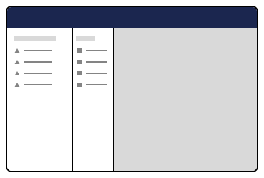

# Entity Actions


This page is a work in progress and may undergo further revisions, updates, or amendments. The information contained herein is subject to change without notice.



Entity Actions was previously called Tree Actions.


Entity Actions is a feature that provides a generic place for secondary or additional functionality for an entity type. An entity type can be a media, document and so on.

Items in an Umbraco Tree can have associated Actions. The actions visible to the currently logged in user can be controlled via User Permissions.

You can set a User's permissions for each item in the Umbraco Content tree from the User Section of the Umbraco Backoffice.

If you are developing a custom section or a custom Dashboard, you might want to display some different options. This depends on a User's permission set on a particular item.

## Entity Actions in the UI <a href="#entity-actions-in-the-ui" id="entity-actions-in-the-ui"></a>

<div><figure><figcaption><p><strong>Sidebar Context Menu</strong></p></figcaption></figure> <figure><figcaption><p><strong>Workspace Entity Action Menu</strong></p></figcaption></figure></div>

<div><figure><figcaption><p><strong>Collection</strong></p></figcaption></figure> <figure><figcaption><p><strong>Pickers</strong></p></figcaption></figure></div>

### Sidebar Context Menu <a href="#registering-an-entity-action" id="registering-an-entity-action"></a>

Sidebar Context Menu is an entity action that can be performed on a menu item. For example in the content section you can perform some extra actions on the content such as sorting, moving, etc.

<figure><figcaption><p>Default Entity Action in the Content Section</p></figcaption></figure>

## Registering an Entity Action <a href="#registering-an-entity-action" id="registering-an-entity-action"></a>

```typescript
import { extensionRegistry } from '@umbraco-cms/extension-registry';
import { MyEntityAction } from './entity-action';

const manifest = {
	type: 'entityAction',
	alias: 'My.EntityAction',
	name: 'My Entity Action',
	weight: 10,
	api: MyEntityAction,
	forEntityTypes: ['my-entity'],
	meta: {
		icon: 'icon-add',
		label: 'My Entity Action',
		repositoryAlias: 'My.Repository',
	},
};

extensionRegistry.register(manifest);
```

**Default Element**

```typescript
interface UmbEntityActionElement {}
```

### The Entity Action Class <a href="#the-entity-action-class" id="the-entity-action-class"></a>

As part of the Extension Manifest you can attach a class that will be instantiated as part of the action. It will have access to the host element, a repository with the given alias and the unique (key etc) of the entity.

The class either provides a getHref method, or an execute method. If the getHref method is provided, the action will use the link. Otherwise the `execute` method will be used. When the action is clicked the `execute` method on the api class will be run. When the action is completed, an event on the host element will be dispatched to notify any surrounding elements.

Example of providing a `getHref` method:

```typescript
import { UmbEntityActionBase } from '@umbraco-cms/backoffice/entity-action';
import { UmbControllerHostElement } from '@umbraco-cms/backoffice/controller-api';
import type { MyRepository } from './my-repository';

export class MyEntityAction extends UmbEntityActionBase<MyRepository> {
	constructor(host: UmbControllerHostElement, repositoryAlias: string, unique: string) {
		super(host, repositoryAlias, unique);
	}

	async getHref() {
		return 'my-link/path-to-something';
	}
}
```

Example of providing a `execute` method:

```typescript
import { UmbEntityActionBase } from '@umbraco-cms/backoffice/entity-action';
import { UmbControllerHostElement } from '@umbraco-cms/backoffice/controller-api';
import type { MyRepository } from './my-repository';

export class MyEntityAction extends UmbEntityActionBase<MyRepository> {
	constructor(host: UmbControllerHostElement, repositoryAlias: string, unique: string) {
		super(host, repositoryAlias, unique);
	}

	async execute() {
		await this.repository.myAction(this.unique);
	}
}
```

If any additional contexts are needed, these can be consumed from the host element:

```typescript
import { UmbEntityActionBase } from '@umbraco-cms/backoffice/entity-action';
import { UmbContextConsumerController } from '@umbraco-cms/controller';
import { UMB_MODAL_SERVICE_CONTEXT } from '@umbraco-cms/modal';
import { MyRepository } from './my-repository';

export class MyEntityAction extends UmbEntityActionBase<MyRepository> {
	constructor(host: UmbControllerHostElement, repositoryAlias: string, unique: string) {
		super(host, repositoryAlias, unique);

		new UmbContextConsumerController(this.host, UMB_MODAL_SERVICE_CONTEXT, (instance) => {
			this.#modalService = instance;
		});
	}
  ...
}
```

We currently have a couple of generic actions that can be used across silos, so we don't have to write the same logic again. These actions include copy, move, trash, delete, etc. We can add more as we discover the needs.

## User Permission Codes <a href="#user-permission-codes" id="user-permission-codes"></a>

Here is a list of the entity actions and associated user permission codes shipped by Umbraco CMS and add-on projects, such as Umbraco Deploy. This list also includes codes used by some community packages.

If you are building a package or adding custom entity actions to your solution, it's important to pick a permission letter. Ensure that it doesn't clash with one of these.

If you have created a package using a custom entity action, please consider providing an update to this documentation page. You can do this via a PR to the [documentation repository](https://github.com/umbraco/UmbracoDocs). This will allow other developers to discover and avoid using the same permission letter.

Currently, we allow two extension points on the client for user permissions:

* **Entity User Permissions** - Relates to an entity (example document).

<figure><figcaption><p><strong>Entity User Permissions UI</strong></p></figcaption></figure>

* **Granular User Permission** - Relates to a $type server schemaType.

<figure><figcaption><p><strong>Granular User Permission UI</strong></p></figcaption></figure>

Each permission comes with a set of verbs, that will be checked against client and server-side.

The Core currently ships with entity user permission for documents. The permissions are as follows:

| Current Backoffice Letter | Verb                             |
| ------------------------- | -------------------------------- |
| C                         | Umb.Document.Create              |
| F                         | Umb.Document.Read                |
| A                         | Umb.Document.Update              |
| D                         | Umb.Document.Delete              |
| I                         | Umb.Document.CreateBlueprint     |
| N                         | Umb.Document.Notifications       |
| U                         | Umb.Document.Publish             |
| R                         | Umb.Document.Permissions         |
| Z                         | Umb.Document.Unpublish           |
| O                         | Umb.Document.Duplicate           |
| M                         | Umb.Document.Move                |
| S                         | Umb.Document.Sort                |
| I                         | Umb.Document.CultureAndHostnames |
| P                         | Umb.Document.PublicAccess        |
| K                         | Umb.Document.Rollback            |
| V                         | Umb.DocumentRecycleBin.Restore   |

**Entity User Permissions** will be registered in the extension registry with a manifest with the following type. Example:

```typescript
{
    "type": "entityUserPermission",
    "alias": "Umb.UserPermission.Document.Rollback",
    "name": "Document Rollback User Permission",
    "meta": {
      "entityType": "document",
      "verbs": ["Umb.Document.Rollback"],
      "labelKey": "actions_rollback",
      "descriptionKey": "actionDescriptions_rollback",
      "group": "administration",
    },
  },
```

**Granular permissions** will also be registered. It is possible to provide a custom element to build the needed UX for that type of permission:

```typescript
{
    "type": "userGranularPermission",
    "alias": "Umb.UserGranularPermission.Document",
    "name": "Document Granular User Permission",
    "element": "element.js",
    "meta": {
      "schemaType": "DocumentPermissionPresentationModel",
      "label": "Documents",
      "description": "Assign permissions to specific documents",
    },
  },
```
