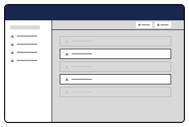

# Entity Bulk Actions


This page is a work in progress and may undergo further revisions, updates, or amendments. The information contained herein is subject to change without notice.


**Entity Bulk Action:** Relates to an entity type: document, media, etc. Performs the action on a selection of items.

<figure><figcaption><p>Entity Bulk Collection</p></figcaption></figure>

## Registering an Entity Bulk Action <a href="#registering-an-entity-bulk-action" id="registering-an-entity-bulk-action"></a>

```typescript
import { extensionRegistry } from '@umbraco-cms/extension-registry';
import { MyEntityBulkAction } from './entity-bulk-action';

const manifest = {
 type: 'entityBulkAction',
 alias: 'My.EntityBulkAction',
 name: 'My Entity Bulk Action',
 weight: 10,
 api: MyEntityBulkAction,
 meta: {
  icon: 'icon-add',
  label: 'My Entity Bulk Action',
  repositoryAlias: 'My.Repository',
 },
 conditions: [
  {
   alias: 'Umb.Condition.CollectionAlias',
   match: 'my-collection-alias',
  },
 ],
};

extensionRegistry.register(manifest);
```

## The Entity Bulk Action Class <a href="#the-entity-bulk-action-class" id="the-entity-bulk-action-class"></a>

As part of the Extension Manifest you can attach a class that will be instantiated as part of the action. It will have access to the host element, a repository with the given alias and the unique (key etc) of the entity. When the action is clicked the `execute` method on the api class will be run. When the action is completed, an event on the host element will be dispatched to notify any surrounding elements.

```typescript
import { UmbEntityBulkActionBase } from '@umbraco-cms/entity-action';
import { UmbControllerHostElement } from '@umbraco-cms/backoffice/controller-api';
import { MyRepository } from './my-repository';

export class MyEntityBulkAction extends UmbEntityBulkActionBase<MyRepository> {
 constructor(host: UmbControllerHostElement, repositoryAlias: string, selection: Array<string>) {
  super(host, repositoryAlias, selection);
 }

 async execute() {
  await this.repository?.myBulkAction(this.selection);
 }
}
```
