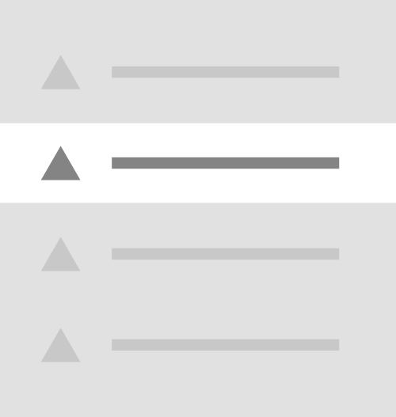
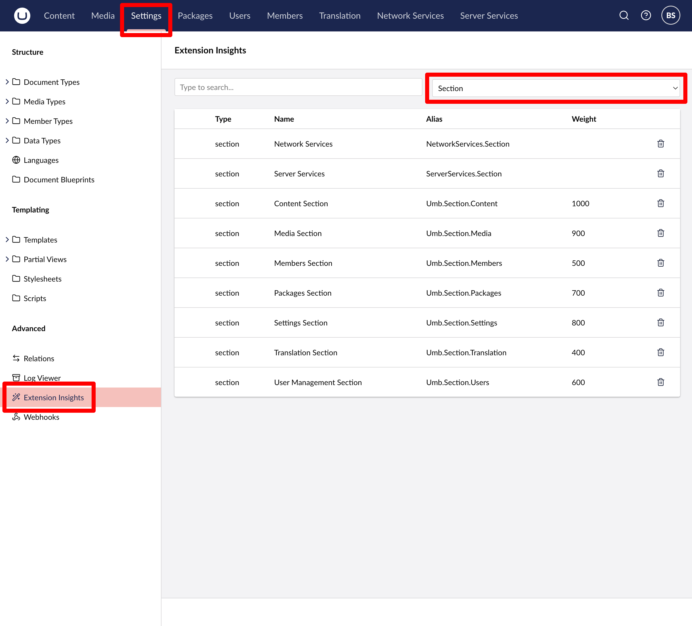

# Menu Items

Menu Item extensions are used together with [Menu](menu.md) extensions. Menu items can be added to custom menus, sidebars, and even the built-in Umbraco menus. Developers can either use the default Menu Item component or create custom Menu Item elements and register them as extensions.


<figure><figcaption><p>Menu Item</p></figcaption></figure>

## Creating Menu Items

Menu Item extensions can be defined either with JSON in `umbraco-package.json` or with TypeScript.

### Manifest

To add custom menu items, define a single `menuItem` manifest and link an element to it. Inside that element, you can fetch data and render as many menu items as needed based on that data.




```json
{
    "$schema": "../../umbraco-package-schema.json",
    "name": "My Package",
    "version": "0.1.0",
    "extensions": [
        {
            "type": "menuItem",
            "alias": "My.MenuItem",
            "name": "My Menu Item",
            "element": "./menu-items.ts",
            "meta": {
                "label": "My Menu Item",
                "menus": ["My.Menu"]
            }
        }
    ]
}
```

The `element` property is optional. If you omit it, Umbraco will render a default-styled menu item.





Extension authors define the menu manifest, then register it dynamically/during runtime using a [Backoffice Entry Point](../../extending-overview/extension-types/backoffice-entry-point.md) extension.


```typescript
import type { ManifestMenuItem } from '@umbraco-cms/backoffice/menu';

export const menuItemManifest: ManifestMenuItem = {
    type: 'menuItem',
    alias: 'My.MenuItem',
    name: 'My Menu Item',
    meta: {
        label: 'My Menu Item',
        menus: ["My.Menu"]
    },
};
```



```typescript
import type {
    UmbEntryPointOnInit,
} from "@umbraco-cms/backoffice/extension-api";
import { umbExtensionsRegistry } from "@umbraco-cms/backoffice/extension-registry";
import { menuItemManifest } from "./../my-menu/manifests.ts";

export const onInit: UmbEntryPointOnInit = (_host, _extensionRegistry) => {
    console.log("Hello from my extension 🎉");

    umbExtensionsRegistry.register(menuItemManifest);
};
```




## Associate Menu Items with Entities

The `menuItem` extension type accepts an optional `entityType` property. When set, this property automatically links the menu item to the matching workspace and shows any registered Entity Actions for that entity type.


```typescript
import type { ManifestMenuItem } from '@umbraco-cms/backoffice/menu';

export const menuItemManifest: ManifestMenuItem = {
    type: 'menuItem',
    alias: 'Umb.MenuItem.Users',
    name: 'Users Menu Item',
    weight: 200,
    meta: {
        label: '#treeHeaders_users',
        icon: 'icon-user',
        entityType: UMB_USER_ROOT_ENTITY_TYPE,
        menus: [UMB_USER_MANAGEMENT_MENU_ALIAS],
    },
};
```


## Menu Item Kinds

The Umbraco backoffice streamlines displaying menu items by providing three kinds that extension authors can reuse. These menu item kinds cover common tasks, including registering `links`, `actions` and `trees`.

### Links

Use a link menu item to navigate to another location, typically external URLs.


```typescript
import type { ManifestMenuItem } from '@umbraco-cms/backoffice/menu';

export const menuItemManifest: ManifestMenuItem = {
    type: 'menuItem',
    kind: 'link',
    alias: 'Umb.MenuItem.Help.LearningBase',
    name: 'Learning Base Help Menu Item',
    weight: 200,
    meta: {
        menus: [UMB_HELP_MENU_ALIAS],
        label: 'Umbraco Learning Base',
        icon: 'icon-movie-alt',
        href: 'https://umbra.co/ulb',
    },
};
```


### Action

Developers can use an action menu item when they want to execute custom logic that runs when the item is clicked. This kind is similar to the default menu item but does not support `entityType`, and therefore does not automatically link to workspaces or Entity Actions.


```typescript
import type { ManifestMenuItem } from '@umbraco-cms/backoffice/menu';

export const menuItemManifest: ManifestMenuItem = {
    type: 'menuItem',
    kind: 'action',
    alias: 'Umb.MenuItem.Tiptap.TableProperties',
    name: 'Tiptap Table Menu Item: Table Properties',
    api: () => import('./actions/table-properties.action.js'),
    weight: 110,
    meta: {
        label: 'Table properties',
        menus: [UMB_MENU_TIPTAP_TABLE_ALIAS],
    },
};
```


### Tree

Use a tree menu item to show a submenu based on a tree structure. Any existing, registered Tree Repositories can be referenced by its extension alias (`treeAlias` property) in the Menu Item manifest. This will render a fully functional tree-based menu.


```typescript
import type { ManifestMenuItem } from '@umbraco-cms/backoffice/menu';

export const menuItemManifest: ManifestMenuItem = {
    type: 'menuItem',
    kind: 'tree',
    alias: UMB_MEDIA_MENU_ITEM_ALIAS,
    name: 'Media Menu Item',
    weight: 100,
    meta: {
        label: 'Media',
        menus: [UMB_MEDIA_MENU_ALIAS],
        treeAlias: UMB_MEDIA_TREE_ALIAS,
        hideTreeRoot: true,
    },
};
```


## Custom Menu Items


**Note:** You do not need a custom menu item subclass to display menu item extensions. Creating a custom class is optional.


To render custom menu items, developers can use the [Umbraco UI Menu Item component](https://uui.umbraco.com/?path=/docs/uui-menu-item--docs). This component supports nested menu structures with minimal markup.

`<uui-menu-item>` elements accept a `has-children` boolean attribute, which shows a caret icon to indicate nested items. When using Lit, you can bind this with the `?` directive, for example: `?has-children=${boolVariable}`.

```html
<uui-menu-item label="Menu Item 1" has-children>
    <uui-menu-item label="Nested Menu Item 1"></uui-menu-item>
    <uui-menu-item label="Nested Menu Item 2"></uui-menu-item>
</uui-menu-item>
```

### Custom menu item element example

Custom elements can fetch data and render menu items using markup like the example above. Storing fetched results in a `@state()` property ensures the component re-renders whenever the value changes.




```typescript
import type { UmbMenuItemElement } from '@umbraco-cms/backoffice/menu';
import { UmbLitElement } from '@umbraco-cms/backoffice/lit-element';
import { html, TemplateResult, customElement, state } from '@umbraco-cms/backoffice/external/lit';
import { MyMenuItemResponseModel, MyMenuResource } from '../../../api';

@customElement('my-menu-item')
class MyMenuItems extends UmbLitElement implements UmbMenuItemElement {
    @state()
    private _items: MyMenuItemResponseModel[] = []; // Store fetched items

    @state()
    private _loading: boolean = true; // Track loading state

    @state()
    private _error: string | null = null; // Track any errors

    override firstUpdated() {
        this.fetchInitialItems(); // Start fetching on component load
    }

    // Fetch initial items
    async fetchInitialItems() {
        try {
            this._loading = true;
            this._items = ((await MyMenuResource.getMenuApiV1()).items); // Fetch root-level items
        } catch (e) {
            this._error = 'Error fetching items';
        } finally {
            this._loading = false;
        }
    }

    // Render items
    renderItems(items: MyMenuItemResponseModel[]): TemplateResult {
        return html`
            ${items.map(element => html`
                <uui-menu-item label="${element.name}" ?has-children=${element.hasChildren}>
                ${element.type === 1
                ? html`<uui-icon slot="icon" name="icon-folder"></uui-icon>`
                : html`<uui-icon slot="icon" name="icon-autofill"></uui-icon>`}
                    <!-- recursively render children -->
                    ${element.hasChildren ? this.renderItems(element.children) : ''}
                </uui-menu-item>
            `)}
        `;
    }

    // Main render function
    override render() {
        if (this._loading) {
            return html`<uui-loader></uui-loader>`;
        }

        if (this._error) {
            return html`<uui-menu-item active disabled label="Could not load form tree!">
        </uui-menu-item>`;
        }

        // Render items if loading is done and no error occurred
        return this.renderItems(this._items);
    }
}

export { MyMenuItems as element };

declare global {
    interface HTMLElementTagNameMap {
        ['my-menu-item']: MyMenuItems;
    }
}
```




```typescript
import type { ManifestMenuItem } from "@umbraco-cms/backoffice/menu";

export const MyMenuItemManifest: ManifestMenuItem = {
  type: "menuItem",
  alias: "My.MenuItem.CustomMenuItem",
  name: "My Custom Menu Item",
  element: () => import("./menu-items.ts"),
  meta: {
    label: "Smtp",
    menus: ["Umb.Menu.Content"],
  },
};
```

**Note:** Extension authors can use the `kind` property to define the type of menu item. Supported values include `tree` and `list`.




```typescript
import type {
    UmbEntryPointOnInit,
} from "@umbraco-cms/backoffice/extension-api";
import { umbExtensionsRegistry } from "@umbraco-cms/backoffice/extension-registry";
import { MyMenuItemManifest } from "./../my-menu/manifests.ts";

export const onInit: UmbEntryPointOnInit = (_host, _extensionRegistry) => {
    console.log("Hello from my extension 🎉");

    umbExtensionsRegistry.register(MyMenuItemManifest);
};
```



## Adding menu items to an existing menu

Developers can add their own menu items to the built-in Umbraco menus.

Examples of built-in menus include:

* Content - `Umb.Menu.Content`
* Media - `Umb.Menu.Media`
* Settings - `Umb.Menu.StructureSettings`
* Templating - `Umb.Menu.Templating`
* ...

You can find all available Umbraco menus (nine in total) using the Extension Insights browser by selecting **Menu** from the dropdown.

<figure><figcaption><p>Backoffice extension browser</p></figcaption></figure>

### Extending Menus

To add a menu item to an existing menu, use the `meta.menus` property.


```json
{
    "$schema": "../../umbraco-package-schema.json",
    "name": "My Package",
    "version": "0.1.0",
    "extensions": [
        {
            "type": "menuItem",
            "alias": "My.MenuItem",
            "name": "My Menu Item",
            "meta": {
                "label": "My Menu Item",
                "menus": ["Umb.Menu.Content"]
            },
            "element": "menu-items.js"
        }
    ]
}
```

