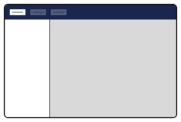
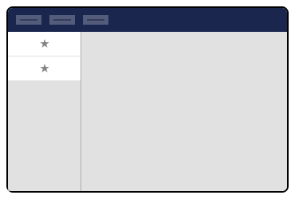
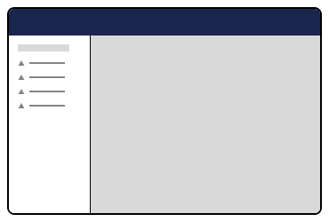
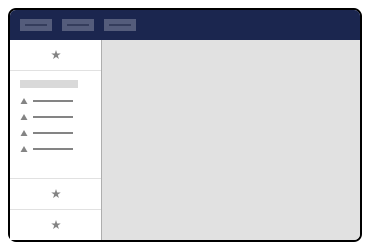

# Section Sidebar

[Section extensions](section.md) can add a Section Sidebar to add navigation, coordinate subviews such as [Section View extensions](section-view.md), and provide Section-wide functionality.

Section Sidebar extensions are optional; if not defined, the Section extension defaults to a single full-screen subview.

<figure><figcaption><p>Section Sidebar</p></figcaption></figure>

## Manifest Properties

The `sectionSidebarApp` manifest supports the following properties:

| Property      | Type                | Required | Description                                                                                                                            |
| ------------- | ------------------- | -------- | -------------------------------------------------------------------------------------------------------------------------------------- |
| `type`        | string              | Yes      | Must be `sectionSidebarApp`.                                                                                                           |
| `alias`       | string              | Yes      | A unique identifier for this extension.                                                                                                |
| `name`        | string              | Yes      | A human-readable name shown in Extension Insights.                                                                                     |
| `weight`      | number              | No       | Controls the display order when multiple sidebar apps are registered in the same section. Higher values display higher in the sidebar. |
| `kind`        | string              | No       | Inherit a preset configuration, for example, `menu`. See [Extension Kinds](../kind.md).                                                |
| `element`     | string              | No       | Path to a custom web component file.                                                                                                   |
| `elementName` | string              | No       | The custom element tag name (if not a default export).                                                                                 |
| `meta`        | object              | No       | Additional configuration depending on the `kind` used.                                                                                 |
| `conditions`  | array               | No       | Conditions that must pass for the app to appear. See [Extension Conditions](../../extension-conditions.md).                            |
| `overwrites`  | string \| string\[] | No       | Alias(es) of extensions this manifest replaces.                                                                                        |

For the full TypeScript interface, see [`ManifestSectionSidebarApp`](https://apidocs.umbraco.com/v17/ui-api/interfaces/packages_core_section.ManifestSectionSidebarApp.html) in the API documentation.

For a general overview of manifest properties shared across all extension types, see [Extension Manifest Introduction](../../extension-registry/extension-manifest.md).

## Section Sidebar Apps

Section Sidebar extensions can be composed of **one or more** section sidebar apps. Extension authors can include common Umbraco types, such as menus and trees, or create custom sidebar apps using web components.

<figure><figcaption><p>Section Sidebar Apps</p></figcaption></figure>

### Custom Sidebar App Example

Section Sidebar extension authors can place any custom web component into the sidebar. Extension authors will need to supply the `element` property with the path of their custom web component. Specify the full path, starting from the Umbraco project root.

Sidebar Section extension authors may specify where the Section Sidebar app appears using [extension conditions](../condition.md).




```json
{
  "$schema": "../../umbraco-package-schema.json",
  "name": "My Package",
  "version": "1.0.0",
  "extensions": [
    {
        "type": "sectionSidebarApp",
        "alias": "My.SectionSidebarApp", 
        "name": "My Section Sidebar App", 
        "weight": 100,
        "element": "/App_Plugins/<package_name>/sidebar-app.js",
        "conditions": [{
            "alias": "Umb.Condition.SectionAlias",
            "match": "My.Section"
        }]
    }]
}
```




These should be registered via a [Backoffice Entry Point](../backoffice-entry-point.md).


```ts
import type { ManifestSectionSidebarApp } from '@umbraco-cms/backoffice/section';

export const manifest: ManifestSectionSidebarApp = {
    type: 'sectionSidebarApp',
    alias: 'My.SectionSidebarApp',
    name: 'My Section Sidebar App',
    weight: 100,
    element: () => import('./sidebar-app.element.js'),
    conditions: [{
        alias: 'Umb.Condition.SectionAlias',
        match: 'My.Section'
    }]
};
```





`Umb.Condition.SectionAlias` is a built-in condition type provided by Umbraco. You must use the exact alias string. Refer to the [Extension Conditions](../../extension-conditions.md) documentation for the complete list of available conditions and their parameters.


### Menu Sidebar App Examples

The menu sidebar app, provided by Umbraco, can be placed in Section Sidebar extensions. It attaches to a menu defined in your manifest via the `meta:menu` property, where this value must match the `alias` value of the menu.

<figure><figcaption><p>Menu Sidebar App</p></figcaption></figure>




```json
{
  "$schema": "../../umbraco-package-schema.json",
  "name": "My Package",
  "version": "1.0.0",
  "extensions": [
    {
        "type": "sectionSidebarApp",
        "kind": "menu",
        "alias": "My.SectionSidebarApp.MyMenu",
        "name": "My Menu Section Sidebar App",
        "weight": 200,
        "meta": {
            "label": "My Sidebar Menu",
            "menu": "My.Menu"
        },
        "conditions": [{
            "alias": "Umb.Condition.SectionAlias",
            "match": "My.Section"
        }]
    }]
}
```




These should be registered via a [Backoffice Entry Point](../backoffice-entry-point.md).


```ts
import type { ManifestSectionSidebarAppMenu } from '@umbraco-cms/backoffice/menu';

export const manifest: ManifestSectionSidebarAppMenu = {
    type: 'sectionSidebarApp',
    kind: 'menu',
    alias: 'My.SectionSidebarApp.MyMenu',
    name: 'My Menu Section Sidebar App',
    weight: 200,
    meta: {
        label: 'My Sidebar Menu',
        menu: 'My.Menu'
    },
    conditions: [{
        alias: 'Umb.Condition.SectionAlias',
        match: 'My.Section'
    }]
};
```





Umbraco also provides a menuWithEntityActions kind, which extends the menu kind to automatically surface registered Entity Actions for items in the menu. Use this kind when your menu items represent entities that have actions (such as create, delete, or move).


In the example below, a menu extension is created and bound to the `meta:menu` (`My.Menu`) property, which matches the menu extension’s `alias`. The _My.Menu_ alias is also used to attach a menu item extension.


```json
[
    {
        "type": "menu",
        "alias": "My.Menu",
        "name": "Section Sidebar Menu"
    },
    {
        "type": "menuItem",
        "alias": "SectionSidebar.MenuItem1",
        "name": "Menu Item 1",
        "meta": {
        "label": "Menu Item 1",
          "menus": ["My.Menu"]
        }
    }
]
```


For more information, see the documentation for the [menus](../menu.md) extension.

#### Coordinating subviews with menu items

Menu sidebar apps can coordinate navigation between subviews in the section extension by referencing [workspace extensions](../workspaces/). Modify the menu item extension to include the `meta:entityType` property, and assign it the same value as a workspace view extension's own `meta:entityType` property.


```json
[
    {
        "type": "menuItem",
        "alias": "SectionSidebar.MenuItem1",
        "name": "Menu Item 1",
        "meta": {
            "label": "Menu Item 1",
            "menus": ["My.Menu"],
            "entityType": "myCustomWorkspaceView"
        }
    },
    {
        "type": "workspace",
        "name": "Workspace 1",
        "alias": "SectionSidebar.Workspace1",
        "element": "/App_Plugins/<package_name>/my-custom-workspace.js",
        "meta": {
            "entityType": "myCustomWorkspaceView"
        }
    }
]
```



These should be registered via a Backoffice Entry Point.


```
```


```ts
import type { UmbExtensionManifest } from '@umbraco-cms/backoffice/extension-api';

export const manifests: UmbExtensionManifest[] = [
    {
        type: 'menuItem',
        alias: 'SectionSidebar.MenuItem1',
        name: 'Menu Item 1',
        meta: {
            label: 'Menu Item 1',
            menus: ['My.Menu'],
            entityType: 'myCustomWorkspaceView'
        }
    },
    {
        type: 'workspace',
        name: 'Workspace 1',
        alias: 'SectionSidebar.Workspace1',
        element: () => import('./my-custom-workspace.element.js'),
        meta: {
            entityType: 'myCustomWorkspaceView'
        }
    }
];
```

Menu items and workspaces are linked by matching `entityType` values.

#### Adding items to an existing menu

Authors can add their extensions to the sidebar of any Umbraco-provided section (Content, Media, Settings, etc.) by configuring `conditions` with the `SectionAlias` property.

<figure><figcaption><p>Composed sidebar menu</p></figcaption></figure>




```json
{
  "$schema": "../../umbraco-package-schema.json",
  "name": "My Package",
  "version": "1.0.0",
  "extensions": [
    {
        "type": "sectionSidebarApp",
        "alias": "My.SectionSidebarApp",
        "name": "My Section Sidebar App",
        "element": "/App_Plugins/<package_name>/sidebar-app.js",
        "conditions": [{
            "alias": "Umb.Condition.SectionAlias", 
            "match": "Umb.Section.Settings"
        }]
    }]
}
```




These should be registered via a Backoffice Entry Point.


```ts
import type { ManifestSectionSidebarApp } from '@umbraco-cms/backoffice/section';

export const manifest: ManifestSectionSidebarApp = {
    type: 'sectionSidebarApp',
    alias: 'My.SectionSidebarApp',
    name: 'My Section Sidebar App',
    element: () => import('./sidebar-app.element.js'),
    conditions: [
        {
            alias: 'Umb.Condition.SectionAlias',
            match: 'Umb.Section.Settings'
        }
    ]
};
```




**Section Aliases**

Common Umbraco-provided section aliases:

* `Umb.Section.Content`
* `Umb.Section.Media`
* `Umb.Section.Settings`
* `Umb.Section.Packages`
* `Umb.Section.Users`
* `Umb.Section.Members`
* `Umb.Section.Translation`
