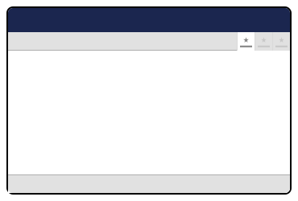

# Section View

Section View extensions are containers for custom Umbraco packages or other backoffice areas, including Content, Media, Settings, Users, Members, or Translations. These extensions can contain other Umbraco extensions, like dashboards or web components, enabling package authors to populate the section with any content or custom interface.

<figure><figcaption><p>Section View</p></figcaption></figure>

## Creating a custom Section View

Custom Section View extensions are straightforward to create. Extension authors register the Section View extension and subsequently implement the content or interface they desire to display within the Section View.

### Registering Section View extensions

Extension authors can register Section View extensions using two methods: 

- Declarative registration via manifests or
- Imperative registration using TypeScript and [Backoffice Entry Points](../backoffice-entry-point.md). 

Both methods are shown below.

#### Registering by manifest



Extensions authors can register the Section View extension using a JSON declaration in the `umbraco-package.json` file.


```json
{
    "type": "sectionView",
    "alias": "My.SectionView",
    "name": "My Section View",
    "element": "/App_Plugins/<package_name>/my-section.element.js",
    "meta": {
        "label": "My View",
        "icon": "icon-add",
        "pathname": "my-view"
    },
    "conditions": [
        {
            "alias": "Umb.Condition.SectionAlias",
            "match": "My.Section"
        }
    ]
}
```


Tip: Use the absolute path, starting from the root of your Umbraco project, in the `element` property for JSON declarations. TypeScript declarations are capable of employing relative paths.




The manifest can also be written in TypeScript.

For this TypeScript example we used a [Backoffice Entry Point](../backoffice-entry-point.md) extension to register the manifests.


```typescript
import type { ManifestSectionView }  from '@umbraco-cms/backoffice/section';

const sectionViews: Array<ManifestSectionView> = [
    {
        type: "sectionView",
        alias: "My.SectionView",
        name: "My Section View",
        element: () => import('./my-section.element.ts'),
        meta: {
            label: "My View",
            icon: "icon-add",
            pathname: "my-view",
        },
        conditions: [
            {
                alias: 'Umb.Condition.SectionAlias',
                match: 'My.Section',
            }
        ]
    }
]
```





### Lit Element

Creating the Section View Element using a Lit Element.


```typescript
import { UmbLitElement } from '@umbraco-cms/backoffice/lit-element';
import { css, html, customElement, property } from '@umbraco-cms/backoffice/external/lit';

@customElement('my-sectionview-element')
export class MySectionViewElement extends UmbLitElement {

    override render() {
        return html`
            <uui-box headline="Sectionview Title goes here">
                Sectionview content goes here
            </uui-box>
        `
    }

    static override readonly styles = [
        css`
            :host {
                display: block;
                padding: 20px;
            }
        `,
    ];

}

export default MySectionViewElement;

declare global {
    interface HTMLElementTagNameMap {
        'my-sectionview-element': MySectionViewElement;
    }
}
```


## Adding Section Views to your own package

When developing a Section View extension for their own package, an extension author must create a Section extension to host the Section View extension.

Guidelines on creating Section extensions can be found at [this link](./section.md).

To link a Section View with a Section, set the `match` property in the condition to the same value as the Section's `alias`. In the provided example, this value is `NetworkServices.Section`.


```json
[
    {
        "type": "section",
        "alias": "NetworkServices.Section",
        "name": "Network Services",
        "meta": {
            "label": "Network Services",
            "pathname": "network-services"
        }
    },
    {
        "type": "sectionView",
        "alias": "NetworkServices.Section.Overview",
        "name": "Network Services Overview",
        "element": "/App_Plugins/NetworkServices/overview-dashboard.js",
        "meta": {
            "label": "Overview",
            "icon": "icon-add",
            "pathname": "overview"
        },
        "conditions": [
            {
                "alias": "Umb.Condition.SectionAlias",
                "match": "NetworkServices.Section"
            }
        ]
    }
]
```


## Adding Section Views to somewhere else in the backoffice

The Umbraco backoffice architecture places a strong emphasis on composing. Authors can extend existing sections, including core ones like Content, Media, and Settings, with Section View extensions.

After an author has completed their Section View extension, they can control the placement of the extension using conditions in the manifest definition.

The `match` property demonstrates how an extension author can incorporate a custom Section View within the Content section.


```json
{
    "type": "sectionView",
    "alias": "My.SectionView",
    "name": "My Section View",
    "element": "/App_Plugins/<package_name>/my-section.element.js",
    "meta": {
        "label": "My View",
        "icon": "icon-add",
        "pathname": "my-view"
    },
    "conditions": [
        {
            "alias": "Umb.Condition.SectionAlias",
            "match": "Umb.Section.Content"
        }
    ]
}
```


Common Umbraco-provided section aliases:

| Section Aliases         |
|-------------------------|
| Umb.Section.Content     |
| Umb.Section.Media       |
| Umb.Section.Settings    |
| Umb.Section.Packages    |
| Umb.Section.Users       |
| Umb.Section.Members     |
| Umb.Section.Translation |

Section View extensions can also appear in Sidebar extensions of Umbraco-provided sections, alongside custom sidebars created by authors.
