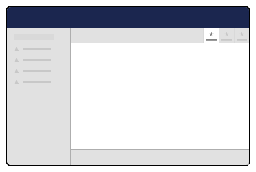
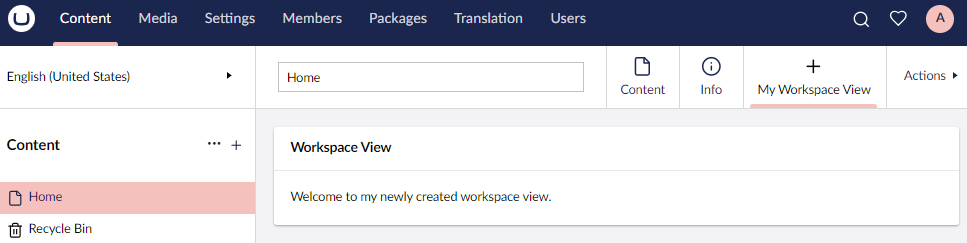

# Workspace Views


This page is a work in progress and may undergo further revisions, updates, or amendments. The information contained herein is subject to change without notice.



Workspace Views was previously called Content Apps.


Workspace Views are customizable companion **tabs** with the ability to take place in any workspace.

<figure><figcaption><p>Workspace Views</p></figcaption></figure>

**In Content Section**

With Workspace Views, editors can switch from editing 'Content' to accessing contextual information related to the item they are editing.

The default workspace view is **'Info'** - displaying Links, History and Status of the current content item.

## Example of a Workspace View

1. Follow the [Vite Package Setup](../../../development-flow/vite-package-setup.md) by creating a new project folder called "`workspaceview`" in `App_Plugins`.
2. Create a manifest file named `umbraco-package.json` at the root of the `workspaceview` folder. Here we define and configure our workspace view.
3. Add the following code to `umbraco-package.json`:


```json
{
  "$schema": "../../umbraco-package-schema.json",
  "name": "My workspace",
  "version": "0.1.0",
  "extensions": [
    {
      "type": "workspaceView",
      "alias": "My.WorkspaceView",
      "name": "My Workspace View",
      "element": "/App_Plugins/workspaceview/dist/workspaceview.js",
      "meta": {
        "label": "My Workspace View",
        "pathname": "/my-workspace-view",
        "icon": "icon-add"
      },
      "conditions": [
        {
          "alias": "Umb.Condition.WorkspaceAlias",
          "match": "Umb.Workspace.Document"
        }
      ]
    }
  ]
}
```


4. Add the following code to the existing `my-element.ts` from the `src`folder:


```typescript
import { LitElement, html, customElement, css } from "@umbraco-cms/backoffice/external/lit";
import { UmbElementMixin } from "@umbraco-cms/backoffice/element-api";

@customElement('my-workspaceview')
export default class MyWorkspaceViewElement extends UmbElementMixin(LitElement) {

  render() {
    return html`     
     <uui-box headline="Workspace View">
        Welcome to my newly created workspace view.
      </uui-box>            
    `
  }

  static styles = css`
    uui-box {
      margin: 20px;
    }
  `
}

declare global {
  interface HTMLElementTagNameMap {
    'my-workspaceview': MyWorkspaceViewElement
  }
}

```


In the `workspaceview` folder run `npm run build` and then run the project. Then in the content section of the Backoffice you will see our new Workspace View:

<figure><figcaption><p>Workspace View Example</p></figcaption></figure>


To see the Workspace View that we have created in the content section, first you will need to have some content created.

