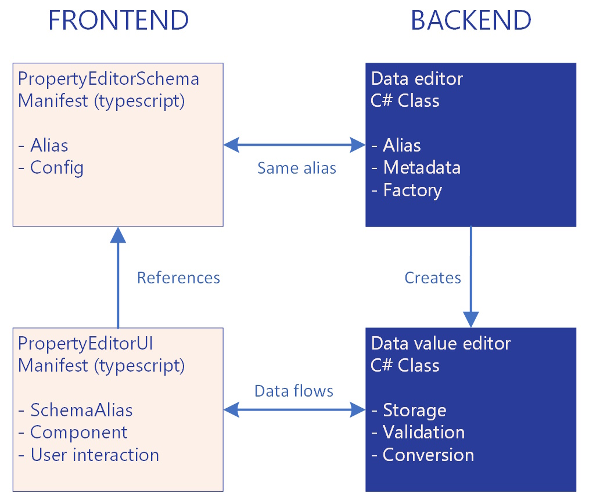

# Property Editors Composition
A Property Editor is the fundamental building block for content editing in Umbraco. It defines how content editors input data, how that data is validated and stored, and how it appears in templates. Property Editors enable content creation through familiar interfaces. Text boxes, rich text editors, media pickers, and date selectors are all Property Editors. But complex editors, like the Block List and Block Grid are also Property Editors and following the same underlying architecture.

Every Property Editor has two distinct parts: a frontend UI component and a backend schema definition. The UI provides the visual editing experience in the backoffice. The schema defines data validation, storage format, and server-side processing rules.

To use a Property Editor in your content, you create a Data Type. A Data Type connects a schema with a UI and applies specific configuration settings. This allows the same Property Editor to serve different purposes with different validation rules or display options.

## Property Editor Architecture

A Property Editor consists of two independent parts that work together: a backend schema definition and a frontend UI component.

### Backend: Property Editor Schema

The Property Editor Schema defines the data contract and server-side processing rules. It specifies the database storage type, provides server-side validation, and handles data conversion between the UI and database. Property Editor Schemas are implemented in C# on the server side.

The schema has the final authority on data validation. Client-side validation provides immediate feedback, but server-side validation always runs regardless of which UI is used. The schema ensures data integrity and defines what constitutes valid data for storage.

### Frontend: Property Editor UI

The Property Editor UI is the visual interface content editors interact with in the backoffice. It renders the input controls, provides client-side validation, and displays user feedback. Property Editor UIs are built using web components.

The UI component can be replaced without affecting stored data as long as the same schema is used. This allows different editing experiences while maintaining the same underlying data structure and validation rules.

### Separation of Concerns
This architectural separation provides flexibility. Multiple UIs can use the same schema with different visual presentations. The same schema can serve different purposes through different UI implementations.

The schema ensures data integrity independent of the UI implementation. You can swap the UI component for a schema without migration or data loss. New UI technologies can be adopted while preserving existing schemas and stored data.

**NOTE: CREATE SCHEMA HERE: UI → Management API → Schema → Database**

---
Data Types: Connecting UI and Schema
A Data Type is where you configure and connect a Property Editor UI with a Property Editor Schema for actual use.
When you create a Data Type, you:
1.	Select a Property Editor Schema (defines what data can be stored)
2.	Select a Property Editor UI (defines how editors interact with it)
3.	Configure settings for both (validation rules, UI options, etc.)
images/property-editor-datatype-connection.jpg
Example:
•	Schema: Umbraco.TextBox (stores strings with optional max length validation)
•	UI Options:
•	Umb.PropertyEditorUi.TextBox (single-line input)
•	Umb.PropertyEditorUi.TextArea (multi-line input)
•	Data Types You Could Create:
•	"Page Title" (TextBox schema + single-line UI, max 60 chars)
•	"Meta Description" (TextBox schema + multi-line UI, max 160 chars)
•	"Article Summary" (TextBox schema + multi-line UI, max 500 chars)
Same schema, different UIs and configurations, different purposes.
---
Configuration & Settings
Both Property Editor Schemas and Property Editor UIs can define configuration settings:
Schema Settings
Defined by the DataEditor and control:
•	Database value type (string, integer, JSON, etc.)
•	Server-side validation rules (min/max values, required fields)
•	Data conversion logic
UI Settings
Defined by the Property Editor UI manifest and control:
•	Visual appearance (colors, labels, icons)
•	Client-side validation
•	User interaction options (autocomplete, character counters)
How Settings Work:
1.	Settings are defined in manifests (both schema and UI can have their own)
2.	Values are configured when creating/editing a Data Type
3.	Values are passed to both server-side validation and the UI component
---
Building Property Editors
Depending on your needs, you can create:
Just a UI (Most Common)
If an existing schema handles your data correctly:
•	property-editor-ui.md
•	Examples: custom date picker, specialized content picker, branded text input
Just a Schema (Less Common)
If you need custom server-side validation/conversion but can use standard UIs:
•	property-editor-schema.md
•	Examples: product SKU validation, custom data transformation, specific database storage
Both UI and Schema
For completely custom requirements:
•	Create both components
•	Full control over data and presentation
•	Examples: complex form builders, custom media editors, specialized data structures

## Advanced

This chapter covers advanced scenarios. It's intended for developers who understand the basic of Property Editors and want to explore more sophisticated patterns.


### Property Editor Data Sources
A Property Editor Data Source is an optional way to provide data to a Property Editor UI. This allows for reuse of the same Property Editor UI but with different data sources. This means that you can provide dynamic data to a Property Editor UI without modifying the UI itself.

* [Property Editor Data Source](property-editor-data-source.md)

--------- OLD, probably needs to go
A property editor is an editor used to insert content into Umbraco. A Property Editor is composed of two extensions. To form a full Property Editor you will need a:

* [Property Editor Schema](property-editor-schema.md)
* [Property Editor UI](property-editor-ui.md)

A Property Editor UI is utilizing a Property Editor Schema, and you can have multiple Property Editor UIs for one Schema. This means you can find a Schema that solves your needs. You only need to build a Property Editor UI.

* Each Property Editor can have multiple Property Editor UIs.
* Both a Property Editor Schema and Property Editor UI can define the Settings used for their configuration.

### Configuration

* Data Type Settings for a Property Editor or Property Editor UI is defined in the manifests.
* They both use the same format for their settings.

