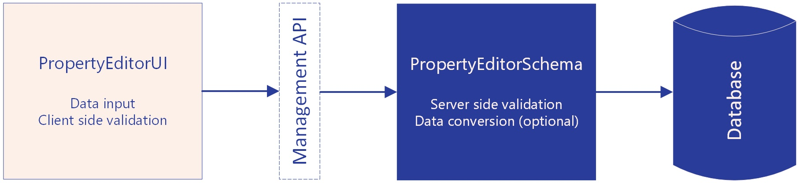

# Property Editors Composition
A Property Editor is the fundamental building block for content editing in Umbraco. It defines how content editors input data, how that data is validated and stored, and how it appears in templates. Property Editors enable content creation through familiar interfaces. Text boxes, rich text editors, media pickers, and date selectors are all Property Editors. Complex editors, like the Block List and Block Grid, are also Property Editors following the same underlying architecture.

Every Property Editor has two distinct parts: a frontend UI component and a backend schema definition. The UI provides the visual editing experience in the backoffice. The schema defines data validation, storage format, and server-side processing rules.

To use a Property Editor in your content, you create a Data Type. A Data Type connects a schema with a UI and applies specific configuration settings. This allows the same Property Editor to serve different purposes with different validation rules or display options.

## Property Editor Architecture

A Property Editor consists of two independent parts that work together: a backend schema definition and a frontend UI component.

### Property Editor Schema - the backend part

The Property Editor Schema defines the data contract and server-side processing rules. It specifies the database storage type, provides server-side validation, and handles data conversion between the UI and database. Property Editor Schemas are implemented in C# on the server side.

The schema has the final authority on data validation. Client-side validation provides immediate feedback, but server-side validation always runs regardless of which UI is used. The schema ensures data integrity and defines what constitutes valid data for storage.

### Property Editor UI - the frontend part

The Property Editor UI is the visual interface content editors interact with in the backoffice. It renders the input controls, provides client-side validation, and displays user feedback. Property Editor UIs are built using web components.

The UI component can be replaced without affecting stored data as long as the same schema is used. This allows different editing experiences while maintaining the same underlying data structure and validation rules.

### Separation of Concerns
This architectural separation provides flexibility. Multiple UIs can use the same schema with different visual presentations. The schema ensures data integrity while you can swap the UI component without migration or data loss.

### Data Types: Configuring Property Editors
A Data Type is a configured instance of a Property Editor that you create in the Umbraco backoffice. A Data Type is the entity that you add as a property on a Document, Media or Member types. It defines how editors will manage a particular item of data. With Data Types, you can create one or multiple instances of the same Property Editor with different settings. When users are editing content, the Data Type knows what UI element to display and what settings to use. When content is saved, the Data Type knows how to process the data. This is because the Data Type knows the alias of the Property Editor UI, the alias of the Property Editor Schema, and the settings set on the Data Type instance.

Take the __Text Box__ Property Editor for example. It has a setting for 'Maximum allowed characters'. You can create multiple Data Types using the Text Box Property Editor with different settings, based on what is needed. 

### Settings
Settings are what make each instance of a Property Editor unique. When creating a Data Type, you give the settings a value specific to that Data Type.

Settings can be defined on both the Property Editor Schema and the Property Editor UI manifest. These settings are merged into one list. When you create a Data Type based on the Property Editor, the settings from the Schema and UI are both displayed. All settings and their values for that specific Data Type are also available to both the Schema and UI in code.

It is best practice to define settings that impact how data is processed and stored on the Property Editor Schema. For instance, settings for whether a certain field on the Property Editor is required or has a maximum length. Settings that only impact the UI but not the data should be set on the Property Editor UI. 

There is technically nothing stopping you from doing it differently. However, remember the separation of concerns. The UI and Schema can be swapped out for another. When considering where to define the setting, always think about whether the Property Editor still works if the UI is swapped out.

## Creating custom Property Editors
When creating a custom Property Editor, you need to consider what you need to implement. As discussed, the architecture of the Property Editor is flexible with separation of concerns. This means that for a custom Property Editor, you need to decide what you need to implement yourself and what to reuse of what is already there.

If Umbraco already has a UI available that you can use, you do not have to implement the UI. In this case, you reuse a UI and implement a custom Schema for custom data handling. However, in most common scenarios, you will probably create a new Property Editor UI to work with. For more information about how to create a UI, see the [Property Editor UI](./property-editor-ui.md) article.

When it comes to a Property Editor Schema, whether you need to create a custom Schema depends on your needs. Does your Property Editor require custom data validation and logic? Umbraco comes with a selection of default Property Editor Schemas that are suitable for many common scenarios. The article about the [Property Editor Schema](./property-editor-schema.md) provides more information about how to create a Schema. It also provides considerations on whether a custom Property Editor Schema is needed.

## Advanced

This chapter covers advanced scenarios. It is intended for developers who understand the basics of Property Editors and want to explore more sophisticated patterns.


### Property Editor Data Sources
A Property Editor Data Source is an optional way to provide data to a Property Editor UI. This allows for reuse of the same Property Editor UI but with different data sources. This means that you can provide dynamic data to a Property Editor UI without modifying the UI itself.

* [Property Editor Data Source](property-editor-data-source.md)

