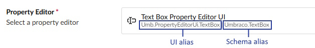
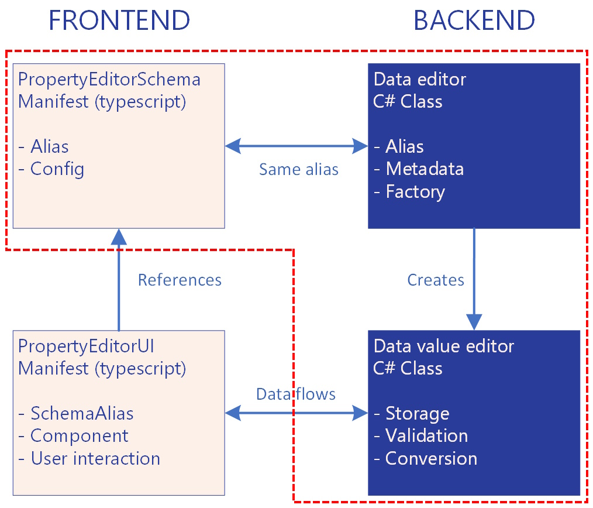

# Property Editor Schema
A Property Editor Schema is the data part of a Property Editor in Umbraco. It defines what type of data can be stored (string, number, date, JSON, etc.) and how that data should be validated. It can also perform conversions of the data going in or coming out of the database. 

The schema's `settings` define what configuration options are available for the Property Editor (like maximum characters, allowed file types, etc.). When you create a Data Type, you provide values for these settings. Those configured values are then passed to both the server-side validation and the Property Editor UI.


You can define settings on both the Property Editor Schema and the Property Editor UI. It's good practice to define settings that have impact on the data (like validation rules) on the Property Editor Schema. Settings that only impact the UI should be set on the Property Editor UI.
 

For details on the settings structure, see the [Property Editor Schema Extension Type](../../extending-overview/extension-types/property-editor-schema.md) documentation.

In essence, the Property Editor Schema defines the data contract for a Property Editor.


When you want to use a Property Editor to edit content in Umbraco, the Property Editor needs to have a schema. If it does not have a schema, you cannot select the Property Editor when creating a [Data Type](../../../fundamentals/data/data-types/). In other scenarios - when using a Property Editor to edit Data Type settings for instance - a schema is not required.


The Property Editor Schema runs server-side (in C# code) and has the final say on whether data is valid to commit to the database. The Property Editor UI is where the user inputs their data. You can have client-side validation, but the Property Editor Schema has the final say. This means that if there is a mismatch in client-side and server-side validation, the server-side validation can reject data that the client-side validation considers valid.

Because the Property Editor Schema defines how to process and validate data, you can have multiple Property Editor UIs using the same schema. As long as they work with the data as defined in the schema, this works. It also makes it possible to swap out the UI while maintaining the same data.

You can see the used schema of a Property Editor in the backoffice of Umbraco when you create a new [Data Type](../../../fundamentals/data/data-types/).



## A custom schema or not?
Umbraco ships with a number of [default property editor schemas](../../../tutorials/creating-a-property-editor/default-property-editor-schema-aliases) that cover most scenarios that are less demanding. Although each situation is different, if you answer yes to any of the following statements, it makes sense to create a custom schema:

* You expect the schema to be used by multiple Property Editor UIs.
* You need a custom [Property Value Converter](../property-value-converters.md) because you need to convert the data going into the cache or you want the Umbraco ModelsBuilder to have a more specific strongly-typed model.
* You need specific server-side validation of your data that is not covered in the default schemas.
* You have specific needs for converting data going into or coming out of the database that are not covered in the default schemas.
* You want to be flexible and prepared for future development.

Otherwise the default schemas are probably fine.

## Property Editor Schema anatomy
On the server side, a Property Editor Schema is built from two collaborating components. The `DataEditor` serves as the definition and factory, while `DataValueEditor` instances perform the actual data handling work. This separation allows Umbraco to efficiently reuse schema definitions across multiple Data Type configurations.

The frontend needs to be able to use the schema. Depending on the use case, it might need to be registered in the Extension Registry. The following entities are covered:




For a complete example, there is a tutorial for creating a Property Editor that shows how to [implement a schema to add server-side validation](../../../tutorials/creating-a-property-editor/adding-server-side-validation.md). It's recommended to use this article together with this one.


### DataEditor
The `DataEditor` is the C# class that implements the Property Editor Schema on the server side. It serves as the blueprint that defines how a Property Editor should work. The `DataEditor` defines the schema's unique alias, the type of data stored in the database, and the default configuration settings. There is only one `DataEditor` instance per Property Editor Schema.

A class becomes a Data Editor by inheriting the `DataEditor` class and adding the `DataEditor` attribute:
```csharp
[DataEditor("My.DataEditor.Suggestions")]
public class MySuggestionsDataEditor : DataEditor
```
Notice the string `My.DataEditor.Suggestions`. This is the alias of the Property Editor Schema and is the only connection between the frontend and backend.

The `DataEditor` attribute has additional optional parameters:
```csharp
[DataEditor("My.DataEditor.Suggestions", ValueType = ValueTypes.String, ValueEditorIsReusable = true)]
public class MySuggestionsDataEditor : DataEditor
```
* `ValueType`: Defines how the data is stored in the database. The default is `String`. Other options are: `Integer`, `Decimal`, `DateTime`, `Date`, `Time`, `Text`, and `Json`.
* `ValueEditorIsReusable`: Defines if the `DataValueEditor` instance is cached and reused as a singleton or created fresh each time. For most custom Property Editors, the default `true` value is best for performance. Set this to `false` if your editor:
	* Maintains state between operations
	* Has complex configuration that varies per Data Type
	* Is a block-based editor or similar complex scenario

See the [full tutorial](../../../tutorials/creating-a-property-editor/adding-server-side-validation.md) on how to implement the DataEditor.

### DataValueEditor
The `DataValueEditor` is the workhorse that handles all data operations for the Property Editor Schema. When property values need saving or loading, the `DataEditor` creates a `DataValueEditor` instance to do the actual work. This instance converts data between what the editor displays and what gets stored in the database. It also runs server-side validation to ensure data integrity and handles any necessary data transformations.

The `DataEditor` creates `DataValueEditor` instances through its `CreateValueEditor()` method. Each instance is configured with specific settings from the [Data Type](../../../fundamentals/data/data-types/). For example, a textbox Property Editor might have one Data Type configured for short text and another for long text. Both use the same `DataEditor` (the blueprint), but each creates `DataValueEditor` instances with different maximum length settings.

A class becomes a Data Value Editor by inheriting the `DataValueEditor` class:

```csharp
public class MySuggestionsDataValueEditor : DataValueEditor
{
    public MySuggestionsDataValueEditor(
        IShortStringHelper shortStringHelper,
        IJsonSerializer jsonSerializer,
        IIOHelper ioHelper,
        DataEditorAttribute attribute)
        : base(shortStringHelper, jsonSerializer, ioHelper, attribute)
        => Validators.Add(new MySuggestionsValueValidator());
}
```
Data Value Editors can have one or more validators to validate the data and check if it complies with any settings that the Property Editor might have.

See the [full tutorial](../../../tutorials/creating-a-property-editor/adding-server-side-validation.md) on how to implement the `DataValueEditor`.

### Register the schema client-side
Before the Property Editor UI can use the schema, it needs to be registered in the Extension Registry using a manifest. This covers only the basics. For the complete manifest reference including configuration settings, see the [Property Editor Schema Extension Type](../../extending-overview/extension-types/property-editor-schema.md) documentation.


If the Property Editor has no settings, it is technically not required to register the schema in the Extension Registry. The Property Editor UI can reference the alias as defined in the `DataEditor` and that will work. However, to show intent and make the schema more visible for frontend developers, it is recommended to register the schema anyway. This also provides a fallback for which Property Editor UI to use in case that cannot be determined.


At minimum, the schema manifest must specify the type, alias, name, and which Property Editor UI should be used by default:

```json
{
	"type": "propertyEditorSchema",
	"name": "Text Box",
	"alias": "Umbraco.TextBox",
	"meta": {
		"defaultPropertyEditorUiAlias": "Umb.PropertyEditorUi.TextBox"
	}
}
```


The `alias` in the manifest must exactly match the alias used in the C# `DataEditor` attribute. This alias string is the only connection between the server-side implementation and the client-side manifest.


If the schema alias is referenced but not properly registered, the backoffice will display a "Missing Property Editor" error state.

The Property Editor Schema is now complete and ready to be used.

## Advanced

This chapter covers advanced scenarios in Property Editor Schema development. It is intended for developers who understand the basic `DataEditor` and `DataValueEditor` concepts and want to explore more sophisticated patterns.


### Custom Data Editors without a Data Value Editor
Usually when you create a custom Data Editor Schema, you implement both the Data Editor and the Data Value Editor. If you do not need custom validation or data manipulation, in most cases you can use one of the [default property editor schemas](../../../tutorials/creating-a-property-editor/default-property-editor-schema-aliases) and do not need to create a Property Editor Schema at all.

However, it is possible to create a custom Data Editor but let the handling of the data be handled by the `DataValueEditor` base class itself. On a Data Editor, you can specify the `ValueType`. This is the type that determines how the data is stored in the database. The `DataValueEditor` can process the data based on the `ValueType`. This means you can create a Data Editor without implementing a custom Data Value Editor.

This pattern is valuable when you need a unique schema identifier for targeting in Property Value Converters or custom indexing, but do not need custom validation or data conversion.

This example creates a custom `DataEditor` that reuses the standard JSON `DataValueEditor`:



```csharp
[DataEditor("MyCompany.ProductConfiguration", ValueType = ValueTypes.Json]
public class ProductConfigurationDataEditor : DataEditor
{
	public ProductConfigurationDataEditor(IDataValueEditorFactory dataValueEditorFactory)
		: base(dataValueEditorFactory)
	{
	}

	// Do not override CreateValueEditor()
	// This uses the base DataValueEditor with ValueType.Json as the type
}
```


Now you can target this specific schema in your Property Value Converter:


```csharp
public class ProductConfigurationValueConverter : PropertyValueConverterBase
{
    public override bool IsConverter(IPublishedPropertyType propertyType)
        => propertyType.EditorAlias == "MyCompany.ProductConfiguration";
		
    ...
}
```
