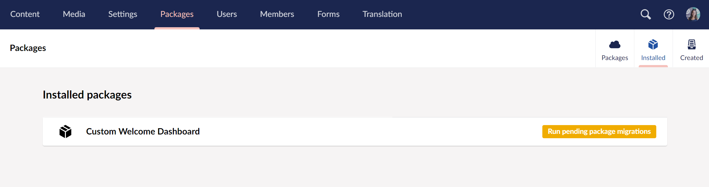

# Creating a Package

This tutorial demonstrates how to create a package in Umbraco. The process described is based on creating a package from the dashboard in the [Creating a Custom Dashboard Tutorial](../../tutorials/creating-a-custom-dashboard/). The same approach can be applied to other packages as well.

## Creating a Package Schema in the Backoffice

To begin creating a package, start by setting up a package schema in the Umbraco backoffice:

1. Navigate to the `Packages` section.
2. Select `Created` in the top-right corner of the screen.
3. Click the `Create package` button.


On the `Create package` page, there are different fields that allow you to define the contents of the package based on backoffice items.

4. Enter the Package Name at the top. For this tutorial, name the package `Custom Welcome Dashboard` matching the name used in the [Creating a Custom Dashboard Tutorial](../../tutorials/creating-a-custom-dashboard/).
5. Fill in the required fields. For more information, see the [Package Content Section](creating-a-package.md#package-content-section).
6. Click `Create` to generate the package schema.
7. Click `Download` to download the package and inspect its contents.

### Package Content section

These fields determine which backoffice items will be included in the package. For this example, the following settings are used:

| Property       | Value   | Note                                                                                                                                                                          |
| -------------- | ------- | ----------------------------------------------------------------------------------------------------------------------------------------------------------------------------- |
| Content        | _Empty_ | Here, you can include content. For example, if you want to create a starter kit. Not relevant for this package though.                                                        |
| Media          | _Empty_ | Here, you can include media. For example, if you want to add media to the starter kit. Not relevant for this package though.                                                  |
| Document Types | _Empty_ | Similar to the Content picker above. If you include content, you will also need to pick all its dependencies in this and the next steps for them to be packaged together.     |
| Media Types    | _Empty_ | Similar to the Media picker above. If you include media, you will also need to pick all its dependencies in this and the next steps for them to be packaged together.         |
| Languages      | _Empty_ | See `Document Types` above. All text is hardcoded or within the lang folder in this package, so this is not needed.                                                           |
| Dictionary     | _Empty_ | See `Document Types` above                                                                                                                                                    |
| Data Types     | _Empty_ | See `Document Types` above                                                                                                                                                    |
| Templates      | _Empty_ | See `Document Types` above                                                                                                                                                    |
| Stylesheets    | _Empty_ | These will come from the **wwwroot/css** folder. If you have stylesheets you want to include from other locations (_like App\_Plugins folder_) you can do so at a later step. |
| Scripts        | _Empty_ | These will come from the **wwwroot/scripts** folder. If you have scripts you want to include from other locations (_like App\_Plugins folder_) you can do so at a later step. |
| Partial Views  | _Empty_ | See `Document Types` above                                                                                                                                                    |

## Inspecting the Package ZIP

If the package includes backoffice-specific items, the downloaded ZIP will contain the `package.xml` along with a folder for any media items included. The contents of the ZIP package might look like this:


The `package.xml` file contains the metadata for the package, while additional files (if any) are referenced within the XML.

Below is an example of the `package.xml` file:

```xml
<?xml version="1.0" encoding="utf-8"?>
<umbPackage>
  <info>
    <package>
      <name>Custom Welcome Dashboard</name>
    </package>
  </info>
  <DocumentTypes />
  <MediaTypes />
  <Templates />
  <Stylesheets />
  <Scripts />
  <PartialViews />
  <DictionaryItems />
  <Languages />
  <DataTypes />
  <MediaItems />
</umbPackage>
```

This XML file contains package metadata, and references where Umbraco should place the files upon installation.

Since this example package does not include backoffice items, only the package name appears, with other tags left empty.

## Creating a NuGet package

NuGet packages are the preferred method for distributing Umbraco extensions. NuGet enables better practices for source control and deployment. This section outlines how to create a NuGet package for the custom dashboard that extends Umbraco’s functionality.

NuGet is the standard package manager for .NET. More details on NuGet can be found in the [Microsoft Documentation](https://docs.microsoft.com/en-us/nuget/what-is-nuget).

### Generate an Empty Package Using a Template

1. Install the latest [.NET SDK](https://dotnet.microsoft.com/download).
2. Run `dotnet new install Umbraco.Templates` to install the project templates.
3. Run `dotnet new umbraco-extension -n CustomWelcomeDashboard` to create a new package project.


If the post-installation script fails due to PowerShell restrictions, manually run `npm install` and `npm run build` in the `Client` folder.


This command will generate the following files:


Apart from the project file, the generated structure includes key folders and files that are essential for building an Umbraco extension.

* **Client** - where you can place any front-end assets, such as JavaScript, CSS, and Angular views, that will be used in the backoffice.
* **Composers** - intended for C# composer classes, which are used to register dependencies and configure services in Umbraco.
* **Controllers** - where you can add API controllers if your package requires custom endpoints.
* **Constants.cs** - serves as a placeholder for any global constants your package may need.

Unlike previous versions, the `umbraco-extension` template does not generate a `package.manifest` file or an `App_Plugins` folder by default. If your package includes client-side assets for the backoffice, you will need to manually create an `App_Plugins/{YourPackageName}` folder.

Additionally, the `.csproj` file is configured to support NuGet packaging, allowing you to distribute your extension. If you plan to include custom C# logic, the files you place in the root folder will be compiled into the package DLL.

### Transfer Files

Since the `umbraco-extension` template does not generate an `App_Plugins` folder by default, you will need to manually create it.

1. Create an `App_Plugins` folder in the downloaded package folder.
2. Go to the `welcome-dashboard` folder created in the [Creating a Custom Dashboard Tutorial](../../tutorials/creating-a-custom-dashboard/#setting-up-a-package).
3. Transfer or copy the `welcome-dashboard` folder in the `App_Plugins` folder.


### Specify Package Properties

You can specify package metadata directly in the `csproj` file. Here, is an example of some package properties:

```xml
<Project Sdk="Microsoft.NET.Sdk">
    <PropertyGroup>
        . . .
        <Title>CustomWelcomeDashboard</Title>
        <Description>Custom welcome dashboard for Umbraco.</Description>
        <PackageTags>umbraco plugin package</PackageTags>
        <Version>1.0.0</Version>
        <Authors>Your Name</Authors>
        <PackageProjectUrl>https://umbraco.com</PackageProjectUrl>
        <PackageLicenseExpression>MIT</PackageLicenseExpression>
    </PropertyGroup>
    . . .
</Project>
```

Alternatively, right-click the `csproj` file in Visual Studio > **Properties** > **Package** and add the required information:


The properties that can be specified include:

| Property                 | Value               | Note                                                                                                                                                                                                        |
| ------------------------ | ------------------- | ----------------------------------------------------------------------------------------------------------------------------------------------------------------------------------------------------------- |
| Version                  | 1.0.0               | This is automatically set to 1.0.0 but can be changed as appropriate.                                                                                                                                       |
| Authors                  | Your name           | Here you get to take credit for your awesome work!                                                                                                                                                          |
| PackageProjectUrl        | https://umbraco.com | This URL will be shown as the package's URL when others install it. It will likely be a GitHub repository, or similar.                                                                                      |
| PackageLicenseExpression | MIT                 | The license is set to MIT. Please consider how you want your package licensed. If in doubt when deciding an open-source license there are [good resources available](https://choosealicense.com/licenses/). |

### Pack the Package

To create the actual NuGet package, use the `dotnet pack` command. You can either output the package to the default `bin` folder or specify a custom location.

#### Default Output

Run the command in the package directory to generate the package in the `bin` folder:

```sh
dotnet pack
```


#### Custom Output Location

To specify a different output location, use the following command:

```sh
dotnet pack --output MyNugetPackages
```


It will pack the project in the current directory and place the resulting package into the `MyNugetPackages` folder.

### Publish the Package

To share the package with others, publish it to a public NuGet repository, such as [https://nuget.org](https://nuget.org).

The official [NuGet Documentation](https://docs.microsoft.com/en-us/nuget/nuget-org/publish-a-package) provides a detailed guide on how to publish a package to NuGet.org.

To release packages to only a limited audience, see the [Hosting your own NuGet feeds](https://docs.microsoft.com/en-us/nuget/hosting-packages/overview) documentation.

For Umbraco-specific packages, refer to the [Listing Your Package](https://docs.umbraco.com/umbraco-dxp/marketplace/listing-your-package) guide to feature your package on the Umbraco Marketplace.

## Installing a NuGet Package

To install the NuGet package, you can use Visual Studio, Rider, or the CLI.

In the CLI, create a new Umbraco project and add the package reference:

```cs
dotnet new umbraco -n CustomWelcomeDashboardProject
cd CustomWelcomeDashboardProject
dotnet add package CustomWelcomeDashboard.1.0.0
dotnet run
```

You can check that the NuGet package was referenced in your solution and that the **App\_Plugins** assets were restored successfully. The custom dashboard should now be available in the Umbraco backoffice.

For testing the package locally without publishing, use the `-p` flag to create a project that depends on the package. So when you build the new project, it will copy the **App\_Plugins** folder from the package project into the test project.

```cs
dotnet new umbraco -n CustomWelcomeDashboardProject -p CustomWelcomeDashboard
```

Go to the `CustomWelcomeDashboardProject` directory, build your Umbraco website using the `dotnet build` command, and then run the application.

### Package Migration

Umbraco supports automatic and custom package migrations to handle content updates when a package is installed.

#### Automatic Package Migration

For schema and content packages, inherit from the `AutomaticPackageMigrationPlan` and specify the package name that is displayed under the packages _Installed_ tab in the backoffice. You will also need to embed the schema file in the same namespace.

```csharp
using Umbraco.Cms.Infrastructure.Packaging;

namespace CustomWelcomeDashboardProject.Migrations;

public class PackageMigrationPlan : AutomaticPackageMigrationPlan
{
    public PackageMigrationPlan() : base("Custom Welcome Dashboard")
    {
    }
}
```



Whenever the embedded package.xml file changes, the automatic package migration plan is executed again. This is due to the fact that the migration state is based on the file hash. Existing schema or content will not be overwritten in this process.


#### Custom Package Migration

Instead of creating an automatic package migration plan, we will inherit from the `PackageMigrationPlan` and again specify the name of the package in the base constructor. Further on, we will define the plan using a unique GUID - in the example below we have a single migration called `MyCustomMigration`.

```csharp
using Umbraco.Cms.Core.Packaging;

namespace CustomWelcomeDashboardProject.Migrations;

public class CustomPackageMigrationPlan : PackageMigrationPlan
{
    public CustomPackageMigrationPlan() : base("Custom Welcome Dashboard")
    {
    }

    protected override void DefinePlan()
    {
        To<CustomPackageMigration>(new Guid("4FD681BE-E27E-4688-922B-29EDCDCB8A49"));
    }
}
```

The custom migrations can inherit from `PackageMigrationBase` where we can use helper methods to pick up the schema. But we can also use the regular `MigrationBase` class.

```csharp
using Microsoft.Extensions.Options;
using Umbraco.Cms.Core.Configuration.Models;
using Umbraco.Cms.Core.IO;
using Umbraco.Cms.Core.PropertyEditors;
using Umbraco.Cms.Core.Services;
using Umbraco.Cms.Core.Strings;
using Umbraco.Cms.Infrastructure.Migrations;
using Umbraco.Cms.Infrastructure.Packaging;

namespace CustomWelcomeDashboardProject.Migrations;

public class CustomPackageMigration : PackageMigrationBase
{
    public CustomPackageMigration(
        IPackagingService packagingService,
        IMediaService mediaService,
        MediaFileManager mediaFileManager,
        MediaUrlGeneratorCollection mediaUrlGenerators,
        IShortStringHelper shortStringHelper,
        IContentTypeBaseServiceProvider contentTypeBaseServiceProvider,
        IMigrationContext context,
        IOptions<PackageMigrationSettings> packageMigrationsSettings)
        : base(
            packagingService,
            mediaService,
            mediaFileManager,
            mediaUrlGenerators,
            shortStringHelper,
            contentTypeBaseServiceProvider,
            context,
            packageMigrationsSettings)
    {
    }

    protected override void Migrate()
    {
        ImportPackage.FromEmbeddedResource<CustomPackageMigration>().Do();
    }
}
```

If your migration step has a requirement for asynchronous work, you can also inherit from `AsyncPackageMigrationBase`:

```csharp
using Microsoft.Extensions.Options;
using Umbraco.Cms.Core.Configuration.Models;
using Umbraco.Cms.Core.IO;
using Umbraco.Cms.Core.Models.Membership;
using Umbraco.Cms.Core.PropertyEditors;
using Umbraco.Cms.Core.Services;
using Umbraco.Cms.Core.Strings;
using Umbraco.Cms.Infrastructure.Migrations;
using Umbraco.Cms.Infrastructure.Packaging;

namespace Umbraco.Cms.Web.UI.Custom.PackageMigration;

public class CustomPackageAsyncMigration : AsyncPackageMigrationBase
{

    public TestMigrationStep2(
        IPackagingService packagingService,
        IMediaService mediaService,
        MediaFileManager mediaFileManager,
        MediaUrlGeneratorCollection mediaUrlGenerators,
        IShortStringHelper shortStringHelper,
        IContentTypeBaseServiceProvider contentTypeBaseServiceProvider,
        IMigrationContext context,
        IOptions<PackageMigrationSettings> packageMigrationsSettings,
        IUserGroupService userGroupService,
        IUserService userService)
        : base(
              packagingService,
              mediaService,
              mediaFileManager,
              mediaUrlGenerators,
              shortStringHelper,
              contentTypeBaseServiceProvider,
              context,
              packageMigrationsSettings)
    {
    }

    protected override async Task MigrateAsync()
    {
        // Use await for asynchronous work.
    }
}
```

Here we also added the ZIP file as an embedded resource to the package project.


Whichever migration plan you choose to create, you will be able to see that your package has been installed after the migration is completed.


When using a custom package migration plan, the current state is ignored by default. This causes it to execute all migrations again whenever this isn't the same as the final state of the plan (e.g. if you added a new migration). This is due to the `IgnoreCurrentState` being set to `true` in the `PackageMigrationPlan` base class. You can override this property and set it to `false` again to make it behave like regular migration plans and only run the migrations that have not yet been executed on the current environment.

### Attended/Unattended migration execution

After creating a migration plan, the content and schema will automatically be imported either during unattended package migration or from the Packages section in the backoffice.

By default, all these package migrations are executed unattended during startup but the solution owners can disable this in the configuration. IntelliSense can help, as well as provide further information about the `PackageMigrationsUnattended` setting. Then in the Packages section, there will be an option to run the package migration for each package individually when the `PackageMigrationsUnattended` is set to `false`.

```json
  "Umbraco": {
    "CMS": {
      . . .
      "Unattended": {
        "PackageMigrationsUnattended": false
      }
    }
  }
```



The configuration of package migrations can be different for each environment and makes it possible to have the migration executed unattended on the development environment, but leave them out or manually execute them on other environments. This is useful when you use a tool like Umbraco Deploy or USync as these will migrate the content.
