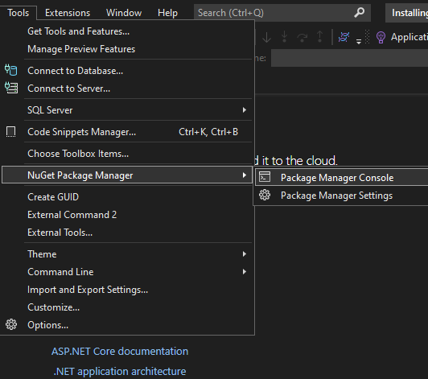
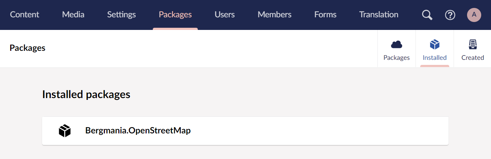

# Installing and Uninstalling Packages

This article will cover the process of installing as well as uninstalling packages from your Umbraco CMS website.

## Installing packages

In the Umbraco Backoffice, you will find a **Packages** section that displays the [Umbraco Marketplace](https://marketplace.umbraco.com/). From here you can browse all community-made as well as official Umbraco packages for the Umbraco CMS.

Navigating to a specific package in the section will present you with an overview of the package, as well as an install snippet for NuGet CLI.

The packages can be installed by using:

* **NuGet Package Manager** in Visual Studio
* **Package Manager Console** in Visual Studio
* .NET CLI (usually accessible from the terminal/command prompt of your system)

For example, to install the StarterKit package for the Umbraco CMS the command would be:

`dotnet add package Umbraco.TheStarterKit`

Navigating to the NuGet Package Manager in Visual Studio is more visual, and gives you an overview of already installed packages.

The Package Manager has an integrated search function that allows you to find any public NuGet package and install it on the project.

Once the package has been installed, it will show up under the **Packages** section in the backoffice, under **Installed** tab.

.png>)

## Uninstalling packages

Uninstalling packages is not always as straightforward as installing them.

In this section, we will provide two examples of uninstalling a package - the StarterKit package and the SEOChecker package.

### Uninstalling packages like the StarterKit


Keep in mind that this particular guide targets a specific package. There are many packages out there, and each one is different. The exact steps presented here might not work the exact same way for all the packages, though the general approach should still apply.


The Starter Kit provides you with a boilerplate website solution to build upon. The package installs Document Types, Templates, media, content, and everything else needed to set up a small website. There is little custom code/functionality involved which is usually the case for such starter kit or sample-site packages.

To uninstall a package, either run a command or use the NuGet Package Manager in Visual Studio.

`dotnet remove package Umbraco.TheStarterKit`

It is recommended to clean the solution after removing any package. This can be done by right-clicking the project in Visual Studio and choosing the _Clean_ option, or using the `dotnet clean` command.

#### Removing package leftovers from the backoffice

With packages like the StarterKit, the process does not end there. While the package is gone, content - and everything else needed for the website - is still available in the backoffice. To fully remove this kind of package, additional steps are needed.

Remove content provided by the package

There is no universal way to tell what content comes from a package, and what content is custom-made. In the Content section, delete individual nodes accordingly. If the goal is to fully remove the package and clean the site, all the content can be removed (and the recycle bin emptied).

Remove media provided by the package

Similar to content, media also might have to be removed.

Remove Document Types

Document Types can be removed from the **Settings** section. If fully removing the package, all Document Types can be deleted, as there are no default Document Types in a clean-slate Umbraco installation.

Removing Data Types

As opposed to Document Types, there are some Data Types that are available out of the box when Umbraco is installed. It is not recommended to remove them. The safe approach is to delete any item that starts with a Document Type prefix and includes multiple dashes. That is the default naming convention for new configurations of Data Types (Example: "Blog - How many posts should be shown - Slider")

Removing Templates

No Templates are available out of the box in a new installation. If cleaning up after a package, it would be okay to delete all that are present

Removing Partial Views

Out of the box, there are a few views available in the `blocklist` and `grid` folders. Everything else can theoretically be removed.

Cleaning leftover files on disk

Some packages might reference other items. For example, installing the StarterKit also adds `Bergmania.OpenStreetMap` to your project. That component will show up as installed in the backoffice even after uninstalling the NuGet package.

In many cases, custom dashboards, editors, and scripts are left in the `App_Plugins` folder after a package has been uninstalled via NuGet. These files also have to be deleted manually.

### Uninstalling packages like the SEOChecker


Keep in mind that this particular guide targets a specific package. There are many packages out there, and each one is different. The exact steps presented here might not work the exact same way for all the packages, though the general approach should still apply.


More advanced packages that add functionality on top of Umbraco, usually rely on providing custom, compiled code. That being said, many of such packages also implement custom Sections, Dashboards, editors, and views.

In this example, we will be using the SEOChecker package. This package allows developers of the site to add custom properties to Document Types used to track search engine optimization practices.

An example use case of the SEOChecker property on a Document Type, as presented in the Content section:

.png>)

To uninstall the SEOChecker from a website, the first step is to remove the package via a `dotnet` command or use the NuGet Package Manager.

The following command can be used for uninstalling the package:

`dotnet remove package SEOChecker`

After that, cleaning the solution is recommended.

Cleaning leftover files on disk

While uninstalling the package would remove most of the custom code, the `App_Plugins` folder has to be cleaned manually.

Removing _seochecker_ folder from `App_Plugins` will clean up the leftover backoffice section and dashboards.

## Consequences of removing packages

If content on the website relies on having a custom Property Editor or a data source installed, those properties will default to a `label` Data Type. All previously saved content in the property will in turn be converted to a string.

In the case of the SEOChecker, the custom property added from the package would look like this after all the package files have been removed:

.png>)

Depending on the packages and the implementation, rendering of content from custom editors, or any frontend functionality dependent on external code, might not work correctly. It is always recommended to inspect the frontend of the site after removing any packages.
