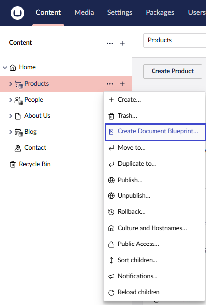
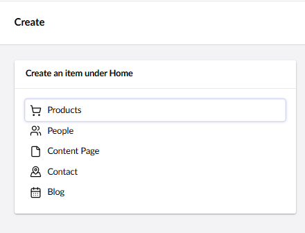

# Document Blueprints


Document Blueprints were previously called Content Templates.


## Document Blueprints Overview

A Document Blueprint allows editors to preconfigure a content node. It serves as a reusable starting point when creating new content.

### Method 1 – Create a Document Blueprint from the Content Section


Before using this method, make sure you have already [created some content](../data/defining-content/#3-creating-the-content).


1. Go to the **Content** section and select an existing content node.

2. Click the **...** menu next to the node and choose **Create Document Blueprint**.

3. Enter a **Name** for the new blueprint.

4. Click **Save**.

The new blueprint will appear under the **Document Blueprints** folder in the **Settings** section.


If you don’t see the new blueprint, try refreshing your browser.


### Method 2 – Create a Document Blueprint from the Settings Section

1. Go to the **Settings** section.
2. Click the **...** menu next to the **Document Blueprints** tree.
3. Select **Create...**.

4. Choose the Document Type you want to base the blueprint on.


You can only create Document Blueprints from **Document Types** or **Document Types with Templates**.


5. Enter a **Name** for the blueprint.
6. Click **Save**.

The new blueprint will appear under the **Document Blueprints** folder in the **Settings** section.

### Edit a Document Blueprint

To edit an existing document blueprint, follow these steps:

1. Go to the **Settings** section.
2. Open the **Document Blueprints** folder.
3. Select the blueprint you want to edit.
4. Make your changes.
5. Click **Save**.

### Use a Document Blueprint

Once you have created a document blueprint, you can use it to create new content nodes.

To use a document blueprint, follow these steps:

1. Go to the **Content** section.
2. Click the **...** menu next to the root node and select **Create**.

3. Select the **Document Type** that has an associated blueprint.

4. Choose how to create the new content:
   * Use the Document Blueprint
   * Start with a blank node

