# Block Grid

`Schema Alias: Umbraco.BlockGrid`

`UI Alias: Umb.PropertyEditorUi.BlockGrid`

`Returns: BlockGridModel`

The **Block Grid** property editor enables editors to layout their content in the Umbraco backoffice. The content is made of Blocks that can contain different types of data.

## Configuring the Block Grid

The Block Grid property editor is configured via the **Data Types** backoffice interface.

To set up the Block Grid property editor, follow these steps:

1. Navigate to the **Settings** section in the Umbraco backoffice.
2. Click **...** next to the **Data Types** folder.
3. Select **Create** -> **New Data Type**.
4. Select **Block Grid** from the list of available property editors.

You will see the configuration options for adding Block Types to the Grid as shown below.

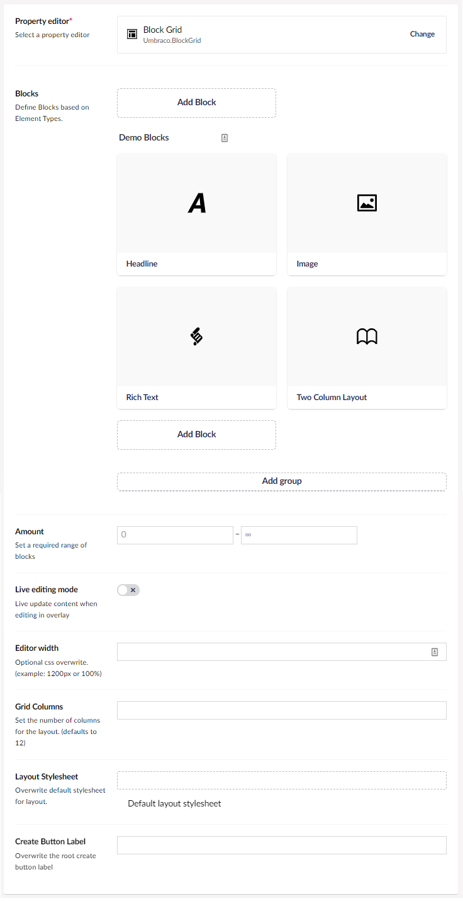

You will also see the following additional configuration options.


The Data Type editor allows you to configure the following properties:

* **Blocks** - Defines the Block Types available for use in the property. For more information, see [Setup Block Types](block-grid-editor.md#setup-block-types). Blocks can also be grouped. This is then visible to editors in the Block Catalogue when populating content, and can also be used to allow a group of Blocks in an Area.
* **Amount** - Sets the minimum and/or the maximum number of Blocks that should be allowed at the root of the layout.
* **Live editing mode** - Enabling this option will allow you to see the changes as you are editing them.
* **Editor width** - Overwrites the width of the property editor. This field takes any valid CSS value for "max-width". For example: 100% or 800px.
* **Create Button Label** - Overwrites the label on the Create button.
* **Grid Columns** - Define the number of columns in your Block Grid. The default is 12 columns.
* **Layout Stylesheet** - Replaces the built-in Layout Stylesheet. Additionally, you can retrieve the default layout stylesheet to use as a base for your own inspiration or for writing your own stylesheet.

## Setup Block Types

Block Types are based on [**Element Types**](../../../../data/defining-content/default-document-types.md#element-type). These can be created beforehand or while setting up your Block Types.

Once you have added an Element Type as a Block Type on your Block Grid Data Type you have the option to configure it.

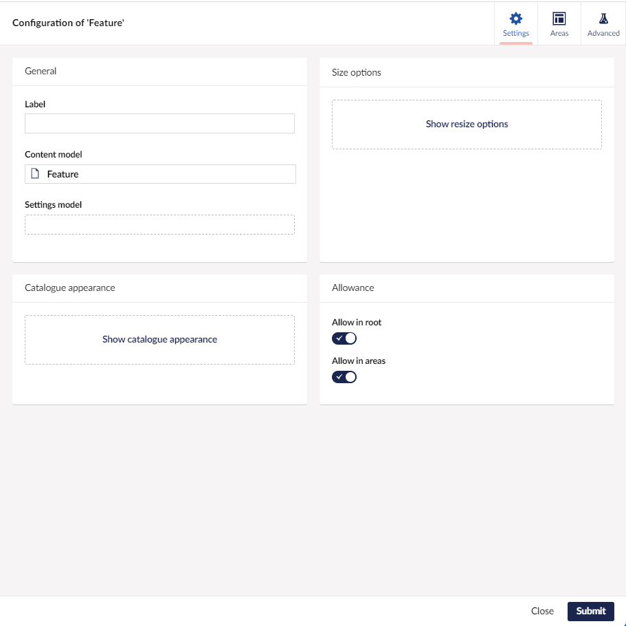

## Block Configuration Settings

Each Block has a set of properties that are optional to configure. These are described below.

### General

Customize the user experience for your content editors when they work with the Blocks in the Content section.

* **Label** - Defines a label for the appearance of the Block in the editor. The label can use [Umbraco Flavoured Markdown](../../../../../reference/umbraco-flavored-markdown.md) to display values of properties. The label is also used for search in the **Add Block** dialog during content editing. If no label is defined, the block will not be searchable. The search does not fall back to the block’s name.
* **Content model** - Presents the Element Type used as model for the Content section of this Block. This cannot be changed but you can open the Element Type to perform edits or view the properties available. Useful when writing your Label.
* **Settings model** - Adds a Settings section to your Block based on a given Element Type. When selected you can open the Element Type or choose to remove the Settings section again.

### Permissions

* **Allow in root** - Determines whether the Block can be created at the root of your layout. Turn this off if you only want a Block to appear within Block Areas.
* **Allow in areas** - Determines whether the Block can be created inside Areas of other Blocks. If this is turned off it can still be allowed in Block Areas by defining specific allowed Blocks.

### Size options

Customize the Blocks size in the Grid. If you define multiple options, the Block becomes scalable.

By default, a Block takes up the available width.

A Block can be resized in two ways:

1. When a Block is placed in an Area, it will fit to the Areas width. Learn more about [Areas](block-grid-editor.md#areas).
2. A Block can have one or more Column Span options defined.

A Column Span option is used to define the width of a Block. With multiple Column Span options defined, the Content Editor can scale the Block to fit specific needs.

Additionally, Blocks can be configured to span rows, this enables one Block to be placed next to a few rows containing other Blocks.

* **Available column spans** - Defines one or more columns, the Block spans across. For example: in a 12 columns grid, 6 columns is equivalent to half width. By enabling 6 columns and 12 columns, the Block can be scaled to either half width or full width.
* **Available row spans** - Defines the amount of rows the Block spans across.

See the [scaling blocks](block-grid-editor.md#scaling-blocks) section of this article for an example of how scaling works.

## Areas

Blocks can nest other Blocks to support specific compositions. These compositions can be used as a layout for other Blocks.

To achieve nesting, a Block must have one or more Areas defined. Each Area can contain one or more Blocks.

Each Area has a size, defined by column and rows spans. The grid for the Areas are based on the same amount of columns as your root grid, unless you choose to change it.

To scale an Area, click and drag the scale-button in the bottom-right corner of an Area.

* **Grid Columns for Areas** - Overwrites the amount of columns used for the Area grid.
* **Areas** - Determines whether the Block can be created inside Areas of other Blocks.

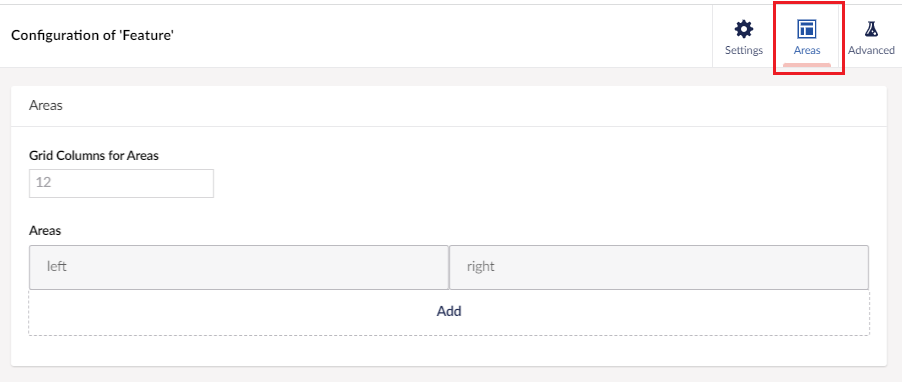

### Area configuration

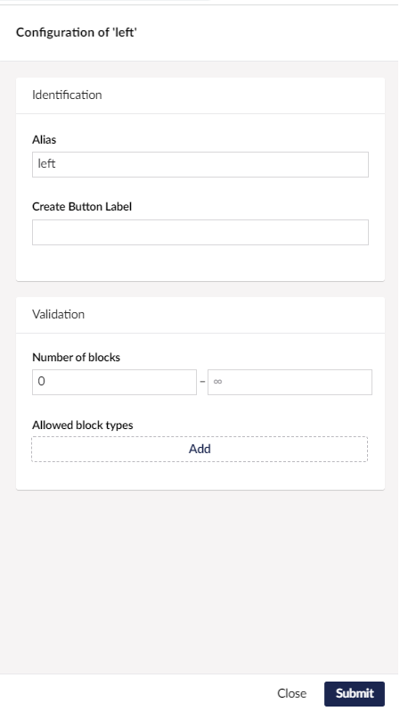

* **Alias** - The alias is used to identify this Area. It is being printed by `GetBlockGridHTML()` and used as name for the Area slot in Custom Views. The alias is also available for CSS Selectors to target the HTML-Element representing an Area.
* **Create Button Label** - Overwrites the Create Button Label of the Area.
* **Number of blocks** - Determines the total number of Blocks in an Area.
* **Allowed block types** - When this is empty, all Blocks with Permissions for creation in Areas, will be available. This can be overwritten by specifying the allowed Blocks. Define the types of Blocks or Groups of Blocks that are allowed. Additionally, you can also set how many Blocks of each type/group should be present.

When allowing a Group of Blocks, you might want to require a specific amount for a certain Block of that Group. This can be done by adding that Block Type to the list as well, and setting the requirements accordingly.

## Advanced

Advanced properties are also available for each Block, as shown below.


### Advanced

* **Overlay editor size** - Sets the size for the Content editor overlay for editing this block.
* **Inline editing mode** - Enabling this will change editing experience to inline, meaning that editing the data of blocks happens at sight as accordions.
* **Hide content editor** - Hides the UI for editing the content in a Block Editor. This is only relevant if you made a custom view that provides the UI for editing of content.

### Custom View

* **Custom view** - Overwrites the view for the block presentation in the Content editor. Building Custom Views for Block representations in Backoffice is the same for all Block Editors. [Read about building a Custom View for Blocks here](../../../../../customizing/extending-overview/extension-types/block-custom-view.md)

### Catalogue appearance

These properties refer to how the Block is presented in the Block catalogue, when editors choose which Blocks to use for their content.

* **Background color** - Define a background color to be displayed beneath the icon or thumbnail. Eg. `#424242`.
* **Icon color** - Change the color of the Element Type icon. Eg. `#242424`.
* **Thumbnail** - Pick an image or SVG file to replace the icon of this Block in the catalogue.

The thumbnails for the catalogue are displayed at a maximum height of 150px and will scale proportionally to maintain their original aspect ratio. Any standard image format (PNG, JPG, SVG) will work effectively.


Configuring the catalogue appearance improves the content editor experience. A well-designed block catalogue with colors and thumbnails makes it easier for editors to quickly identify and select the right blocks for their content.


## Editing Blocks

When viewing a **Block Grid** property editor in the **Content** section for the first time, you will be presented with the option to **Add content**.

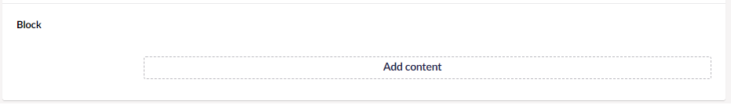

Clicking the **Add content** button opens up the **Block Catalogue**.

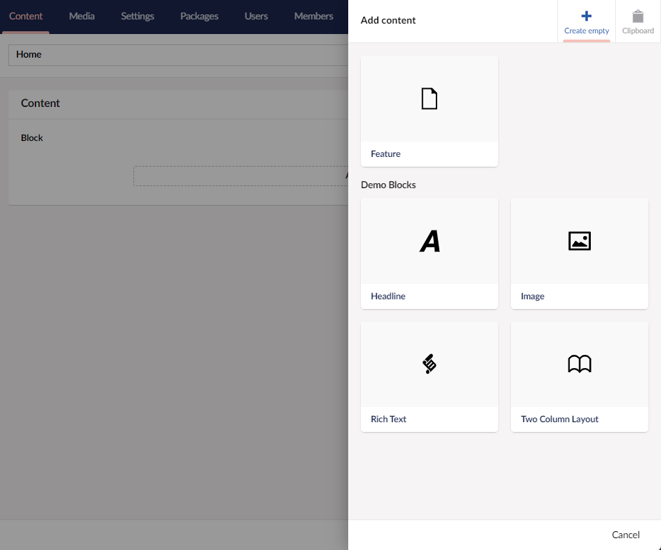

The Block Catalogue looks different depending on the amount of available Blocks and their catalogue appearance.

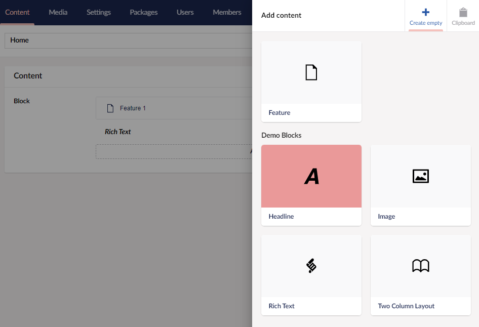

Click the Block Type you wish to create and a new Block will appear in the layout.

More Blocks can be added to the layout by clicking the Add content button. Alternatively, use the Add content button that appears on hover to add new Blocks between, besides, or above the existing Blocks.

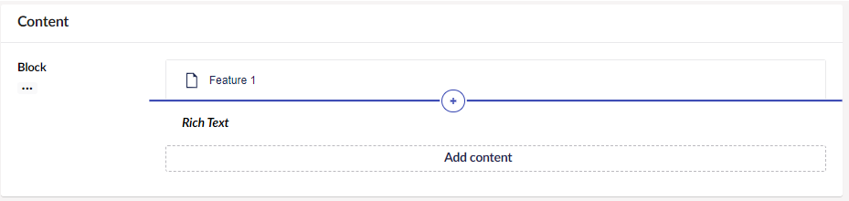

To delete a Block, click the trash icon which appears on the mouse hover.

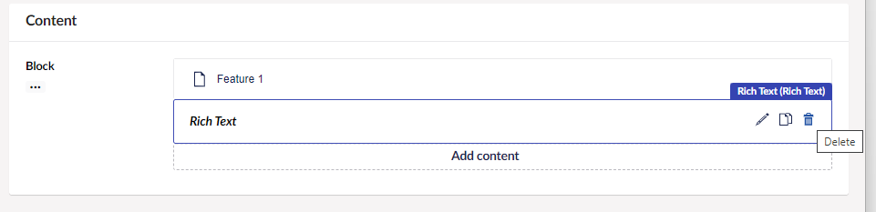

## Sorting Blocks

Blocks can be rearranged using the click and drag feature. Move them up or down to place them in the desired order.

Moving a Block from one Area to another is done in the same way. If a Block is not allowed in the given position, the area will display a red color and not allow the new position.

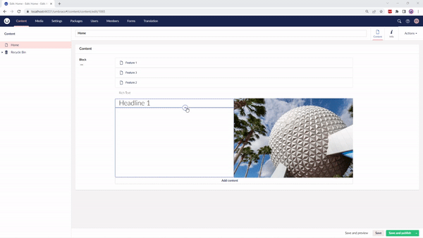

## Scaling Blocks

If a Block has multiple size options it can be scaled via the UI. This appears in the bottom left corner of the Block.

The Block is resized using a click-and-drag feature. Moving the mouse will change the size to the size options closest to the mouse pointer.

<figure><figcaption><p>Scale blocks in the grid by dragging from the bottom-right corner.</p></figcaption></figure>

## Rendering Block Grid Content

Rendering the stored value of your **Block Grid** property editor can be done in two ways:

1. [Default rendering](#1-default-rendering)
2. [Build your own rendering](#2-build-custom-rendering)

### 1. Default rendering

You can choose to use the built-in rendering mechanism for rendering Blocks using a Partial View for each block.

The default rendering method is named `GetBlockGridHtmlAsync()` and comes with a few options - for example:

```csharp
@await Html.GetBlockGridHtmlAsync(Model, "myGrid")
```

In the sample above `"myGrid"` is the alias of the Block Grid editor.

If you are using ModelsBuilder, the example will look like this:

```csharp
@await Html.GetBlockGridHtmlAsync(Model.MyGrid)
```

To use the `GetBlockGridHtmlAsync()` method, you will need to create a Partial View for each Block Type. The Partial View must be named using the alias of the Element Type that is being used as Content Model for the Block Type.

These Partial View files need to go into the `Views/Partials/blockgrid/Components/` folder.

Example: `Views/Partials/blockgrid/Components/MyElementTypeAliasOfContent.cshtml`.

The Partial Views will receive a model of type `Umbraco.Cms.Core.Models.Blocks.BlockGridItem`. This model contains `Content` and `Settings` from your block, as well as the configured `RowSpan`, `ColumnSpan`, and `Areas` of the Block.

#### Rendering the Block Areas

The Partial View for the Block is responsible for rendering its own Block Areas. This is done using another built-in rendering mechanism:

```csharp
@await Html.GetBlockGridItemAreasHtmlAsync(Model)
```

Here you will need to create a Partial View for each Block Type within the Block Area. For the name, use the alias of the Element Type that is being used as Content Model for the Block Type.

These Partial Views must be placed in the same folder as before, (`Views/Partials/blockgrid/Components/`), and will receive a model of type `Umbraco.Cms.Core.Models.Blocks.BlockGridItem`.

#### Putting it all together

The following is an example of a Partial View for a Block Type of type `MyElementTypeAliasOfContent`.


```csharp
@inherits Umbraco.Cms.Web.Common.Views.UmbracoViewPage<Umbraco.Cms.Core.Models.Blocks.BlockGridItem>;

@* Render the value of field with alias 'heading' from the Element Type selected as Content section *@
<h1>@Model.Content.Value("heading")</h1>

@* Render the block areas *@
@await Html.GetBlockGridItemAreasHtmlAsync(Model)
```


If you are using ModelsBuilder, you can make the property rendering strongly typed by letting your view accept a model of type `BlockGridItem<T>`. For example:


```csharp
@inherits Umbraco.Cms.Web.Common.Views.UmbracoViewPage<Umbraco.Cms.Core.Models.Blocks.BlockGridItem<ContentModels.MyElementTypeAliasOfContent>>;
@using ContentModels = Umbraco.Cms.Web.Common.PublishedModels;

@* Render the Heading property from the Element Type selected as Content section *@
<h1>@Model.Content.Heading</h1>

@* Render the block areas *@
@await Html.GetBlockGridItemAreasHtmlAsync(Model)
```


#### Stylesheet

Using the default rendering together with your layout stylesheet will provide what you need for rendering the layout.

To use the Default Layout Stylesheet, copy the stylesheet to your frontend. You can download the default layout stylesheet from the link within the DataType, we recommend putting the file in the `css` folder, example: `wwwroot/css/umbraco-blockgridlayout.css`.

```csharp
<link rel="stylesheet" href="@Url.Content("~/css/blockgridlayout.css")" />
```


A set of built-in Partial Views are responsible for rendering the Blocks and Areas in a Block Grid. If you want to tweak or change the way the Block Grid is rendered, you can use the built-in Partial Views as a template:

1. Clone the views from [GitHub](https://github.com/umbraco/Umbraco-CMS/tree/main/src/Umbraco.Web.UI/Views/Partials/blockgrid). They can be found in `src/Umbraco.Web.UI/Views/Partials/blockgrid` .
2. Copy the cloned views to the local folder `Views/Partials/blockgrid/` .
3. Make changes to your copied views. The entry point for `GetBlockGridHtmlAsync()` is the view `default.cshtml` .


### 2. Build custom rendering

The built-in value converter for the Block Grid property editor lets you use the block data as you like. Call the `Value<T>` method with a type of `BlockGridModel` to have the stored value returned as a `BlockGridModel` instance.

`BlockGridModel` contains the Block Grid configuration (like the number of columns as `GridColumns`) whilst also being an implementation of `IEnumerable<BlockGridItem>` (see details for `BlockGridItem` above).

The following example mimics the built-in rendering mechanism for rendering Blocks using Partial Views:


```csharp
@inherits Umbraco.Cms.Web.Common.Views.UmbracoViewPage
@using Umbraco.Cms.Core.Models.Blocks
@{
    var grid = Model.Value<BlockGridModel>("myGrid");

    // get the number of columns defined for the grid
    var gridColumns = grid.GridColumns;

    // iterate the block items
    foreach (var item in grid)
    {
        var content = item.Content;

        @await Html.PartialAsync("PathToMyFolderOfPartialViews/" + content.ContentType.Alias, item);
    }
}
```


If you do not want to use Partial Views, you can access the block item data directly within your rendering:


```csharp
@inherits Umbraco.Cms.Web.Common.Views.UmbracoViewPage
@using Umbraco.Cms.Core.Models.Blocks
@{
    var grid = Model.Value<BlockGridModel>("myGrid");

    // get the number of columns defined for the grid
    var gridColumns = grid.GridColumns;

    // iterate the block items
    foreach (var item in grid)
    {
        // get the content and settings of the block
        var content = item.Content;
        var settings = item.Settings;
        // get the areas of the block
        var areas = item.Areas;
        // get the dimensions of the block
        var rowSpan = item.RowSpan;
        var columnSpan = item.ColumnSpan;

        // render the block data
        <div style="background-color: #@(settings.Value<string>("color"))">
            <h2>@(content.Value<string>("title"))</h2>
            <span>This block is supposed to span <b>@rowSpan rows</b> and <b>@columnSpan columns</b></span>
        </div>
    }
}
```


## Using Block Grid with the Delivery API

When using Block Grid in a headless scenario with the [Content Delivery API](../../../../../reference/content-delivery-api/README.md), the property outputs a structured JSON representation instead of rendered HTML.

The JSON structure includes:

* `gridColumns` - The number of columns configured for the grid (typically 12)
* `items` - An array of block items, each containing:
  * `content` - The block's content data
  * `settings` - The block's settings data (if configured)
  * `rowSpan` and `columnSpan` - Layout dimensions for the block
  * `areaGridColumns` - Number of columns for nested areas
  * `areas` - Array of nested areas within the block, each containing their own items

Your frontend application is responsible for:

* Parsing the grid layout structure
* Implementing CSS Grid or an equivalent layout system
* Rendering blocks recursively to handle nested areas
* Handling responsive behavior

For detailed information about the JSON structure and property expansion options, see [Property expansion and limiting](../../../../../reference/content-delivery-api/property-expansion-and-limiting.md#block-grid).

## Write a Custom Layout Stylesheet

The default layout stylesheet is using CSS Grid. This can be modified to fit your implementation and your project.

### Adjusting the Default Layout Stylesheet

To make additions or overwrite parts of the default layout stylesheet, import the default stylesheet at the top of your own file.

```css
@import 'css/umbblockgridlayout.css';
```

You need to copy the Default Layout Stylesheet to your frontend. You can download the default layout stylesheet from the link within the DataType, we recommend putting the file in the `css` folder, example: `wwwroot/css/umbraco-blockgridlayout.css`.

### Write a new Layout Stylesheet

In this case, you would have to write the layout from scratch.

You are free to pick any style, meaning there is no requirement to use CSS Grid. It is, however, recommended to use CSS Grid to ensure complete compatibility with the Umbraco backoffice.

### CSS Class structure and available data

When extending or writing your own layout, you need to know the structure and what data is available.

For example: You can use the below HTML structure:

```html
<div class="umb-block-grid"
     style="--umb-block-grid--grid-columns: 12;"
>

    <!-- Notice this is the same markup used every time we will be printing a list of blocks: -->
    <div class="umb-block-grid__layout-container">

        <!-- repeated for each layout entry -->
        <div
            class="umb-block-grid__layout-item"
            data-content-element-type-alias="MyElementTypeAlias"
            data-content-element-type-key="00000000-0000-0000-0000-000000000000"
            data-element-udi="00000000-0000-0000-0000-000000000000"
            data-col-span="6"
            data-row-span="1"
            style="
            --umb-block-grid--item-column-span: 6;
            --umb-block-grid--item-row-span: 1;
            "
        >

            <!-- Here the Razor View or Custom View for this block will be rendered. -->

            <!-- Each razor view must render the 'area-container' them self.
            This can be done by the Razor helper method:

            @await Html.GetBlockGridItemAreasHtmlAsync(Model)

            The structure will be as printed below,
            Do notice targeting the 'area-container' needs a double selector as markup will be different in Backoffice.
            Here is an example of the CSS selector:
                .umb-block-grid__area-container, umb-block-grid-areas-container::part(area-container) {
                    position: relative;
                }
            -->
            <div
                class="umb-block-grid__area-container"
                style="--umb-block-grid--area-grid-columns: 9;"
            >

                <!-- repeated for each area for this block type. -->
                <div
                    class="umb-block-grid__area"
                    data-area-col-span="3"
                    data-area-row-span="1"
                    data-area-alias="MyAreaAlias"
                    style="
                    --umb-block-grid--grid-columns: 3;
                    --umb-block-grid--area-column-span: 3;
                    --umb-block-grid--area-row-span: 1;
                    ">

                        <!-- Notice here we print the same markup as when we print a list of blocks(same as the one in the root of this structure..):
                        <div class="umb-block-grid__layout-container">
                            ...
                        </div>
                        End of notice.  -->
                </div>
                <!-- end of repeat -->

            </div>


        </div>
        <!-- end of repeat -->

    </div>

</div>
```

## Build a Custom Backoffice View

Building Custom Views for Block representations in Backoffice is based on the same API for all Block Editors.

[Read about building a Custom View for Blocks here](../../../../../customizing/extending-overview/extension-types/block-custom-view.md)

## Creating a Block Grid programmatically

In this example, we will be creating content programmatically for a "spot" Blocks in a Block Grid.

1. Create an element type to represent block content called **Spot Element** with the following properties:

* A property called **title** with the editor of **Textstring**
* A property called **text** with the editor of **Textstring**

2. Create an element type to represent block content called **Spot Settings** with the following properties:

* A property called **featured** with the editor of **True/false**.

3. Add a property called **blockGrid** in a Document Type.
4. Select **Block Grid** as the property editor.
5. Click **Add** in the **Blocks** Settings and select **Spot Element**.
6. Select **Spot Settings** in the **Settings model** field.

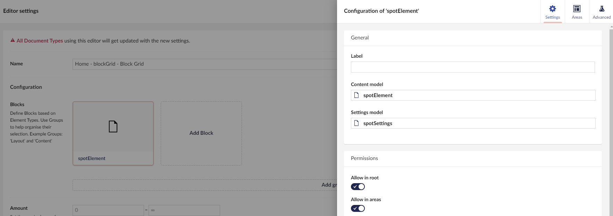

The raw input data for the spots looks like this:

```csharp
new[]
{
    new { Title = "Item one", Text = "This is item one", Featured = false, ColumnSpan = 12, RowSpan = 1 },
    new { Title = "Item two", Text = "This is item two", Featured = true, ColumnSpan = 6, RowSpan = 2 }
}
```

The resulting JSON object stored for the Block Grid will look like this:

```json
{
   "contentData":[
      {
         "contentTypeKey":"fd01539a-5bcf-48f7-aee5-8ad925c75902",
         "udi":null,
         "key":"019f2a7a-35b4-45b3-b867-910b3f340f25",
         "values":[
            {
               "editorAlias":"Umbraco.TextBox",
               "culture":null,
               "segment":null,
               "alias":"title",
               "value":"Item one"
            },
            {
               "editorAlias":"Umbraco.TextBox",
               "culture":null,
               "segment":null,
               "alias":"text",
               "value":"This is item one"
            }
         ]
      },
      {
         "contentTypeKey":"fd01539a-5bcf-48f7-aee5-8ad925c75902",
         "udi":null,
         "key":"063f8062-8610-441a-97f1-ea6d73fe2678",
         "values":[
            {
               "editorAlias":"Umbraco.TextBox",
               "culture":null,
               "segment":null,
               "alias":"title",
               "value":"Item two"
            },
            {
               "editorAlias":"Umbraco.TextBox",
               "culture":null,
               "segment":null,
               "alias":"text",
               "value":"This is item two"
            }
         ]
      }
   ],
   "settingsData":[
      {
         "contentTypeKey":"03c43074-a4ba-4bd2-92b1-c3a35a0eed4d",
         "udi":null,
         "key":"5b2d74bc-3e85-4aa3-b684-4b1f11522d7c",
         "values":[
            {
               "editorAlias":"Umbraco.TrueFalse",
               "culture":null,
               "segment":null,
               "alias":"featured",
               "value":0
            }
         ]
      },
      {
         "contentTypeKey":"03c43074-a4ba-4bd2-92b1-c3a35a0eed4d",
         "udi":null,
         "key":"1c6599fc-6558-4a0b-9da8-4f002925f59f",
         "values":[
            {
               "editorAlias":"Umbraco.TrueFalse",
               "culture":null,
               "segment":null,
               "alias":"featured",
               "value":1
            }
         ]
      }
   ],
   "expose":[
      {
         "contentKey":"019f2a7a-35b4-45b3-b867-910b3f340f25",
         "culture":null,
         "segment":null
      },
      {
         "contentKey":"063f8062-8610-441a-97f1-ea6d73fe2678",
         "culture":null,
         "segment":null
      }
   ],
   "Layout":{
      "Umbraco.BlockGrid":[
         {
            "columnSpan":12,
            "rowSpan":1,
            "areas":[

            ],
            "contentUdi":null,
            "settingsUdi":null,
            "contentKey":"019f2a7a-35b4-45b3-b867-910b3f340f25",
            "settingsKey":"5b2d74bc-3e85-4aa3-b684-4b1f11522d7c"
         },
         {
            "columnSpan":12,
            "rowSpan":1,
            "areas":[

            ],
            "contentUdi":null,
            "settingsUdi":null,
            "contentKey":"063f8062-8610-441a-97f1-ea6d73fe2678",
            "settingsKey":"1c6599fc-6558-4a0b-9da8-4f002925f59f"
         }
      ]
   }
}
```

For each item in the raw data, we need to create:

* One `contentData` entry with the _title_ and _text_.
* One `settingsData` entry with the _featured_ value (the checkbox expects `"0"` or `"1"` as data value).
* One `layout` entry with the desired column and row spans.

All `contentData` and `layoutData` entries need their own unique `Udi` as well as the ID (key) of their corresponding Element Types. In this sample, we only have one Element Type for content (`spotElement`) and one for settings (`spotSettings`). In a real life scenario, there could be any number of Element Type combinations.

7. Create a class called **Model.cs** containing the following to transform the raw data into Block Grid-compatible JSON:


```csharp
using System.Text.Json.Serialization;

namespace My.Site.Models;

// this is the "root" of the block grid data
public class BlockGridData
{
    public BlockGridData(BlockGridElementData[] contentData, BlockGridElementData[] settingsData, BlockGridExposeData[] expose, BlockGridLayout layout)
    {
        ContentData = contentData;
        SettingsData = settingsData;
        Expose = expose;
        Layout = layout;
    }

    [JsonPropertyName("contentData")]
    public BlockGridElementData[] ContentData { get; }

    [JsonPropertyName("settingsData")]
    public BlockGridElementData[] SettingsData { get; }

    [JsonPropertyName("expose")]
    public BlockGridExposeData[] Expose { get; }

    [JsonPropertyName("Layout")]
    public BlockGridLayout Layout { get; }
}

// this represents an item in the block grid content or settings data collection
public class BlockGridElementData
{
    public BlockGridElementData(Guid contentTypeKey, Guid key, BlockGridValueData[] values)
    {
        ContentTypeKey = contentTypeKey;
        Key = key;
        Values = values;
    }

    [JsonPropertyName("contentTypeKey")]
    public Guid ContentTypeKey { get; }

    [JsonPropertyName("key")]
    public Guid Key { get; }

    [JsonPropertyName("values")]
    public BlockGridValueData[] Values { get; }
}

public class BlockGridValueData
{
    public BlockGridValueData(string alias, string editorAlias, object? value)
    {
        Alias = alias;
        EditorAlias = editorAlias;
        Value = value;
    }

    [JsonPropertyName("alias")]
    public string Alias { get; }

    [JsonPropertyName("editorAlias")]
    public string EditorAlias { get; }

    [JsonPropertyName("value")]
    public object? Value { get; }
}

// this represents an item in the block grid expose data collection
public class BlockGridExposeData
{
    public BlockGridExposeData(Guid contentKey) => ContentKey = contentKey;

    [JsonPropertyName("contentKey")]
    public Guid ContentKey { get; }
}

// this is a wrapper for the block grid layout, purely required for correct serialization
public class BlockGridLayout
{
    public BlockGridLayout(BlockGridLayoutItem[] layoutItems) => LayoutItems = layoutItems;

    [JsonPropertyName("Umbraco.BlockGrid")]
    public BlockGridLayoutItem[] LayoutItems { get; }
}

// this represents an item in the block grid layout collection
public class BlockGridLayoutItem
{
    public BlockGridLayoutItem(int columnSpan, int rowSpan, Guid contentKey, Guid settingsKey)
    {
        ColumnSpan = columnSpan;
        RowSpan = rowSpan;
        ContentKey = contentKey;
        SettingsKey = settingsKey;
    }

    [JsonPropertyName("columnSpan")]
    public int ColumnSpan { get; }

    [JsonPropertyName("rowSpan")]
    public int RowSpan { get; }

    [JsonPropertyName("contentKey")]
    public Guid ContentKey { get; }

    [JsonPropertyName("settingsKey")]
    public Guid SettingsKey { get; }

    [JsonPropertyName("areas")]
    // areas are omitted from this sample for abbreviation
    public object[] Areas { get; } = [];
}
```


9. By injecting [ContentService](https://apidocs.umbraco.com/v16/csharp/api/Umbraco.Cms.Core.Services.ContentService.html) and [ContentTypeService](https://apidocs.umbraco.com/v16/csharp/api/Umbraco.Cms.Core.Services.ContentTypeService.html) into an API controller, we can transform the raw data into Block Grid JSON. It can then be saved to the target content item. Create a class called **BlockGridTestController.cs** containing the following:


```csharp
using Microsoft.AspNetCore.Mvc;
using My.Site.Models;
using Umbraco.Cms.Core.Models;
using Umbraco.Cms.Core.Serialization;
using Umbraco.Cms.Core.Services;

namespace My.Site.Controllers;

[ApiController]
[Route("/umbraco/api/blockgridtest")]
public class BlockGridTestController : Controller
{
    private readonly IContentService _contentService;
    private readonly IContentTypeService _contentTypeService;
    private readonly IJsonSerializer _serializer;

    public BlockGridTestController(IContentService contentService, IContentTypeService contentTypeService, IJsonSerializer serializer)
    {
        _contentService = contentService;
        _contentTypeService = contentTypeService;
        _serializer = serializer;
    }

    // POST: /umbraco/api/blockgridtest/create
    [HttpPost("create")]
    public ActionResult Create()
    {
        // get the item content to modify
        IContent? content = _contentService.GetById(Guid.Parse("7ed0bd1f-2a52-4b45-9811-2560b907fe48"));
        if (content == null)
        {
            return NotFound("Could not find the content item to modify");
        }

        // get the element types for spot blocks (content and settings)
        IContentType? spotContentType = _contentTypeService.Get("spotElement");
        IContentType? spotSettingsType = _contentTypeService.Get("spotSettings");
        if (spotContentType == null || spotSettingsType == null)
        {
            return NotFound("Could not find one or more content types for block data");
        }

        // this is the raw data to insert into the block grid
        var rawData = new[]
        {
            new { Title = "Item one", Text = "This is item one", Featured = false, ColumnSpan = 12, RowSpan = 1 },
            new { Title = "Item two", Text = "This is item two", Featured = true, ColumnSpan = 6, RowSpan = 2 }
        };

        // build the individual parts of the block grid data from the raw data
        var contentData = new List<BlockGridElementData>();
        var settingsData = new List<BlockGridElementData>();
        var exposeData = new List<BlockGridExposeData>();
        var layoutItems = new List<BlockGridLayoutItem>();
        foreach (var data in rawData)
        {
            // generate new keys for block content and settings
            var contentKey = Guid.NewGuid();
            var settingsKey = Guid.NewGuid();

            // create new content data
            var contentValues = new BlockGridValueData[]
            {
                new("title", "Umbraco.TextBox", data.Title),
                new("text", "Umbraco.TextBox", data.Text),
            };
            contentData.Add(new BlockGridElementData(spotContentType.Key, contentKey, contentValues));

            // create new settings data
            var settingValues = new BlockGridValueData[]
            {
                new("featured", "Umbraco.TrueFalse", data.Featured ? "1" : "0"),
            };
            settingsData.Add(new BlockGridElementData(spotSettingsType.Key, settingsKey, settingValues));

            // create a new expose item
            exposeData.Add(new BlockGridExposeData(contentKey));

            // create a new layout item
            layoutItems.Add(new BlockGridLayoutItem(data.ColumnSpan, data.RowSpan, contentKey, settingsKey));
        }

        // construct the block grid data from layout, content and settings
        var blockGridData = new BlockGridData(
            [.. contentData],
            [.. settingsData],
            [.. exposeData],
            new BlockGridLayout([.. layoutItems]));

        // serialize the block grid data as JSON and save it to the "blockGrid" property on the content item
        var propertyValue = _serializer.Serialize(blockGridData);
        content.SetValue("blockGrid", propertyValue);
        _contentService.Save(content);

        return Ok("Saved");
    }
}
```


For the above code `IContent? content = _contentService.GetById(Guid.Parse("efba7b97-91b6-4ddf-b2cc-eef89ff48c3b"));` change the id with your content node that is using the Block Grid.

10. To test this implementation, run the project and send a `POST` request to `/umbraco/api/blockgridtest/create` after your domain name. If the result shows as **Saved**, then check your content node, and you will see the 2 spotElement contents.

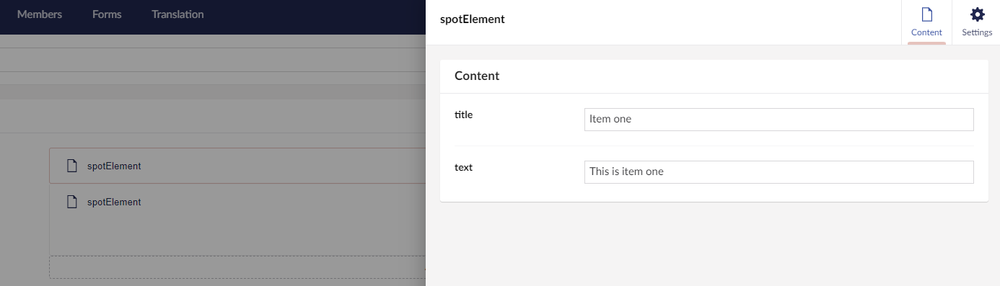

_This can also be tested via Postman as well if preferred._
