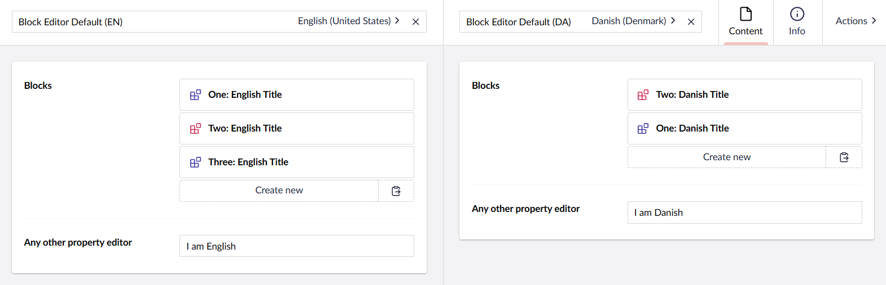
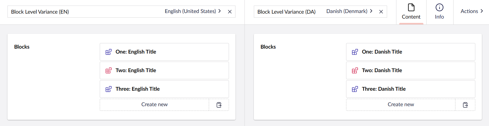
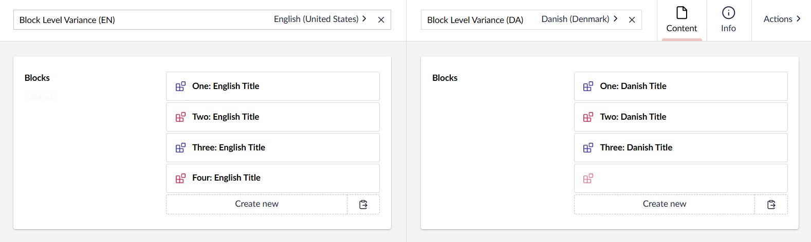

# Block Level Variance

In a variant context, a Block Editor behaves like any other Umbraco property editor by default. The Blocks contained within the editor "belong" to the Document variant, and there is no connection between Blocks across variants.

In other words, both Block content and structure can vary between each Document variant.

This is the desired behavior for many cases. However, in some cases it is preferable to have a shared Block structure across all variants, where only the Block content varies.

This is known as Block Level Variance:

Block Level Variance is achieved when:

* The [Document Type](../../../../data/defining-content/default-document-types.md#document-type) is configured for variance, and
* The Block Editor property is _not_ configured for variance, and
* The Block Editor property editor is configured to use [Element Types](../../../../data/defining-content/default-document-types.md#element-type) that _do_ vary.

## The "unexposed" Block state

When adding a new _variant_ Block to one Document variant, it is automatically added to all variants of the Document.

The Block will start out in an "unexposed" state for all other Document variants than the one where it was added. It will remain like that for each variant until it is edited in that variant.

The "unexposed" state is visualized by a dimmed-down icon and title (or likely a missing title, if [Umbraco Flavored Markdown](../../../../../reference/umbraco-flavored-markdown.md) is used):


"Unexposed" Blocks are omitted from the published Document output. So, you do not need to worry about defensive coding to avoid rendering these Blocks.


## Invariance vs. Block Level Variance

It is entirely possible to mix and match variance and invariance within the scope of Block Level Variance. Invariance is fully supported, both at Block level and at Block property level.

Invariance within Block Level Variance follows the same rules as invariance at Document level:

- Invariant content is added to and updated across all Document variants.
- Invariant content is explicitly published for all published Document variants when one or more variants are published.

### Examples

Consider a Document with English and Danish language variants, which is published in both languages.

- An editor opens the English variant.
- They add an invariant Block, and
- They re-publish the English variant.

**Result:** The new block will appear in both the English and Danish published content.

- An editor opens the Danish variant.
- They update an invariant property value in a variant Block, and
- They re-publish the Danish variant.

**Result:** The updated property value appears in both the English and Danish published content.

## Structure vs. Block Level Variance

The Block Editor structure is _invariant_ for Block Level Variance. This means that the structure follows the same rules for invariance as outlined in the section above.

In other words: If an editor changes the order of the Blocks in one Document variant, it changes for all Document variants. The change is applied to all published Document variants, as soon as one or more variants are published.
