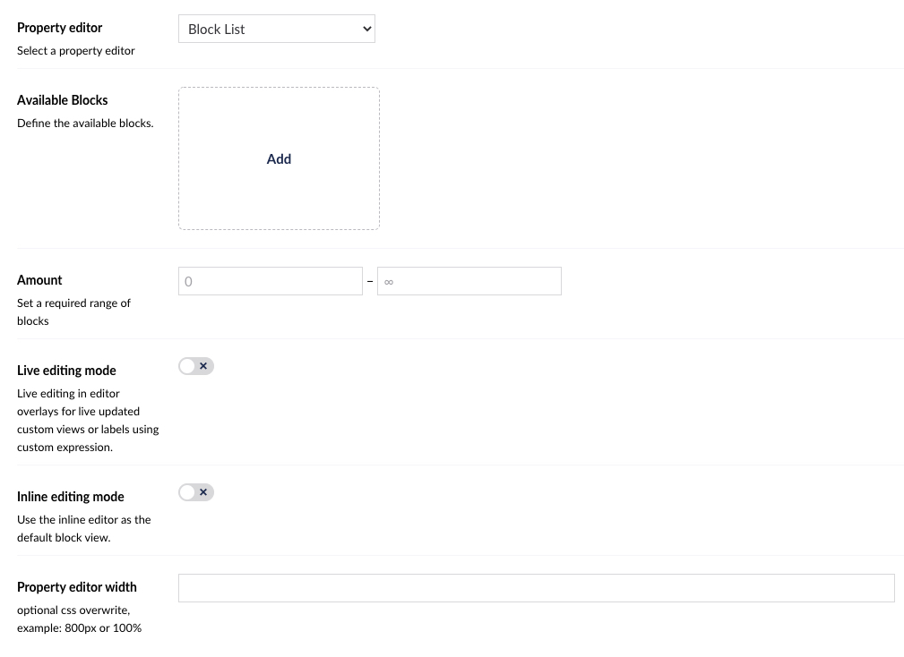
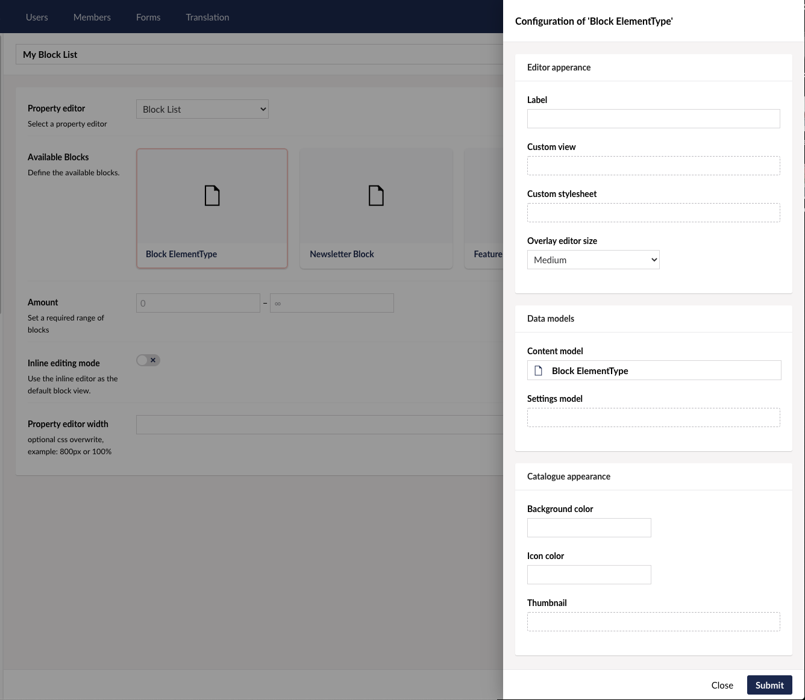
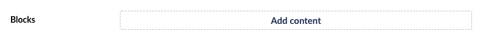
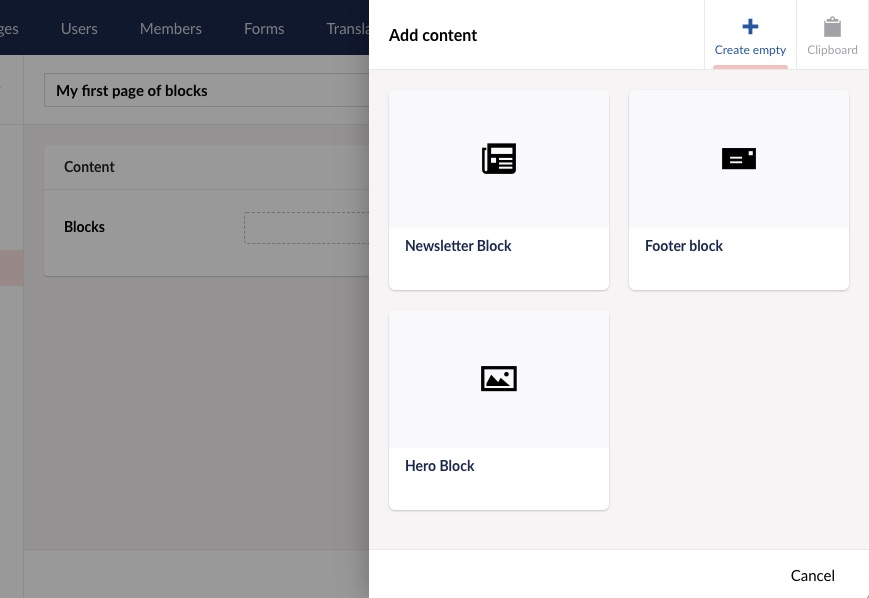
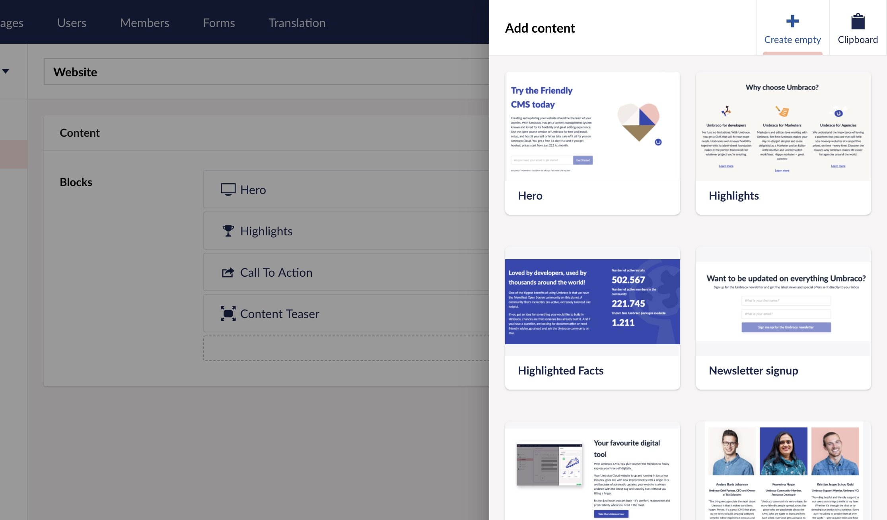
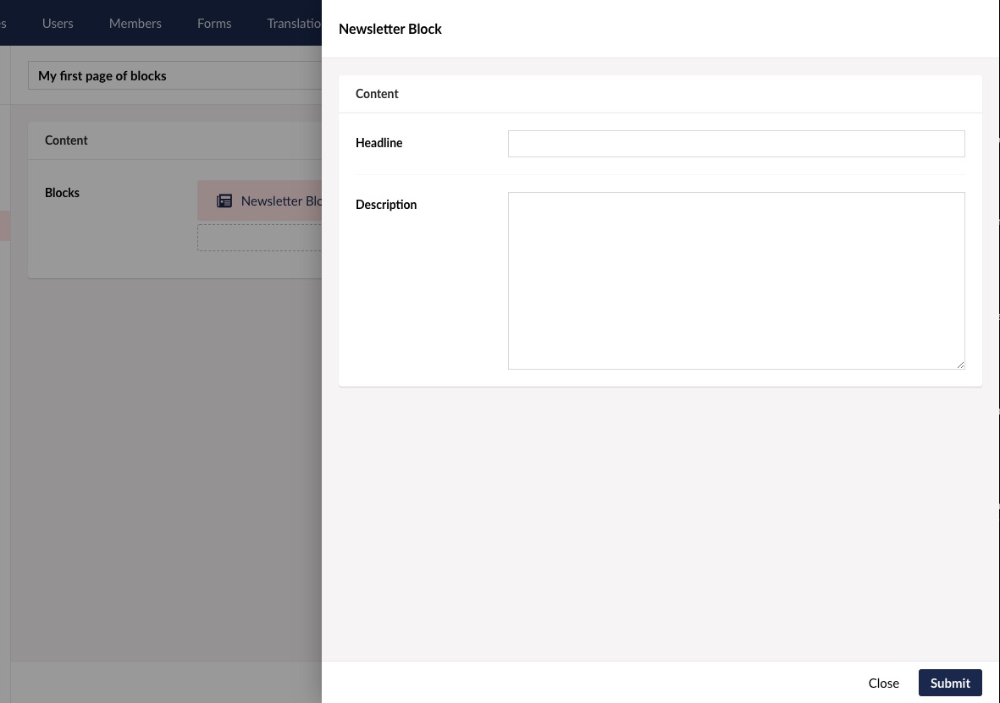
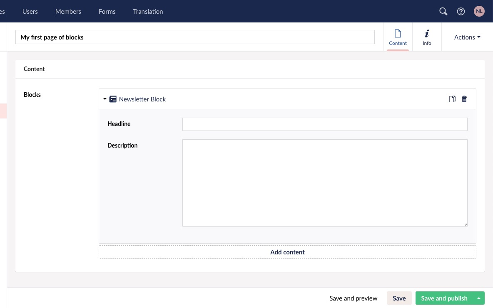
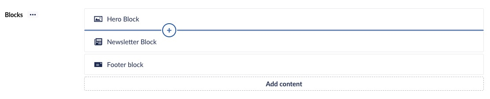

# Block List

`Schema Alias: Umbraco.BlockList`

`UI Alias: Umb.PropertyEditorUi.BlockList`

`Returns: IEnumerable<BlockListItem>`


This article is a work in progress and may undergo further revisions, updates, or amendments. The information contained herein is subject to change without notice.


**Block List** is a list editing property editor, using [Element Types](../../../../data/defining-content/#element-types) to define the list item schema.


The _Block List_ replaces the obsolete _Nested Content_ editor.


## Configure Block List

The Block List property editor is configured in the same way as any standard property editor, via the _Data Types_ admin interface.

To set up your Block List Editor property, create a new _Data Type_ and select **Block List** from the list of available property editors.

Then you will see the configuration options for a Block List as shown below.



The Data Type editor allows you to configure the following properties:

* **Available Blocks** - Here you will define the Block Types to be available for use in the property. Read more on how to set up Block Types below.
* **Amount** - Sets the minimum and/or maximum number of blocks that should be allowed in the list.
* **Single block mode** - When in Single block mode, the output will be `BlockListItem<>` instead of `BlockListModel`
* **Live editing mode** - Enabling this will make editing of a block happening directly to the document model, making changes appear as you type.
* **Inline editing mode** - Enabling this will change editing experience to inline, meaning that editing the data of blocks happens at sight as accordions.
* **Property editor width** - Overwrite the width of the property editor. This field takes any valid css value for "max-width".

## Setup Block Types

Block Types are **Element Types** which need to be created before you can start configuring them as Block Types. This can be done either directly from the property editor setup process, or you can set them up beforehand and add them to the block list after.

Once you have added an element type as a Block Type on your Block List Data Type you will have the option to configure it further.



Each Block has a set of properties that are optional to configure. They are described below.

### Editor Appearance

By configuring the properties in the group you can customize the user experience for your content editors when they work with the blocks in the Content section.

* **Label** - Define a label for the appearance of the Block in the editor. The label uses [Umbraco Flavoured Markdown](../../../../../reference/umbraco-flavored-markdown.md) to display values of properties. The label is also used for search in the **Add Block** dialog during content editing. If no label is defined, the block will not be searchable. The search does not fall back to the block’s name.
* **Overlay editor size** - Set the size for the Content editor overlay for editing this block.

### Data Models

It is possible to use two separate Element Types for your Block Types. Its required to have one for Content and optional to add one for Settings.

* **Content model** - This presents the Element Type used as model for the content section of this Block. This cannot be changed, but you can open the Element Type to perform edits or view the properties available. Useful when writing your Label.
* **Settings model** - Add a Settings section to your Block based on a given Element Type. When picked you can open the Element Type or choose to remove the settings section again.

### Catalogue appearance

These properties refer to how the Block is presented in the Block catalogue, when editors choose which Blocks to use for their content.

* **Background color** - Define a background color to be displayed beneath the icon or thumbnail. Eg. `#424242`.
* **Icon color** - Change the color of the Element Type icon. Eg. `#242424`.
* **Thumbnail** - Pick an image or SVG file to replace the icon of this Block in the catalogue.

The thumbnails for the catalogue are presented in the format of 16:10, and we recommend a resolution of 400px width and 250px height.

### Advanced

These properties are relevant when you work with custom views.

* **Force hide content editor** - If you made a custom view that enables you to edit the content part of a block and you are using default editing mode (not inline) you might want to hide the content-editor from the block editor overlay.

## Editing Blocks

When viewing a **Block List** editor in the Content section for the first time, you will be presented with the option to Add content.



Clicking the Add content button brings up the Block Catalogue.



The Block Catalogue looks different depending on the amount of available Blocks and their catalogue appearance.



Click the Block Type you wish to create and a new Block will appear in the list.

Depending on whether your Block List Editor is setup to use default or inline editing mode you will see one of the following things happening:

In default mode you will enter the editing overlay of that Block:



In inline editing mode the new Blocks will expand to show its inline editor:



More Blocks can be added to the list by clicking the Add content button or using the inline Add content button that appears on hover between or above existing Blocks.



To reorder the Blocks, click and drag a Block up or down to place in the desired order.

To delete a Block click the trash-bin icon appearing on hover.

## Rendering Block List Content

Rendering the stored value of your **Block List** property can be done in two ways.

### 1. Default rendering

You can choose to use the built-in rendering mechanism for rendering blocks via a Partial View for each block.

The default rendering method is named `GetBlockListHtml()` and comes with a few options to go with it. The typical use could be:

```csharp
@Html.GetBlockListHtml(Model, "MyBlocks")
```

"MyBlocks" above is the alias for the Block List editor.

If using ModelsBuilder the example can be simplified:

Example:

```csharp
@Html.GetBlockListHtml(Model.MyBlocks)
```

To make this work you will need to create a Partial View for each block, named by the alias of the Element Type that is being used as Content Model.

These partial views must be placed in this folder: `Views/Partials/BlockList/Components/`. Example: `Views/Partials/BlockList/Components/MyElementTypeAliasOfContent.cshtml`.

A Partial View will receive the model of `Umbraco.Core.Models.Blocks.BlockListItem`. This gives you the option to access properties of the Content and Settings section of your Block.

In the following example of a Partial view for a Block Type, please note that the `MyElementTypeAliasOfContent`and `MyElementTypeAliasOfSettings` should correspond with the selected Element Type Alias for the given model in your case.

Example:

```csharp
@inherits Umbraco.Cms.Web.Common.Views.UmbracoViewPage<Umbraco.Cms.Core.Models.Blocks.BlockListItem>;
@using ContentModels = Umbraco.Cms.Web.Common.PublishedModels;
@{
    var content = (ContentModels.MyElementTypeAliasOfContent)Model.Content;
    var settings = Model.Settings as ContentModels.MyElementTypeAliasOfContent; // Cast Model.Settings safely using 'as' to avoid null reference exceptions
}

@* Output the value of field with alias 'heading' from the Element Type selected as Content section *@
<h1>@content.Value("heading")</h1>
```

With ModelsBuilder:

```csharp
@* Output the value of field with alias 'heading' from the Element Type selected as Content section *@
<h1>@content.Heading</h1>
```

### 2. Build your own rendering

A built-in value converter is available to use the data as you like. Call the `Value<T>` method with a generic type of `IEnumerable<BlockListItem>` and the stored value will be returned as a list of `BlockListItem` entities.

Example:

```csharp
@inherits Umbraco.Cms.Web.Common.Views.UmbracoViewPage;
@using Umbraco.Cms.Core.Models.Blocks;
@{
    var blocks = Model.Value<IEnumerable<BlockListItem>>("myBlocksProperty");
    foreach (var block in blocks)
    {
        var content = block.Content;

        @Html.Partial("MyFolderOfBlocks/" + content.ContentType.Alias, block)
    }
}
```

Each item is a `BlockListItem` entity that contains two main properties `Content` and `Settings`. Each of these is a `IPublishedElement` which means you can use all the value converters you are used to using.

Example:

```csharp
@inherits Umbraco.Cms.Web.Common.Views.UmbracoViewPage;
@using ContentModels = Umbraco.Cms.Web.Common.PublishedModels;
@using Umbraco.Cms.Core.Models.Blocks;
@{
    var blocks = Model.Value<IEnumerable<BlockListItem>>("myBlocksProperty");
    foreach (var block in blocks)
    {
        var content = (ContentModels.MyAliasOfContentElementType)block.Content;
        var settings = (ContentModels.MyAliasOfSettingsElementType)block.Settings;

        <h1>@content.MyExampleHeadlinePropertyAlias</h1>
    }
}
```

## Extract Block List Content data

In some cases, you might want to use the Block List Editor to hold some data and not necessarily render a view since the data should be presented in different areas on a page. An example could be a product page with variants stored in a Block List Editor.

In this case, you can extract the variant's data using the following, which returns `IEnumerable<IPublishedElement>`.

Example:

```csharp
@inherits Umbraco.Cms.Web.Common.Views.UmbracoViewPage;
@using ContentModels = Umbraco.Cms.Web.Common.PublishedModels;
@using Umbraco.Cms.Core.Models.Blocks;
@{
    var variants = Model.Value<IEnumerable<BlockListItem>>("variants").Select(x => x.Content);
    foreach (var variant in variants)
    {
        <h4>@variant.Value("variantName")</h4>
        <p>@variant.Value("description")</p>
    }
}
```

If using ModelsBuilder the example can be simplified:

Example:

```csharp
@inherits Umbraco.Web.Mvc.UmbracoViewPage
@using ContentModels = Umbraco.Web.PublishedModels;
@{
    var variants = Model.Variants.Select(x => x.Content).OfType<ProductVariant>();
    foreach (var variant in variants)
    {
        <h4>@variant.VariantName</h4>
        <p>@variant.Description</h4>
    }
}
```

If you know the Block List Editor only uses a single block, you can cast the collection to a specific type `T` using `.OfType<T>()` otherwise the return value will be `IEnumerable<IPublishedElement>`.

## Build a Custom Backoffice View

Building Custom Views for Block representations in Backoffice is the same for all Block Editors. [Read about building a Custom View for Blocks here](../../../../../customizing/extending-overview/extension-types/block-custom-view.md)
