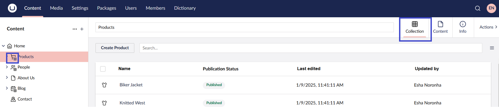
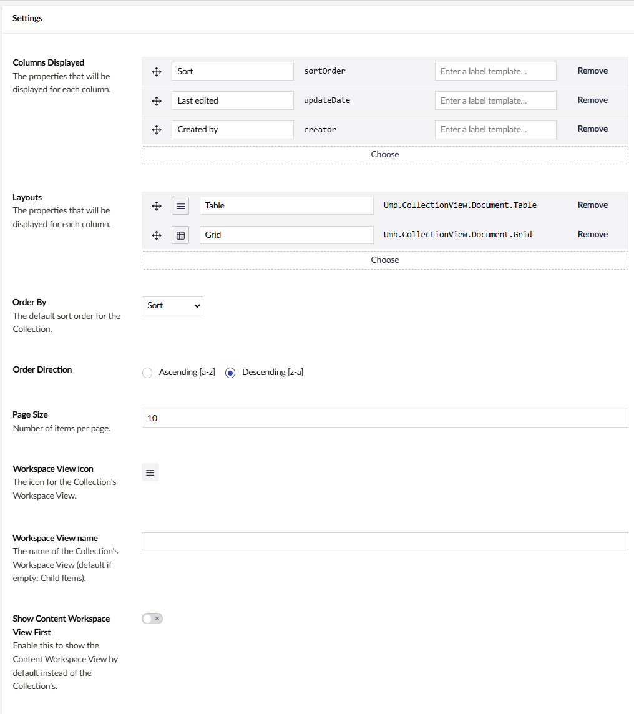

# Collection

`Schema Alias: Umbraco.ListView`

`UI Alias: Umb.PropertyEditorUi.Collection`

`Returns: IEnumerable<IPublishedContent>`

**Collection** displays a collection of categories when it is enabled on a Document Type with children.

## Configure Collection

Once Collections are configured, the parent content item displays its child items in a list view format within the content item itself. If Collections are not configured, the child items are displayed directly in the Content Tree, rather than being grouped within the parent content item.

## Settings

### Columns Displayed

It is possible to add more columns to the collection, via adding the properties through the picker modal. These properties are based on the Data Types which are used by the Document Type. The properties will listed for selection.

.png>)

Once you have selected a column you want to display, define what its heading label should be and what kind of value it should display. You can also move the headers around, re-ordering how they should look. This is done by the move icon on the left side of the alias.

The template section is where you define what kind of value you want to display. The value of the column is in the `value` variable.

### Layouts

Collection comes with two layouts by default. A list and a grid view. These views can be disabled if you are not interested in any of them.


A minimum of one layout needs to be enabled for Collection to work.


You can also make your own layout and add it to the settings. For example, if you wanted to change the width or length of the grid, you will be able to do so.

### Order By

Will sort your collection by the selection you choose in the dropdown. By default it selects "Last edited" and you get the following three columns:

* **Last edited** - When the content node was last edited and saved.
* **Name** - Name of the content node(s).
* **Created by** - This is the user who the content node was created by.

You can add more sorting to this collection by adding more datatypes to the columns in the "Columns Displayed" section.

### Order Direction

You can select order of the content nodes displayed, "Ascending \[a-z]" or "Descending \[z-a]". The order is affected by the "Order By" selection.

### Page Size

Defines how many child content nodes you want to see per page. This will limit how many content items you will see in your collection. If you set it to 5, then only 5 content items will be shown in the collection.

### Workspace View icon


Support for changing the Workspace View icon has not been implemented yet.


Changes the icon in the backoffice of the collection. By default it will look like the image below.

.png>)

### Workspace View name


Support for changing the Workspace View name has not been implemented yet.


You can change the name of the collection itself. Default if empty: 'Child Items'.

### Show Content Workspace View First


Support for setting the Content Workspace View First has not been implemented yet.


Enable this to show the Content Workspace View by default instead of the collection's.

## Content Example

### Generic field value

This example shows how to use a generic field from a child item and display its value in a collection.

You can use the [Umbraco Flavored Markdown](../../../../reference/umbraco-flavored-markdown.md) syntax to display the label value. Here, the `{=value}` placeholder retrieves the value of the _Email_ property and displays it in the collection, as shown in the image below:

### Content name

First, a Content Picker property needs to be present on the content item. In this example, the `child item` has gotten a Content Picker Data Type with the alias of `contentPicker`.

.png>)

The child item has a document and the value that should be displayed is the name of the picked value. The next step is to reconfigure the template value in the collection setting.

.png>)

This will take the value picked up by the content picker.

.png>)

And display it in the collection. Shown in the example below:

.png>)
