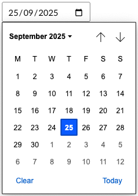

# Date Only

`Schema Alias: Umbraco.DateOnly`

`UI Alias: Umb.PropertyEditorUi.DateOnlyPicker`

`Returns: DateOnly?`

The Date Only property editor provides an interface for selecting dates without including time or time zone information. It focuses purely on date selection and returns a `DateOnly` value.

## Configuration
You can configure this property editor in the same way as any standard property editor, using the *Data Types* admin interface.

To set up a property using this editor, create a new *Data Type* and select **Date Only** from the list of available property editors.

This editor has no configuration options.

## Editing experience

### Adding or editing a value

You will be presented with a date input.



## Rendering

The value returned will have the type `DateOnly?`.

### Display the value

With Models Builder:
```csharp
@Model.EventDate
```

Without Models Builder:
```csharp
@Model.Value<DateOnly?>("eventDate")
```

## Add values programmatically

This property editor stores values as a JSON object. The object contains the date as an ISO 8601 string with midnight time and UTC offset.

### Storage format

The property editor stores values in this JSON format:
```json
{
    "date": "2025-01-01T00:00:00+00:00"
}
```

The property editor handles date-only values. Time is set to 00:00:00 and offset to +00:00 for storage consistency. These time components are ignored in the Date Only context.

1. Create a C# model that matches the JSON schema.

    ```csharp
    using System.Text.Json.Serialization;

    namespace UmbracoProject;

    public class DateOnlyValue
    {
        /// <summary>
        /// The date value, represented as a <see cref="DateTimeOffset"/> for storage compatibility.
        /// </summary>
        [JsonPropertyName("date")]
        public DateTimeOffset Date { get; init; }
    }
    ```
2. Convert your existing date value to `DateTimeOffset` for storage.

   If you have a `DateOnly`:
   ```csharp
   DateOnly dateOnly = DateOnly.FromDateTime(DateTime.Today); // Your existing DateOnly value
   DateTimeOffset dateTimeOffset = dateOnly.ToDateTime(TimeOnly.MinValue);
   ```

   If you have a `DateTime`:
   ```csharp
   DateTime dateTime = DateTime.Today; // Your existing DateTime value
   DateOnly dateOnly = DateOnly.FromDateTime(dateTime);
   DateTimeOffset dateTimeOffset = dateOnly.ToDateTime(TimeOnly.MinValue);
   ```

3. Create an instance of the class with the `DateTimeOffset` value.
    ```csharp
    DateOnlyValue value = new DateOnlyValue
    {
        Date = dateTimeOffset
    };
    ```

4. Inject the `IJsonSerializer` and use it to serialize the object.
   ```csharp
   string jsonValue = _jsonSerializer.Serialize(value);
   ```

5. Inject the `IContentService` to retrieve and update the value of a property of the desired content item.
   ```csharp
   IContent content = _contentService.GetById(contentKey) ?? throw new Exception("Content not found");

   // Set the value of the property with alias 'eventDate'. 
   content.SetValue("eventDate", jsonValue);

   // Save the change
   _contentService.Save(content);
   ```
