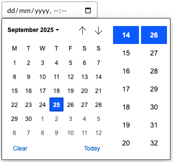

# Date Time (Unspecified)

`Schema Alias: Umbraco.DateTimeUnspecified`

`UI Alias: Umb.PropertyEditorUi.DateTimePicker`

`Returns: DateTime?`

The Date Time (Unspecified) property editor provides an interface for selecting dates and times without including time zone information.

## Configuration
You can configure this property editor in the same way as any standard property editor, using the *Data Types* admin interface.

To set up a property using this editor, create a new *Data Type* and select **Date Time (Unspecified)** from the list of available property editors.

You will see the configuration options as shown below.


- **Time format** - Specifies the level of precision for time values shown and stored by the editor.

### Time format

- **HH:mm** - Displays hours and minutes (e.g., `14:30`).  
Suitable for most general use cases.  

- **HH:mm:ss** - Displays hours, minutes, and seconds (e.g., `14:30:45`).  
Use this when you need more precise timing.  


## Editing experience

### Adding or editing a value

You will be presented with a date and time input. This editor focuses only on the date and time components, unlike the time zone version.



## Rendering

The value returned will have the type `DateTime?`.

### Display the value

With Models Builder:
```csharp
@Model.EventDateTime.Value
```

Without Models Builder:
```csharp
@Model.Value<DateTime?>("eventDateTime")
```

## Add values programmatically

This property editor stores values as a JSON object. The object contains the date as an ISO 8601 string.

### Storage format

The property editor stores values in this JSON format:
```json
{
    "date": "2025-01-01T00:00:00+00:00"
}
```

The property editor handles unspecified date and time values without time zone information. The value is stored with offset +00:00 for consistency. The offset is ignored unless you replace this editor with the Date Time (with time zone) version.

1. Create a C# model that matches the JSON schema.

    ```csharp
    using System.Text.Json.Serialization;

    namespace UmbracoProject;

    public class DateTimeUnspecified
    {
        /// <summary>
        /// The date and time value, represented as a <see cref="DateTimeOffset"/> for storage compatibility.
        /// </summary>
        [JsonPropertyName("date")]
        public DateTimeOffset Date { get; init; }
    }
    ```

2. Convert your existing DateTime value to `DateTimeOffset` for storage.
   ```csharp
   DateTime dateTime = DateTime.Now; // Your existing DateTime value
   DateTimeOffset dateTimeOffset = dateTime; // Explicit conversion
   ```

3. Create an instance of the class with the `DateTimeOffset` value.
   ```csharp
   var value = new DateTimeUnspecified
   {
       Date = dateTimeOffset
   };
   ```

4. Inject the `IJsonSerializer` and use it to serialize the object.
   ```csharp
   string jsonValue = _jsonSerializer.Serialize(value);
   ```

5. Inject the `IContentService` to retrieve and update the value of a property of the desired content item.
   ```csharp
   IContent content = _contentService.GetById(contentKey) ?? throw new Exception("Content not found");

   // Set the value of the property with alias 'eventDateTime'. 
   content.SetValue("eventDateTime", jsonValue);

   // Save the change
   _contentService.Save(content);
   ```
