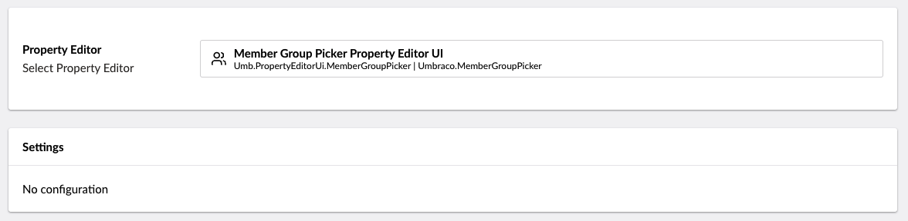
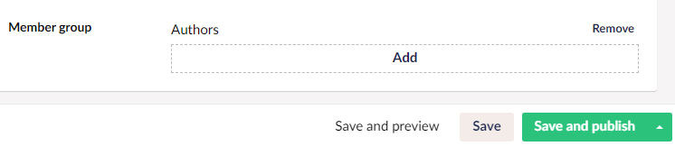

# Member Group Picker

`Schema Alias: Umbraco.MemberGroupPicker`

`UI Alias: Umb.PropertyEditorUi.MemberGroupPicker`

`Returns: string`

The Member Group Picker opens a panel to pick one or more member groups from the Member section. The value saved is of type string (comma separated IDs).

## Data Type Definition Example



## Content Example



## MVC View Example

### Without Models Builder

```csharp
@if (Model.HasValue("memberGroup"))
{
    var memberGroup = Model.Value<string>("memberGroup"); 
    <p>@memberGroup</p>
}
```

### With Models Builder

```csharp
@if (!string.IsNullOrEmpty(Model.MemberGroup))
{
    <p>@Model.MemberGroup</p>
}
```

## Add values programmatically

See the example below to see how a value can be added or changed programmatically. To update a value of a property editor you need the [Content Service](https://apidocs.umbraco.com/v15/csharp/api/Umbraco.Cms.Core.Services.ContentService.html).


The example below demonstrates how to add values programmatically using a Razor view. However, this is used for illustrative purposes only and is not the recommended method for production environments.


```csharp
@using Umbraco.Cms.Core.Services
@inject IContentService ContentService
@{
    // Create a variable for the GUID of the page you want to update
    var guid = new Guid("796a8d5c-b7bb-46d9-bc57-ab834d0d1248");
    
    // Get the page using the GUID you've defined
    var content = ContentService.GetById(guid); // ID of your page

    // Set the value of the property with alias 'memberGroup'. The value is the specific ID of the member group
    content.SetValue("memberGroup", 1067);
            
    // Save the change
    ContentService.Save(content);
}
```

You can also add multiple groups by creating a comma separated string with the desired member group IDs.

```csharp
@{
    // Set the value of the property with alias 'memberGroup'. 
    content.SetValue("memberGroup", "1067","1068");
}
```

Although the use of a GUID is preferable, you can also use the numeric ID to get the page:

```csharp
@{
    // Get the page using it's id
    var content = ContentService.GetById(1234); 
}
```

If Models Builder is enabled you can get the alias of the desired property without using a magic string:

```csharp
@using Umbraco.Cms.Core.PublishedCache
@inject IPublishedContentTypeCache PublishedContentTypeCache
@{
    // Set the value of the property with alias 'memberGroup'
    content.SetValue(Home.GetModelPropertyType(PublishedContentTypeCache, x => x.MemberGroup).Alias, 1067);
}
```
