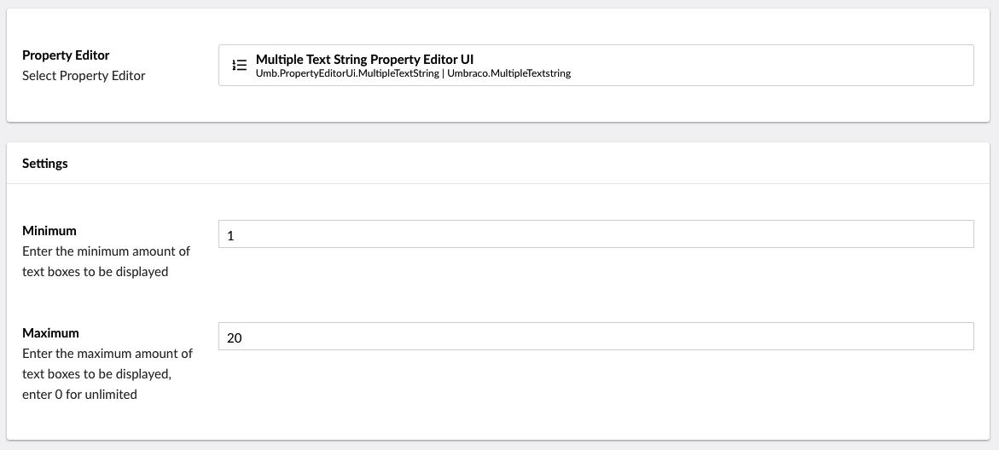

# Repeatable Textstrings

`Schema Alias: Umbraco.MultipleTextstring`

`UI Alias: Umb.PropertyEditorUi.MultipleTextString`

`Returns: array of strings`

The Repeatable textstrings property editor enables a content editor to make a list of text items. For best use with an unordered-list.

## Data Type Definition Example



## Content Example

 (1).png>)

## MVC View Example

### Without Models Builder

```csharp
@{
    if (Model.Value<string[]>("keyFeatureList").Length > 0)
    {
        <ul>
            @foreach (var item in Model.Value<string[]>("keyFeatureList"))
            {
                <li>@item</li>
            }
        </ul>
    }
}
```

### With Models Builder

```csharp
@{
    if (Model.KeyFeatureList.Any())
    {
        <ul>
            @foreach (var item in Model.KeyFeatureList)
            {
                <li>@item</li>
            }
        </ul>
    }
}
```

## Add values programmatically

See the example below to see how a value can be added or changed programmatically. To update a value of a property editor you need the [Content Service](https://apidocs.umbraco.com/v15/csharp/api/Umbraco.Cms.Core.Services.ContentService.html).


The example below demonstrates how to add values programmatically using a Razor view. However, this is used for illustrative purposes only and is not the recommended method for production environments.


```csharp
@using Umbraco.Cms.Core.Services
@inject IContentService ContentService
@{
    // Create a variable for the GUID of the page you want to update
    var guid = new Guid("32e60db4-1283-4caa-9645-f2153f9888ef");

    // Get the page using the GUID you've defined
    var content = ContentService.GetById(guid); // ID of your page

    // Set the value of the property with alias 'keyFeatureList'
    content.SetValue("keyFeatureList", "Awesome" + Environment.NewLine + "Super");

    // Save the change
    ContentService.Save(content);
}
```


To add multiple values to the repeatable text strings property editor you have to put each value on a new line. This can be achieved using either `\r\n\` or `Environment.NewLine`.


Although the use of a GUID is preferable, you can also use the numeric ID to get the page:

```csharp
@{
    // Get the page using it's id
    var content = ContentService.GetById(1234); 
}
```

If Models Builder is enabled you can get the alias of the desired property without using a magic string:

```csharp
@using Umbraco.Cms.Core.PublishedCache
@inject IPublishedContentTypeCache PublishedContentTypeCache
@{
    // Set the value of the property with alias 'keyFeatureList'
    content.SetValue(Home.GetModelPropertyType(PublishedContentTypeCache, x => x.KeyFeatureList).Alias, "Awesome" + Environment.NewLine + "Super");
}
```
