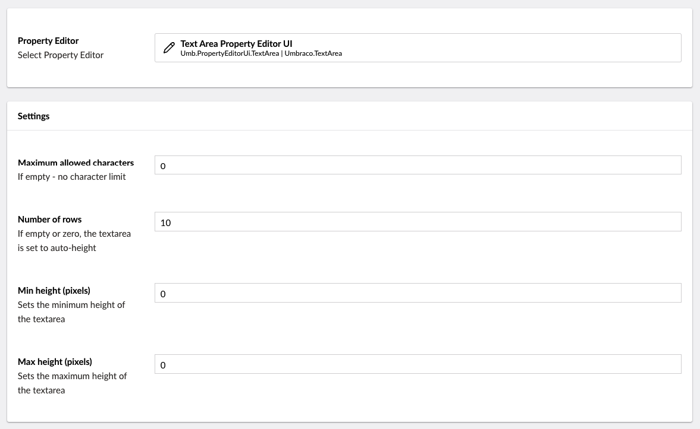

# Textarea

`Schema Alias: Umbraco.TextArea`

`UI Alias: Umb.PropertyEditorUi.TextArea`

`Returns: String`

Textarea is an HTML textarea control for multiple lines of text. It can be configured to have a fixed character limit, as well as define how big the space for writing can be. By default, there is no character limit unless it's specifically set to a specific value like 200 for instance. If you don't specify the number of rows, 10 will be the amount of rows the textarea will be occupying, unless changed to a custom value.

## Data Type Definition Example



## Settings

## Content Example

### Without a character and rows limit


### With a character limit and rows limit


## MVC View Example

### Without Models Builder

```csharp
@{
    if (Model.HasValue("description")){
        <p>@(Model.Value<string>("description"))</p>
    }
}
```

### With Models Builder

```csharp
@if (!Model.HasValue(Model.Description))
{
   <p>@Model.Description</p>
}
```

## Add value programmatically

See the example below to learn how a value can be added or changed programmatically to a Textarea property. To update a value of a property editor you need the [Content Service](https://apidocs.umbraco.com/v15/csharp/api/Umbraco.Cms.Core.Services.ContentService.html).


The example below demonstrates how to add values programmatically using a Razor view. However, this is used for illustrative purposes only and is not the recommended method for production environments.


```csharp
@using Umbraco.Cms.Core.Services
@inject IContentService ContentService
@{
    // Create a variable for the GUID of your page
    var guid = new Guid("796a8d5c-b7bb-46d9-bc57-ab834d0d1248");

    // Get the page using the GUID you've just defined
    var content = ContentService.GetById(guid);

    // Set the value of the property with alias 'description'
    content.SetValue("description", "This is some text for the text area!");

    // Save the change
    ContentService.Save(content);
}
```

Although the use of a GUID is preferable, you can also use the numeric ID to get the page:

```csharp
@{
    // Get the page using it's id
    var content = ContentService.GetById(1234); 
}
```

If Models Builder is enabled you can get the alias of the desired property without using a magic string:

```csharp
@using Umbraco.Cms.Core.PublishedCache
@inject IPublishedContentTypeCache PublishedContentTypeCache
@{

    // Set the value of the property with alias 'description'
    content.SetValue(Home.GetModelPropertyType(PublishedContentTypeCache, x => x.Description).Alias, "This is some text for the text area!");
}
```
