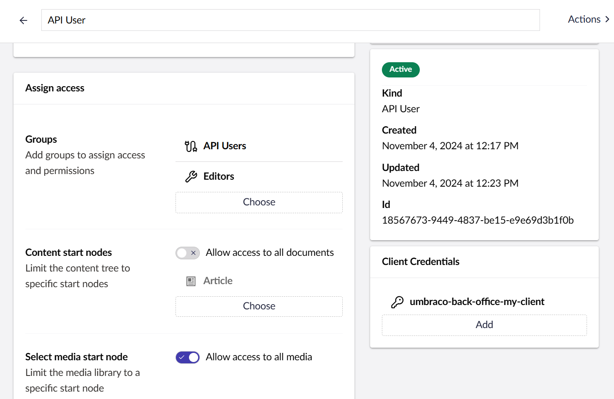

# API Users

API Users allow for authorizing [external access](../../../reference/management-api/external-access.md) to the Management API.

An API User is identical to a [regular User](README.md) except for one thing: It has no password. In fact, API Users are not allowed to log into the backoffice like regular Users.

Instead, API Users hold the Client Credentials used to authorize against the Management API. When an external source authorizes using Client Credentials, it effectively assumes the identity of the API User.

Since API Users are identical to regular Users their backoffice access can be controlled in the same way. This allows for imposing detailed access control on the external sources connected to the Management API.


Client IDs for API Users are explicitly prefixed with `umbraco-back-office-`. This guards against API Users accidentally taking over one of the Client IDs used by the Umbraco core.


## Creating an API User

To create an API User:

1. Go to the **Users** section in the backoffice.
2. Select **Create -> API User**.
3. Enter the **Name** and **Email** of the new API user.
4. Select which **User group** the new user should be added to.
5. Click **Create user**.
