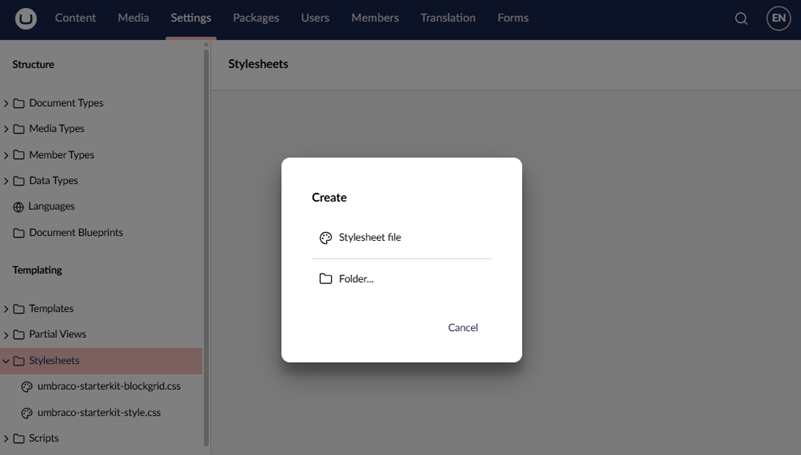
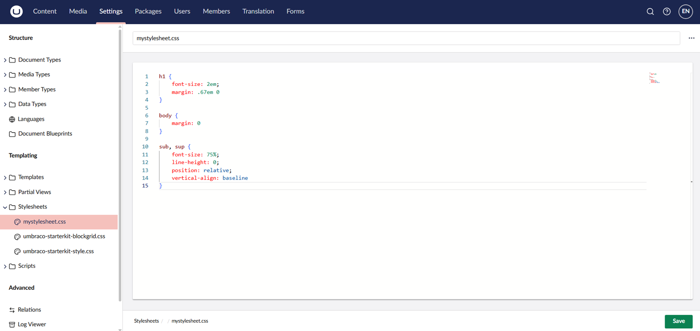
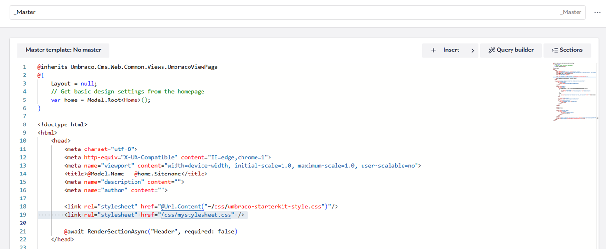
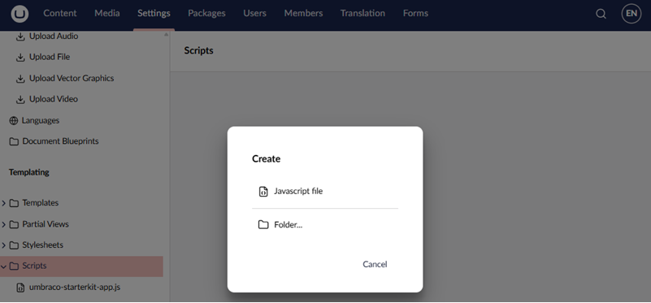
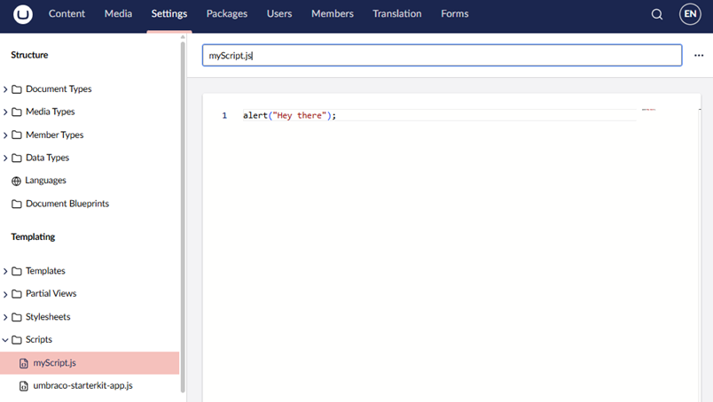
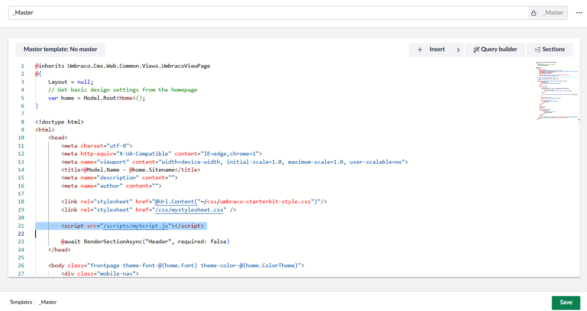

# Stylesheets And JavaScript

In Umbraco, you can manage stylesheets and JavaScript files directly from the backoffice. These files are used to control the appearance and behavior of your website.

This article explains how to work with stylesheets and JavaScript and clarifies how styling works with the Rich Text Editor (RTE) Data Type.

## Stylesheets in the Backoffice

Stylesheets are used to define how your website content is displayed. You can create and manage CSS files from the **Settings** section.

### Creating a stylesheet

To create a stylesheet:

1. Go to **Settings** section in the backoffice.
2. Expand the **Stylesheets** folder.
3. Click the **⋯** (options) menu.
4. Select **Create**.



5. Select **Stylesheet file**.
6. Give the file a name and add your CSS.



7. Click **Save**.

The stylesheet is saved in the `wwwroot/css` folder of your project.

### Using stylesheets

Stylesheets created in the backoffice are standard CSS files. To use them on your website, reference them in your templates or layout files:



```html
<link rel="stylesheet" href="@Url.Content("~/css/umbraco-starterkit-style.css")"/>
```

or

```html
<link rel="stylesheet" href="/css/mystylesheet.css" />
```

## JavaScript files in the Backoffice

JavaScript files can also be created and managed from the backoffice.

### Creating a JavaScript file

To create JavaScript files:

1. Go to **Settings** section in the backoffice.
2. Expand the **Scripts** folder.
3. Click the **⋯** (options) menu.
4. Select **Create**.



5. Select **JavaScript file**.
6. Give the file a name and add your JavaScript code.



7. Click **Save**.

The JavaScript is saved in the `wwwroot/scripts` folder of your project.

### Using JavaScript files

Navigate to the template where you would like to reference your scripts:

```html
<script src="/scripts/myScript.js"></script>
```




If you are working locally, you can create CSS and JS files outside of the Backoffice. Place files in the `css` or `scripts` folders. In the Backoffice, click **...** next to the **Stylesheets**  or **Scripts** folder and select **Reload children**.


## Rich Text Editor styling

Editor styles are configured using the Style Menu in RTE. To provide editors with predefined styles such as classes, tags, or IDs, you must configure them as part of the Style Menu configuration. For more information, see the [Rich Text Editor](https://docs.umbraco.com/umbraco-cms/fundamentals/backoffice/property-editors/built-in-umbraco-property-editors/rich-text-editor/style-menu#creating-a-custom-style-select-menu) article.


Styles defined in your CSS must still exist for the frontend, but they will not automatically appear in the Rich Text Editor.


If content appears differently in the backoffice editor than on the frontend, it may be caused by additional stylesheets applied in your site.
