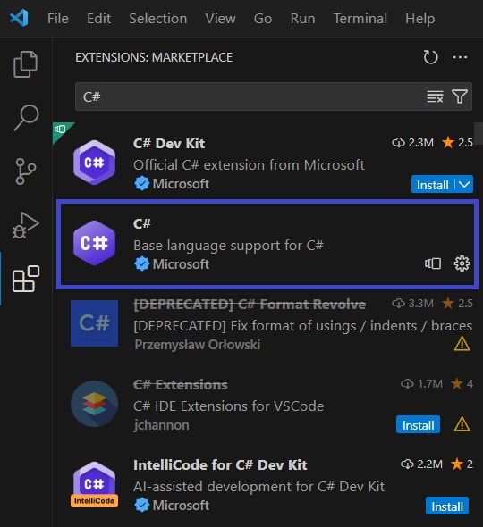
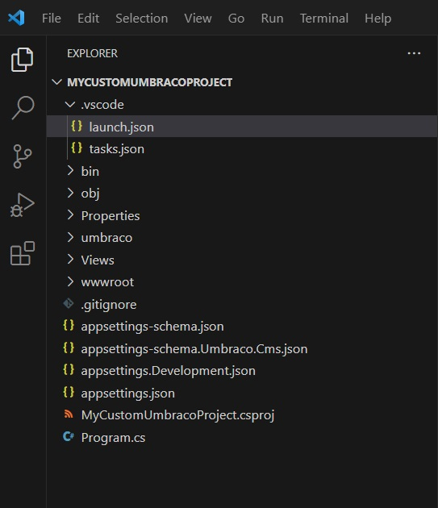
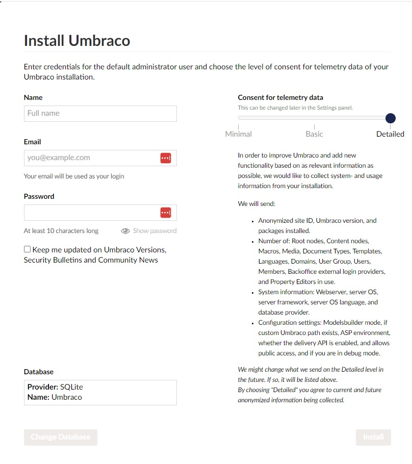

# Install using Visual Studio Code

The benefit of using Visual Studio Code is that it is super quick to get up and running. Follow these steps to set up an Umbraco project with Visual Studio Code.

## Installing and setting up Visual Studio Code

1. Go to [https://code.visualstudio.com/](https://code.visualstudio.com/) and download Visual Studio Code for free.
2. Launch Visual Studio Code once the installation is complete.
3. Click the extensions menu on the left side.
4. Search for **C#** and install it.

    

## Creating your Umbraco project

Follow the [Install using .NET CLI](install-umbraco-with-templates.md) article to create your project folder.

## Configure Visual Studio Code to run the Umbraco project

1. Open your project folder in Visual Studio Code.

2. Open the command palette using the shortcut `Ctrl+Shift+P`.
3. Type **Tasks: Configure**.
4. Select **Tasks: Configure Task**.

.png>)

5. Select **Create task.json from template**.

.png>)

6. select **.NET Core** as your template.

.png>)

Visual Studio Code creates a folder called **.vscode** that contains a file called **tasks.json**. The **tasks.json** file tells Visual Studio Code how to build your project.

7. Select the **Run and Debug** button from the left side menu.
8. Select the **Create a launch.json file** link.

9. Select **.NET 5+ and .NET Core**.

.jpg>)


If **.NET 5+ and .NET Core** is missing in the drop-down menu:

1. Press **Ctrl + Shift + P** (on Windows/Linux) or **Cmd + Shift + P** (on macOS) to open the Command Palette.
2. Search for the command `.NET: Generate Assets for Build and Debug`.
   This command will generate the necessary assets for building and debugging your .NET application.


Now you'll see a green play button appear with a dropdown where **.NET Core Launch (web)** is selected.

.jpg>)

If you navigate to the **Explorer** section, a new **launch.json** file is created in the **.vscode** folder. When you press F5, the **launch.json** file tells Visual Studio Code to build your project, run it, and then open a browser.

With that, you're ready to run the project. Press F5 or click the green play button in the **Run and Debug** section to run your brand new Umbraco site locally.

## Umbraco Web Installer

This section covers the installation and configuration of Umbraco inside your web browser when you run Umbraco for the first time.

You will see the install screen where you will need to fill in some data before Umbraco can be installed.

When the installation is completed, you will be prompted to enter the login credentials. Enter the credentials you used to install Umbraco.

After entering the credentials, you are logged into the backoffice.

Congratulations, you have now installed an Umbraco site.


You can log into your Umbraco site by entering the following into your browser: `https://localhost:xxxxx/umbraco/`.

