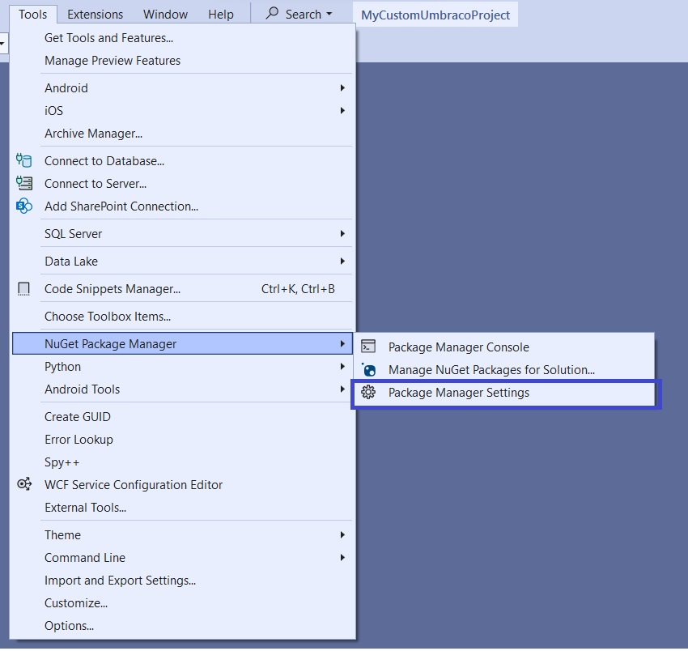
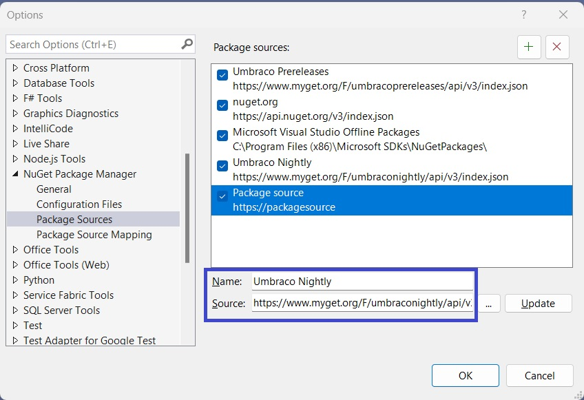
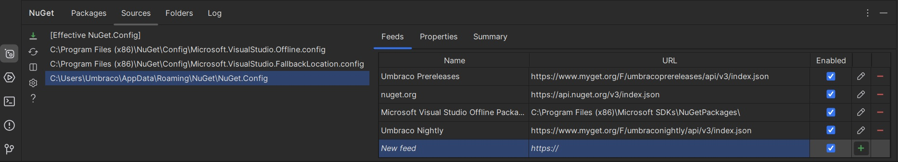
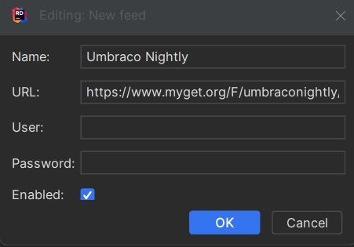
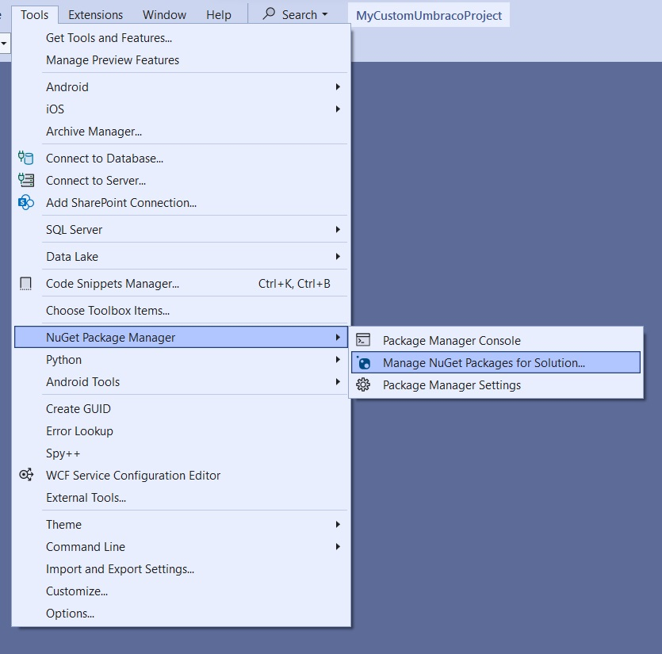
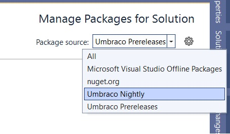
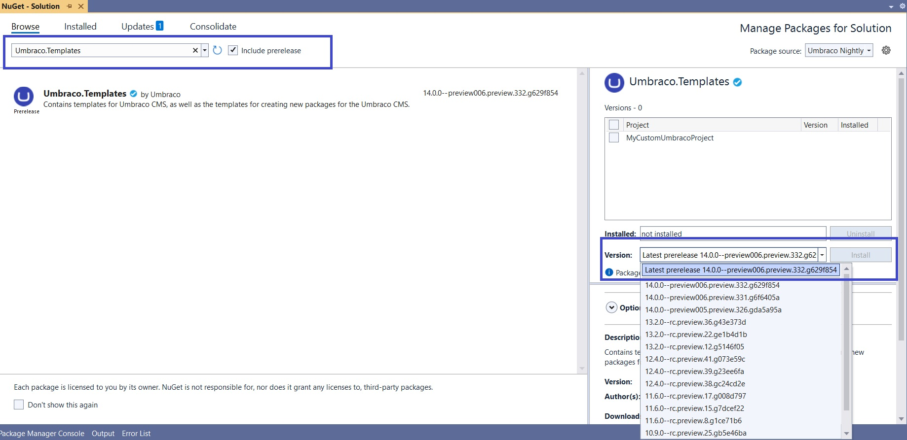
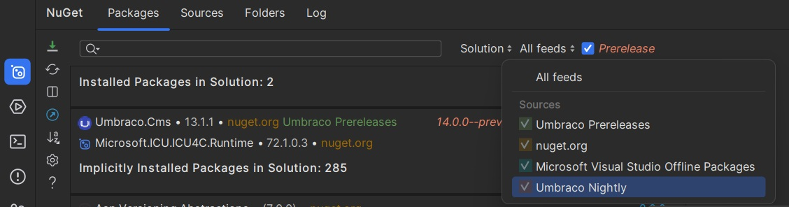
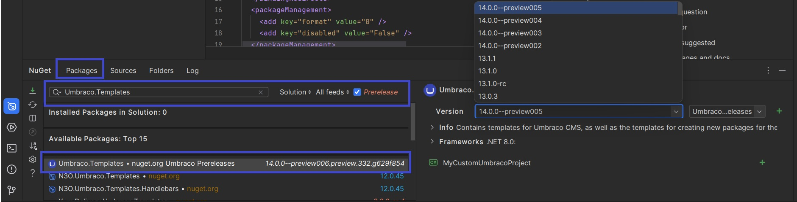

# Installing Nightly Builds


Nightly builds are pre-releases and may be unstable. Do not use them in production environments.


This article covers how to get the latest builds of Umbraco. You can do this in three steps:

1. [Adding the nightly feed as a NuGet source](installing-nightly-builds.md#adding-the-nightly-feed-as-a-nuget-source)
2. [Finding the latest nightly version](installing-nightly-builds.md#finding-the-latest-nightly-version)
3. [Installing the latest nightly version template](installing-nightly-builds.md#installing-the-latest-nightly-version-template)

## Adding the nightly feed as a NuGet source

The nightly builds are available on the following NuGet feed: `https://www.myget.org/F/umbraconightly/api/v3/index.json`.

You can either add the feed through the command line or use an IDE of your choice.

This article covers the following options:

* [Using the command line](installing-nightly-builds.md#option-1-using-the-command-line)
* [Using Visual Studio](installing-nightly-builds.md#option-2-using-visual-studio)
* [Using Rider](installing-nightly-builds.md#option-3-using-rider)

### Option 1: Using the command line

Follow these steps to add the nightly feed using the command line:

1. Open a command prompt of your choice.
2. Run the following command:

```bash
dotnet nuget add source "https://www.myget.org/F/umbraconightly/api/v3/index.json" -n "Umbraco Nightly"
```

Now the feed is added as a source named `Umbraco Nightly`.

### Option 2: Using Visual Studio

Follow these steps to add the nightly feed using Visual Studio:

1. Open Visual Studio.
2. Go to **Tools** > **NuGet Package Manager** > **Package Manager Settings**.



3. Select the **Package Sources** option in the **NuGet Package Manager** section.
4. Click the `+` icon.
5. Enter the desired name for the feed in the **Name** field.
6. Enter the link `https://www.myget.org/F/umbraconightly/api/v3/index.json` into the **Source** field.
7. Click **OK**.



Now the feed is added as a source named `Umbraco Nightly`.

### Option 3: Using Rider

Follow these steps to add the nightly feed using Rider:

1. Open Rider.
2. Go to **View** > **Tool Windows** > **NuGet**.
3. Go to **Sources** tab.
4. Select the global `NuGet.Config` to add the feed globally.
5. Click the green `+` button in the **New Feed** field.



6. Enter the desired name in the **Name** field.
7. Enter `https://www.myget.org/F/umbraconightly/api/v3/index.json` in the URL field.


Leave the **User, Password** fields empty, and the **Enabled** checkbox ticked.




8. Click **OK**.

Now the feed is added as a source named `Umbraco Nightly`.

## Finding the latest nightly version

The next step is to identify which nightly build to install.

However, which version do you choose? This is especially relevant when creating a new site using the dotnet template. The dotnet command does not allow for using wildcard characters to install the newest version.

Using an IDE, you can see a list of available versions in both Visual Studio and Rider. Use these versions to install the template you need.

The following steps apply to creating a new site using the dotnet template. The approach is the same if you're updating an existing site. You'll click the **Update** button for the `Umbraco.Cms` package instead of installing the template through the terminal.

Find the latest version of the nightly build using either of the following options:

* [Visual Studio](installing-nightly-builds.md#option-1-using-visual-studio)
* [Rider](installing-nightly-builds.md#option-2-using-rider)

### Option 1: Using Visual Studio

Use the package manager in Visual Studio to browse the available template versions.

1. Open Visual Studio.
2. Go to **Tools** > **NuGet Package Manager** > **Manage NuGet Packages For Solution...**



3. Select **Umbraco Nightly** from the **Package source** dropdown in the **NuGet - Solution** window.



4. Check the **Include prerelease** checkbox.
5. Search for **Umbraco.Templates** in the **Browse** field.
6. Choose that package.
7. Click on the **Version** dropdown and see the available nightly builds.
8. Choose the applicable version and note down the version number.



### Option 2: Using Rider

Use the NuGet window in Rider to browse the available template versions.

1. Open Rider.
2. Go to the **Packages** tab in the **NuGet** window.
3. Select **Umbraco Nightly** from the **All Feeds** dropdown.



4. Check the **Prerelease** checkbox.
5. Search for **Umbraco.Templates** in the **Search** field.
6. Choose that package.
7. Click on the **Version** drop down and see the available nightly builds.
8. Choose the applicable version and note down the version number.



## Installing the latest nightly version template

To install the latest nightly version template:

1. Open the command prompt/terminal.
2. Run the following command, replacing the version with the one you noted in the previous step:

```bash
dotnet new install Umbraco.Templates::X.Y.Z--build.N
```

You can now create a site using the `dotnet new umbraco -n MyAwesomeNightlySite` command.

For more information about installing Umbraco, see the [Installation](./) article.
