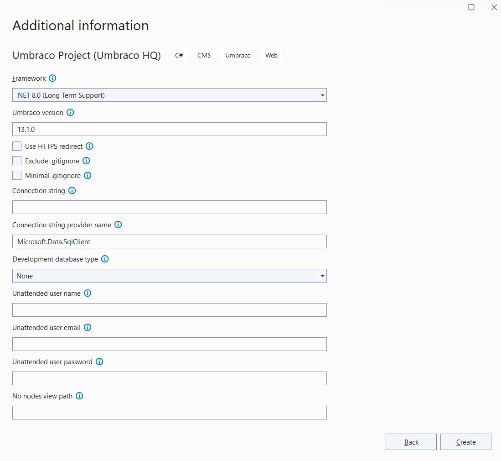

# Unattended Installs

In some cases, you might need to install Umbraco instances automatically without having to run through the installation wizard to configure the instance.

You can use the **Unattended installs** feature to allow for quick installation and set up of Umbraco instances on something like Azure Web Apps.

This article will give you the details you need to install Umbraco unattended.

## Get clean install of Umbraco

In order to get a clean instance of Umbraco, follow our installation guide for how to [Install an Umbraco project template](install-umbraco-with-templates.md#install-using-net-cli).

## Configure your database

As you will not be running through the installation wizard when using this feature, you need to manually tell Umbraco which database to use.

* Set up and configure a new database - see [Requirements](../requirements.md#hosting) for details.
* Add the connection string using configuration.


Umbraco can create an SQL Server database for you during the unattended install process. The user specified by the credentials in your connection string needs to have the `CREATE DATABASE` permission granted and the global setting [InstallMissingDatabase](../../../reference/configuration/globalsettings.md#install-missing-database) is set to `true`.

If your connection string is for SQLite or SQL Server Express LocalDB it is assumed that a database should be created when missing. This is regardless of the value of the `InstallMissingDatabase` setting.


### SQL Server Example in appsettings.json

```json
{
  "ConnectionStrings": {
    "umbracoDbDSN": "server=localhost;database=UmbracoUnicore;user id=sa;password='P@ssw0rd'",
    "umbracoDbDSN_ProviderName": "System.Data.SqlClient"
  }
}
```


The 'umbracoDbDSN\_ProviderName' attribute sets the .NET Framework data provider name for the DataSource control's connection. For more information on the data providers included in the .Net Framework, see the [Microsoft Documentation](https://learn.microsoft.com/en-us/dotnet/api/system.web.ui.webcontrols.sqldatasource.providername?#remarks).


### SQLite Example in appsettings.json

A value is configured for the key`umbracoDbDSN_ProviderName` to ensure usage of the `Microsoft.Data.SQLite` ADO.NET provider.

It is recommended that you make use of the values shown below for the `Cache`, `Foreign Keys` and `Pooling` keywords on your connection string.

```json
{
  "ConnectionStrings": {
    "umbracoDbDSN": "Data Source=|DataDirectory|/Umbraco.sqlite.db;Cache=Shared;Foreign Keys=True;Pooling=True",
    "umbracoDbDSN_ProviderName": "Microsoft.Data.Sqlite"
  }
}
```

## Enable the unattended installs feature

The unattended installs feature is disabled by default. In order to enable it, you need to add the following JSON object to a JSON configuration source.

```json
{
  "Umbraco": {
    "CMS": {
      "Unattended": {
        "InstallUnattended": true,
        "UnattendedUserName": "FRIENDLY_NAME",
        "UnattendedUserEmail": "EMAIL",
        "UnattendedUserPassword": "PASSWORD",
        "UnattendedTelemetryLevel": "Detailed"
      }
    }
  }
}
```

Remember to set the value of `InstallUnattended` to `true`.

The `UnattendedTelemetryLevel` can be set to `Minimal`, `Basic`, or `Detailed`. If omitted, `Detailed` is the default.

Alternatively you may set your configuration with Environment Variables or other means. Learn more about this in the [Microsoft .Net Core config documentation](https://docs.microsoft.com/en-us/aspnet/core/fundamentals/configuration/?view=aspnetcore-5.0#environment-variables).

The keys for this would then be as follows:

```
Umbraco__CMS__Unattended__InstallUnattended
Umbraco__CMS__Unattended__UnattendedUserName
Umbraco__CMS__Unattended__UnattendedUserEmail
Umbraco__CMS__Unattended__UnattendedUserPassword
Umbraco__CMS__Unattended__UnattendedTelemetryLevel
```

## Initialize the unattended install

After completing the steps above you can now initialize the installation by booting up the Umbraco instance.

Once it has completed, you should see the following when visiting the frontend of the site.

<figure><figcaption></figcaption></figure>

## Configuration options

Depending on your preferences, you can use any type of configuration to specify the connection string and login information, as well as enable unattended install. With the extending configuration functionality, it is possible to read from all kinds of sources. One example can be using a JSON file or environment variables.

**Program.cs** has a condition, which if met, an _appsettings.Local.json_ file will be added and configured as a configuration source.

```
#if DEBUG
  .ConfigureAppConfiguration(config
    => config.AddJsonFile(
      "appsettings.Local.json",
      optional: true,
      reloadOnChange: true))
#endif
```

Having intellisense will help you to add your connection string and information needed for the unattended install.

```json
{
    "ConnectionStrings": {
        "umbracoDbDSN": "server=localhost;database=UmbracoUnicore;user id=sa;password='P@ssw0rd'"
    },
    "Umbraco": {
        "CMS": {
            "Unattended": {
                "InstallUnattended": true,
                "UnattendedUserName": "FRIENDLY_NAME",
                "UnattendedUserEmail": "EMAIL",
                "UnattendedUserPassword": "PASSWORD",
                "UnattendedTelemetryLevel": "Detailed"
            }
        }
    }
}
```

## More support

We have added support for unattended installs with Name, Email and Password, and Connection String as CLI params, which are also available in Visual Studio. There you can fill in your information as follows:

### CLI

```powershell
dotnet new umbraco -n MyNewProject --friendly-name "Friendly User" --email user@email.com --password password1234 --telemetry-level Detailed --connection-string "Server=(localdb)\Umbraco;Database=MyDatabase;Integrated Security=true" --version 10.0.0
```

### Visual Studio

<figure><figcaption></figcaption></figure>

## References

For running Umbraco in Docker containers, see [Running Umbraco in Docker using Docker Compose](running-umbraco-on-docker-locally.md) article.
