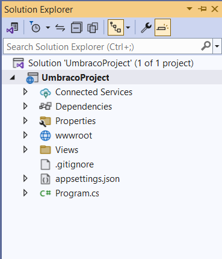

# Install using Visual Studio

## Prerequisites

* Check the [Requirements](../requirements.md) article to ensure you have everything you need to start your Umbraco project.

## Install the template

1. Install the latest [.NET SDK](https://dotnet.microsoft.com/download).
2. Run `dotnet new install Umbraco.Templates` to install the project templates.

### Create the Visual Studio project

1. Go to **File > New > Project/Solution**.
2. Search for `Umbraco` in the _Search for templates_ field.

3. Select **Umbraco Project (Umbraco HQ)**.
4. Click **Next**.
5. Enter a **Project name**.


Refrain from changing the Solution name, as this will cause a namespace conflict with the CMS itself.


5. Select **.Net 10.0 Long-Term Support (LTS)** from the **Framework** dropdown. The rest of the fields are optional.
6. Click **Create**.

The Umbraco Project is ready for you.

### Running the site

You can now run the site through Visual Studio using **F5** or the **Debug** button.

Follow the installation wizard and after a few steps, you will get a message saying the installation was a success.

## Next steps

You are now ready to start building your Umbraco project. Have a look below for different resources on the next steps.

* [Getting Started with Umbraco](../../../tutorials/creating-a-basic-website/getting-started.md)
* [Tutorial: Create a website from scratch](../../../tutorials/creating-a-basic-website/)
* [Find different options for hosting your Umbraco website](../server-setup/)
* [Learn about configuration in Umbraco CMS](../../../reference/configuration/)
