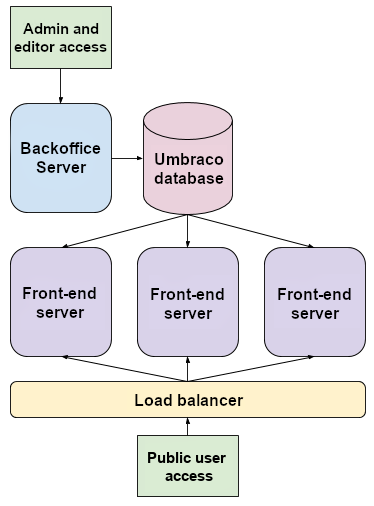
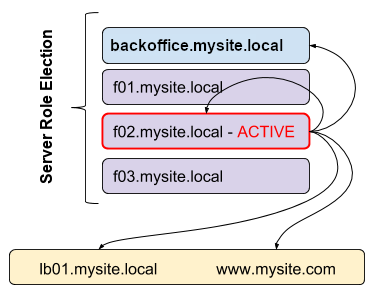

# Umbraco in Load Balanced Environments

## Overview

Configuring and setting up a load balanced server environment requires planning, design and testing. This document should assist you in setting up your servers, load balanced environment and Umbraco configuration.

This document assumes that you have a fair amount of knowledge about:

* Umbraco
* IIS 10+
* Networking & DNS
* Windows Server
* .NET5+


It is highly recommended that you setup your staging environment to also be load balanced so that you can run all of your testing on a similar environment to your live environment.


## Design

These instructions make the following assumptions:

* All web servers can communicate with the database where Umbraco data is stored
* You are running Umbraco 9.0.0 or above
* _**You will designate a single server to be the backoffice server for which your editors will log into for editing content.**_ Umbraco will not work correctly if the backoffice is behind the load balancer.

There are three design alternatives you can use to effectively load balance servers:

1. You use cloud based auto-scaling appliances like [Microsoft's Azure Web Apps](https://azure.microsoft.com/en-us/services/app-service/web/)
2. Each server hosts copies of the load balanced website files and a file replication service is running to ensure that all files on all servers are up to date
3. The load balanced website files are located on a centralized file share (SAN/NAS/Clustered File Server/Network Share)

You will need a load balancer to do your load balancing.

## How Umbraco load balancing works

In order to understand how to host your site it is best to understand how Umbraco's flexible load balancing works.

The following diagram shows the data flow/communication between each item in the environment:

The process is as follows:

* Administrators and editors create, update, delete data/content on the backoffice server
* These events are converted into data structures called "instructions" and are stored in the database in a queue
* Each front-end server checks to see if there are any outstanding instructions it hasn't processed yet
* When a front-end server detects that there are pending instructions, it downloads them and processes them and in turn updates it's cache, cache files and indexes on its own file system
* There can be a delay between content updates and a front-end server's refreshing, this is expected and normal behaviour.

## Scheduling and server role election

Although there is a backoffice server designated for administration, by default this is not explicitly set as the "Scheduling server". In Umbraco there can only be a single scheduling server which performs the following tasks:

* Scheduled tasks - to initiate any configured scheduled tasks
* Scheduled publishing - to initiate any scheduled publishing for documents

### Automatic Server Role Election

Umbraco will automatically elect a "Scheduling server" to perform the above services. This means that all of the servers will need to be able to resolve the URL of either: itself, the Backoffice server, the internal load balancer, or the public address.

There are two server roles:

* `SchedulingPublisher` - Usually this is the backoffice instance.
* `Subscriber` - These are the scalable front-end instances - not recommended to be used for backoffice access.


These new terms replace 'Master and Replica', in Umbraco versions 7 and 8.


Each instance will be allocated a role by the automatic server role election process, but they can also be set explicitly (recommended)

For example, In the following diagram the node **f02.mysite.local** is the elected "Scheduling server". In order for scheduling to work it needs to be able to send requests to itself, the Backoffice server, the internal load balancer or the public address. The address used by the "Scheduling server" is called the "umbracoApplicationUrl".

By default, Umbraco will set the "umbracoApplicationUrl" to the address made by the first accepted request when the AppDomain starts. It is assumed that this address will be a DNS address that the server can resolve.

For example, if a public request reached the load balancer on `www.mysite.com`, the load balancer may send the request on to the servers with the original address: `www.mysite.com`. By default the "umbracoApplicationUrl" will be `www.mysite.com`. However, load balancers may route the request internally under a different DNS name such as "f02.mysite.local" which by default would mean the "umbracoApplicationUrl" is "f02.mysite.local". In any case the elected "Scheduling server" must be able to resolve this address.

In many scenarios this is fine, but in case this is not adequate there's a few of options you can use:

* **Recommended**: [set your front-end(s) (non-admin server) to be explicit subscriber servers](flexible-advanced.md#explicit-schedulingpublisher-server) by creating a custom `IServerRegistrar`, this means the front-end servers will never be used as the SchedulingPublisher server role.
* Set the `UmbracoApplicationUrl` property in the [WebRouting section of the CMS config](../../../../reference/configuration/webroutingsettings.md)

## Common load balancing setup information

_The below section applies to all ASP.NET load balancing configurations._

## Server Configuration

This section describes the configuration options depending on your hosting setup:

1. [Azure Web Apps](azure-web-apps.md) - _You use cloud based auto-scaling appliances like_ [_Microsoft's Azure Web Apps_](https://azure.microsoft.com/en-us/services/app-service/web/)
2. [File Replication](file-system-replication.md#synchronised-file-system) - _Each server hosts copies of the load balanced website files and a file replication service is running to ensure that all files on all servers are up to date_
3. [Centralized file share](file-system-replication.md#synchronised-file-system) - _The load balanced website files are located on a centralized file share (SAN/NAS/Clustered File Server/Network Share)_

[Full documentation is available here](file-system-replication.md)

### Data Protection

The replacement for Machine Keys in ASP.NET Core are called Data Protection. You will need to setup data protection to the same keys on all servers, without this you will end up with view state errors, validation errors and encryption/decryption errors since each server will have its own generated key.

ASP.NET Core supports multiple ways to share keys. Use the [official docs](https://docs.microsoft.com/en-us/aspnet/core/security/data-protection/configuration/overview) to find a description that fits your setup the best.

### Session State and Distributed Cache

It is required to setup a distributed cache, like `DistributedSqlServerCache` or an alternative provider (see [https://docs.microsoft.com/en-us/aspnet/core/performance/caching/distributed](https://docs.microsoft.com/en-us/aspnet/core/performance/caching/distributed) for more details). The distributed cache is used by the session in your application, which is used by the default TempDataProvider in MVC.

Because Umbraco in some cases uses TempData, your setup needs to be configured with a distributed cache.

### Logging

There are some logging configurations to take into account no matter what type of load balancing environment you are using.

[Full documentation is available here](logging.md)

### Testing

Your staging environment should also be load balanced so that you can see any issues relating to load balancing in that environment before going to production.

You'll need to test this solution **a lot** before going to production. You need to ensure there are no windows security issues, etc... The best way to determine issues is have a lot of people testing this setup and ensuring all errors and warnings in your application/system logs in Windows are fixed.

Ensure to analyze logs from all servers and check for any warnings and errors.

## Unattended upgrades

When upgrading it is possible to run the upgrades unattended.

Find steps on how to enable the feature for a load balanced setup in the [General Upgrades](../../upgrading/#unattended-upgrades-in-a-load-balanced-setup) article.

## FAQs

_Here's some common questions that are asked regarding Load Balancing with Umbraco:_

**Question>** _Why do I need to have a single web instance for Umbraco admin?_

_TL:DR_ You must not load balance the Umbraco backoffice, you will end up with data integrity or corruption issues.

The reason you need a single server is because there is no way to guarantee transactional safety between servers. This is because we don't currently use database level locking, we only use application (c#) level locks to guarantee transactional data integrity which is only possible to work on one server. If you have multiple admins saving and publishing at once between servers then the order in which this data is read and written to the database absolutely must be consistent otherwise you will end up with data corruption.

Additionally, the order in which cache instructions are written to the cache instructions table is important for LB, this order is guaranteed by having a single admin server.

**Question>** _Can my SchedulingPublisher backoffice admin server also serve front-end requests?_

Yes. There are no problems with having your SchedulingPublisher backoffice admin server also serve front-end request.

However, if you wish to have different security policies for your front-end servers and your back office servers, you may choose to not do this.

***

## Umbraco Training


