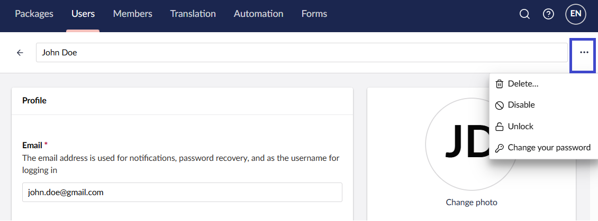
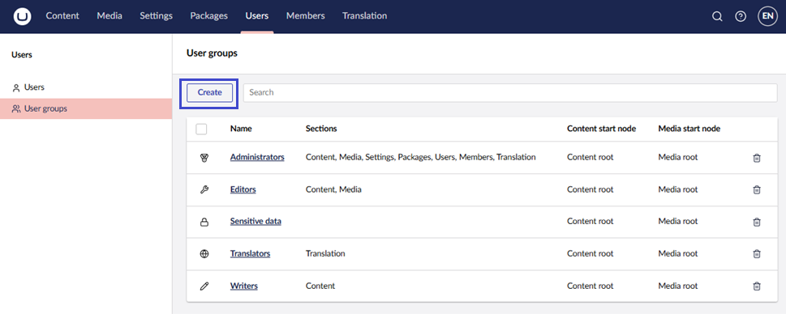
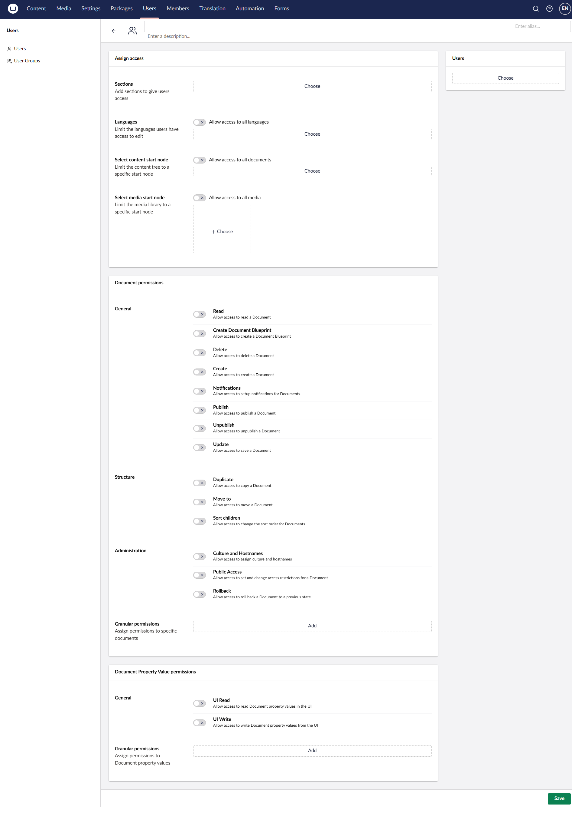

# Users

Users are people who have access to the Umbraco backoffice (not to be confused with [Members](../members.md)). These could include Content Editors, Translators, Web Designers, and Developers.

This guide will walk you through how to create and invite users, manage user profiles, work with User Groups and permissions in the backoffice.

## Creating a User

To create or invite a User:

1. Go to the **Users** section in the backoffice.
2. Select **Create -> User**. Alternatively, click **Invite...**.
3. Enter the **Name** and **Email** of the new user.
4. Select which **User group** the new user should be added to.
5. _[Optional]_ Enter a **Message** for the invitation.
6. Click **Create user** or **Send invite**.

Once you have created the user, the new user will receive a system-generated password for their initial login. This password needs to be used to access the account.

### Managing a User Profile

Open a user’s profile from the **Users** section to update:

* Profile photo.
* Email address of the user.
* UI Culture (sets the backoffice language of the user account).
* User Group (determines the scope of access in the backoffice).
* Start nodes for both Content and Media sections to limit access.

### Managing User Access

From a user's profile, use the **⋯** menu (top-right) to manage their account access:

* **Delete...** : Permanently remove the user.
* **Disable**: Manually disable the user's access to the backoffice.
* **Unlock**: Available only when a user's status is **Locked out** (after repeated failed login attempts). Restores the user's ability to log in.
* **Change your password**: Reset the password for this user.

The status panel below the profile photo also shows account details for reference:

* Status (Active, Disabled, Locked out, Invited, Inactive)
* Kind
* Last login
* Failed login attempts
* Last lockout date
* Password last changed
* User created
* User last updated
* Id

## Managing Users

When working with multiple users in Umbraco, the user screen provides tools to help you quickly locate and manage users using filters and layout options.

### Filter and Organize Users

At the top of the Users section, use the search bar to quickly find a user by typing their name or email address.

Use the **Status** filter to narrow down users based on their current state:

* Active – Users who have logged in and are enabled.
* Disabled – Users whose access has been explicitly turned off.
* Locked out – User has been automatically blocked after too many failed login attempts.
* Invited – User has been sent an invitation to access the backoffice.
* Inactive – Users who haven't logged in or have been disabled.

The **Groups** filter lets you view users based on the user groups they belong to. For example:

* Administrators
* Editors
* Sensitive data
* Translators
* Writers

Use **Order by** to sort users by:

* Name (A–Z)
* Name (Z-A)
* Newest
* Oldest
* Last Login

### Layout Options

Users are displayed in Cards format by default, showing:

* Initials, full name, and group membership.
* Login status (for example, “Inactive” label).
* Last login time (if applicable).

Click the Cards/Table icon (top-right corner) to switch to a more compact, table-based layout.

## Default User Groups

By default, the User Groups available to new users are **Administrators**, **Editors**, **Sensitive Data**, **Translators,** and **Writers**.

* **Administrators**: Can do anything when editing nodes in the content section (has all permissions).
* **Editors**: Allowed to create and publish content items or nodes on the website without approval from others or restrictions. Editors have the following permissions:
  * All **Document permissions** except **Culture and Hostnames**
  * All **Document Property Value permissions**
* **Sensitive data**: Any users added to this User group will have access to view any data marked as sensitive. Learn more about this feature in the [Sensitive Data](../../../run-in-production/security/sensitive-data-on-members.md) article.
* **Translators**: These are used for translating your website. Translations of site pages must be reviewed by others before publication. Translators have the following permissions:
  * **Document permissions** limited to **Read** and **Update**
  * All **Document Property Value permissions**
* **Writers**: Allowed to read nodes, create nodes, receive notifications, and save content. Not allowed to publish directly. Writers have the following permissions:
  * **Document permissions** limited to **Read**, **Create**, **Notifications**, and **Update**
  * All **Document Property Value permissions**


In previous versions of Umbraco, "Send to publish" was enabled for Writers. Since Umbraco 16, approval processes can be configured using the official [Umbraco Workflow package](https://umbraco.com/products/add-ons/workflow/).


## Creating a User Group

You can also create your own custom User Groups to fit your specific access requirements.

1. Go to the **Users** section.
2. Select **User Groups**.
3. Click **Create**.

## User Group Parameters

Enter the information about the User Group and settings for custom properties:

* **Name**: The name of the User Group.
* **Alias**: Used to reference the User Group in code. The alias is auto-generated based on the name.
* **Assign access**: Define which sections and languages the users will have access to. Also, if the users should have access to only some or all content and media.
* **Users**: Add existing users directly to this User Group.
* **Document Permissions**: Select the permissions granted to users of the User Group for working with Documents.
* **Document Property Value Permissions**: Select the permissions granted to users of the User Group for reading and writing individual property values on a Document.

### Document Permissions

Depending on which User Group a user is added to, each user has a set of permissions associated with their accounts. These permissions either enable or disable a user's ability to perform their associated function.

The available permissions are grouped into **General**, **Structure**, and **Administration**.

#### General

* **Read**: Allow access to read a Document.
* **Create Document Blueprint**: Allow access to create a Document Blueprint.
* **Delete**: Allow access to delete a Document.
* **Create**: Allow access to create a Document.
* **Notifications**: Allow access to set up notifications for Documents.
* **Publish**: Allow access to publish a Document.
* **Unpublish**: Allow access to unpublish a Document.
* **Update**: Allow access to update a Document.

#### Structure

* **Duplicate**: Allow access to create a copy of a Document.
* **Move to**: Allow access to move a Document.
* **Sort children**: Allow access to change the sort order for Documents.

#### Administration

* **Culture and Hostnames**: Allow access to assign culture and hostnames.
* **Public Access**: Allow access to set and change access restrictions for a Document.
* **Rollback**: Allow access to roll back a Document to a previous state.

#### Granular Permissions

As an addition to Document permissions, it is also possible to add more granular permissions on specific Documents. Use the **Add** control under **Granular permissions** in the Document permissions card to choose specific Documents from the Content section.

### Document Property Value Permissions

Lets you define read and write permissions for individual properties on a Document Type.

* **UI Read**: Allow access to read Document property values in the UI.
* **UI Write**: Allow access to write Document property values from the UI.

Use the **Add** control under **Granular permissions** to select a Document Type, choose a Property, and set the read and write permissions for it.

### Setting User Permissions

When a new user is created, you can set specific permissions for that user on different domains and subdomains. You can also set permissions on different User Groups, even for the default types.

## Technical

As a developer, you are only able to leverage your website from the backoffice when you build on the Users section of Umbraco. This is because the Users section is restricted to the Umbraco backoffice.

For the full set of properties available on a User, see the [`IUser` interface reference](https://apidocs.umbraco.com/v17/csharp/api/Umbraco.Cms.Core.Models.Membership.IUser.html) documentation.

To manage users programmatically (for example, assigning a user to a User Group), see [Using the User Service](../../../extend-your-project/server-side-extensions/management/using-services/userservice.md) article.

## [Managing Forms Security](https://docs.umbraco.com/umbraco-forms/developer/security)

Umbraco Forms has a backoffice security model integrated with Umbraco Users. You can manage the details in the **Users** section of the backoffice, within a tree named **Forms Security**.
