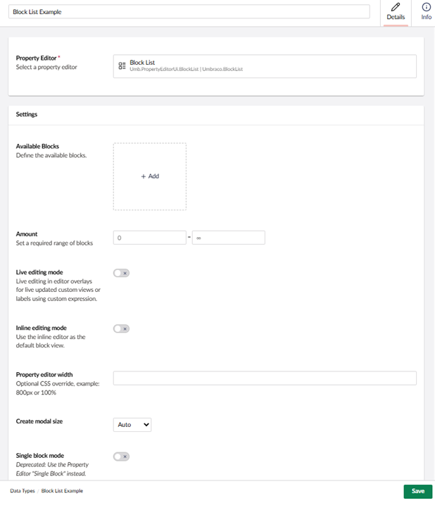
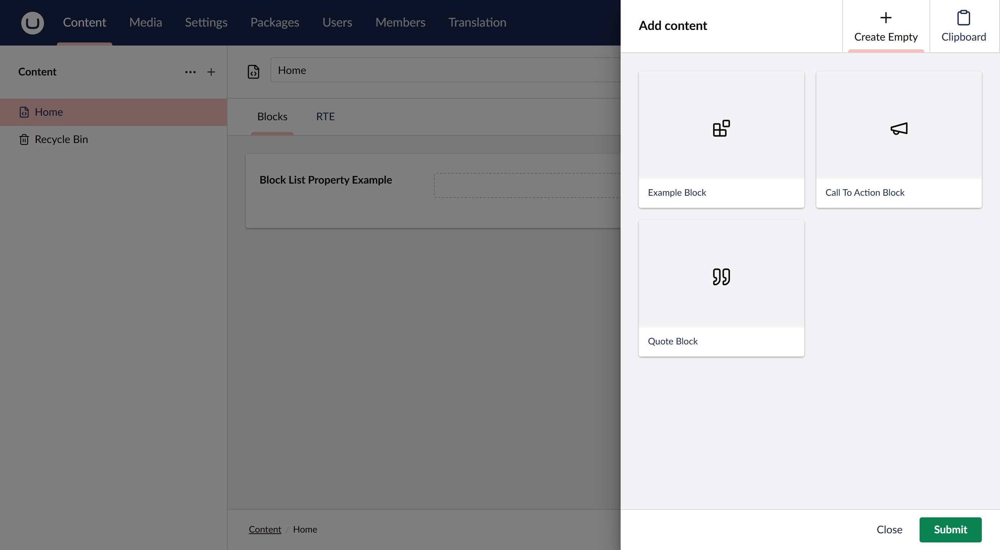
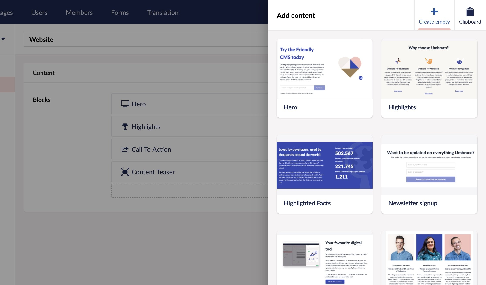
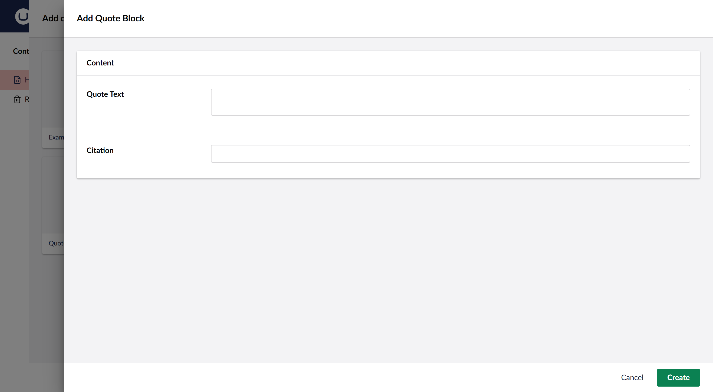
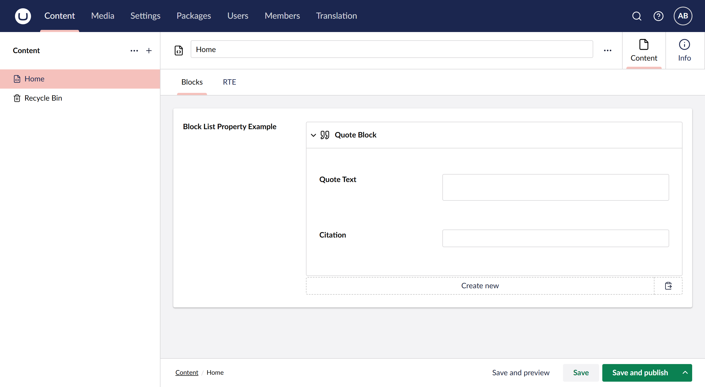
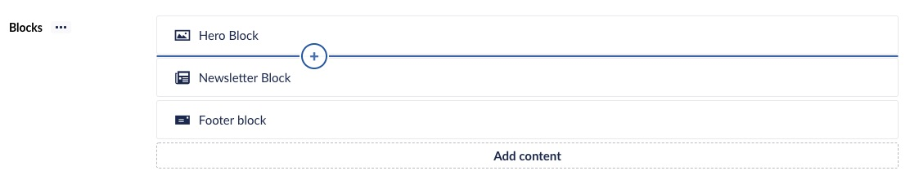
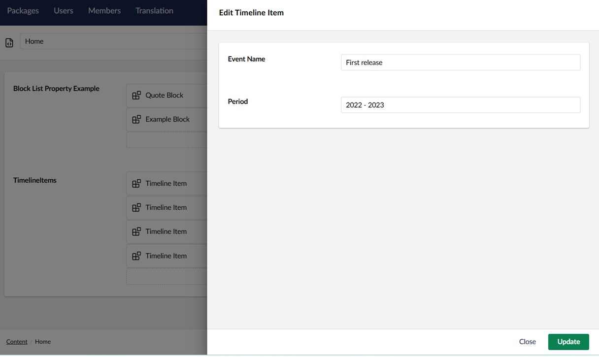

# Block List

`Schema Alias: Umbraco.BlockList`

`UI Alias: Umb.PropertyEditorUi.BlockList`

`Returns: IEnumerable<BlockListItem>`

**Block List** is a list editing property editor, using [Element Types](../../../content-types-and-structure/data/defining-content/default-document-types.md#element-type) to define the list item schema.


The _Block List_ replaces the obsolete _Nested Content_ editor.


## Configure Block List

The Block List property editor is configured in the same way as any standard property editor, via the _Data Types_ admin interface.

To set up your Block List Editor property, create a new _Data Type_ and select **Block List** from the list of available property editors.

Then you will see the configuration options for a Block List as shown below.



The Data Type editor allows you to configure the following properties:

* **Available Blocks** - Here you will define the Block Types to be available for use in the property. For more information, see [Setup Block Types](block-list-editor.md#setup-block-types).
* **Amount** - Sets the minimum and/or maximum number of blocks that should be allowed in the list.
* **Live editing mode** - Enabling this will make editing of a block happening directly to the document model, making changes appear as you type.
* **Inline editing mode** - Enabling this will change editing experience to inline, meaning that editing the data of blocks happens at sight as accordions.
* **Property editor width** - Overwrite the width of the property editor. This field takes any valid css value for "max-width".
* **Create modal size**- Controls the size of the overlay dialog that appears when an editor clicks to create or edit a block.
* **Single block mode** - When enabled, the Block List is restricted to a single block and the property returns a `BlockListItem<>` instead of `BlockListModel`


Single block mode is deprecated. Use the Single Block property editor instead.


## Setup Block Types

Block Types are **Element Types** which need to be created before you can start configuring them as Block Types. This can be done directly from the property editor setup process. You can also set them up beforehand and add them to the block list after.

Once you have added an element type as a Block Type on your Data Type you will have the option to configure it further.

.png>)

Each Block has a set of properties that are optional to configure. They are described below.

### Editor Appearance

You can configure the properties in the group to customize the user experience for your content editors. This helps them to quickly identify and select the right blocks for their content.

* **Label** - Define a label for the appearance of the Block in the editor. The label uses [Umbraco Flavoured Markdown](../../umbraco-flavored-markdown.md) to display values of properties. The label is also used for search in the **Add Block** dialog during content editing. If no label is defined, the block will not be searchable. The search does not fall back to the block’s name.
* **Overlay editor size** - Set the size for the Content editor overlay for editing this block.

### Data Models

It is possible to use two separate Element Types for your Block Types. Its required to have one for Content and optional to add one for Settings.

* **Content model** - This presents the Element Type used as model for the content section of this Block. This cannot be changed, but you can open the Element Type to perform edits or view the properties available. Useful when writing your Label.
* **Settings model** - Add a Settings section to your Block based on a given Element Type. When picked you can open the Element Type or choose to remove the settings section again.

### Catalogue appearance

These properties refer to how the Block is presented in the Block catalogue, when editors choose which Blocks to use for their content.

* **Background color** - Define a background color to be displayed beneath the icon or thumbnail. Eg. `#424242`.
* **Icon color** - Change the color of the Element Type icon. Eg. `#242424`.
* **Thumbnail** - Pick an image or SVG file to replace the icon of this Block in the catalogue.

The thumbnails for the catalogue are displayed at a maximum height of 150px and will scale proportionally to maintain their original aspect ratio. Any standard image format (PNG, JPG, SVG) will work effectively.


Configuring the catalogue appearance improves the content editor experience. A well-designed block catalogue with colors and thumbnails makes it easier for editors to quickly identify and select the right blocks for their content.


### Advanced

These properties are relevant when you work with custom views.

* **Force hide content editor** - If you made a custom view that enables you to edit the content part of a block and you are using default editing mode (not inline) you might want to hide the content-editor from the block editor overlay.

## Editing Blocks

When viewing a **Block List** editor in the Content section for the first time, you will be presented with the option to add content.

.png>)

Clicking the "Create new" button brings up the Block Catalogue. If you only have a single block configured, this button will display "Add {block type name}".



The Block Catalogue looks different depending on the amount of available Blocks and their catalogue appearance.



Click the Block Type you wish to create and a new Block will appear in the list.

Depending on whether your Block List Editor is setup to use default or inline editing mode you will see one of the following things happening:

In default mode you will enter the editing overlay of that Block:



In inline editing mode the new Blocks will expand to show its inline editor:



More Blocks can be added to the list by clicking the "Create new" button. You can also use the inline Add button that appears on hover between or above existing Blocks.



To reorder the Blocks, click and drag a Block up or down to place in the desired order.

To delete a Block click the trash-bin icon appearing on hover.

## Rendering Block List Content

Rendering the stored value of your **Block List** property can be done in two ways.

### 1. Default rendering

You can choose to use the built-in rendering mechanism for rendering blocks via a Partial View for each block.

The default rendering method is named `GetBlockListHtml()` and comes with a few options to go with it. The typical use could be:

```csharp
@Html.GetBlockListHtml(Model, "MyBlocks")
```

"MyBlocks" above is the alias for the Block List editor.

If using ModelsBuilder the example can be simplified:

Example:

```csharp
@Html.GetBlockListHtml(Model.MyBlocks)
```

To make this work you will need to create a Partial View for each block. The partial view should be named by the alias of the Element Type that is being used as Content Model.

These partial views must be placed in this folder: `Views/Partials/BlockList/Components/`. Example: `Views/Partials/BlockList/Components/MyElementTypeAliasOfContent.cshtml`.

A Partial View will receive the model of `Umbraco.Core.Models.Blocks.BlockListItem`. This gives you the option to access properties of the Content and Settings section of your Block.

In this example of a Partial view for a Block Type, the `MyElementTypeAliasOfContent` and `MyElementTypeAliasOfSettings` should correspond with the selected Element Type Alias for the given model.

Example:

```csharp
@inherits Umbraco.Cms.Web.Common.Views.UmbracoViewPage<Umbraco.Cms.Core.Models.Blocks.BlockListItem>;
@using ContentModels = Umbraco.Cms.Web.Common.PublishedModels;
@{
    var content = (ContentModels.MyElementTypeAliasOfContent)Model.Content;
    var settings = Model.Settings as ContentModels.MyElementTypeAliasOfContent; // Cast Model.Settings safely using 'as' to avoid null reference exceptions
}

@* Output the value of field with alias 'heading' from the Element Type selected as Content section *@
<h1>@content.Value("heading")</h1>
```

`ContentModels.MyElementTypeAliasOfContent` must be replaced with the PascalCase version of your Element Type alias, as generated by ModelsBuilder. For example, an Element Type with alias `exampleBlock` becomes `ContentModels.ExampleBlock`.

With ModelsBuilder:

```csharp
@* Output the value of field with alias 'heading' from the Element Type selected as Content section *@
<h1>@content.Heading</h1>
```

### 2. Build your own rendering

A built-in value converter is available to use the data as you like. Call the `Value<T>` method with a generic type of `IEnumerable<BlockListItem>` and the stored value will be returned as a list of `BlockListItem` entities.

Example:

```csharp
@using Umbraco.Cms.Core.Models.Blocks
@using Umbraco.Cms.Web.Common.PublishedModels;
@inherits Umbraco.Cms.Web.Common.Views.UmbracoViewPage<ContentModels.TestBlockPage>
@using ContentModels = Umbraco.Cms.Web.Common.PublishedModels;
@{
    var blocks = Model.Value<IEnumerable<BlockListItem>>("myBlocksProperty");
    foreach (var block in blocks)
    {
        var content = block.Content;

        @Html.Partial("MyFolderOfBlocks/" + content.ContentType.Alias + ".cshtml", block)
    }
}
```

Replace `MyFolderOfBlocks/` with the path to your partial views folder. If using the default location, this should be `~/Views/Partials/BlockList/Components/`.

Each item is a `BlockListItem` entity that contains two main properties `Content` and `Settings`. Each of these is a `IPublishedElement` which means you can use all the value converters you are used to using.

Example:

```csharp
@using Umbraco.Cms.Core.Models.Blocks
@using Umbraco.Cms.Web.Common.PublishedModels;
@inherits Umbraco.Cms.Web.Common.Views.UmbracoViewPage<ContentModels.TestBlockPage>
@using ContentModels = Umbraco.Cms.Web.Common.PublishedModels;
@{
    var blocks = Model.Value<IEnumerable<BlockListItem>>("myBlocksProperty");
    foreach (var block in blocks)
    {
        var content = (ContentModels.MyAliasOfContentElementType)block.Content;
        var settings = (ContentModels.MyAliasOfSettingsElementType)block.Settings;

        <h1>@content.MyExampleHeadlinePropertyAlias</h1>
    }
}
```

## Extract Block List Content data

Sometimes, you might want to use the Block List Editor to hold some data and not necessarily render a view. This applies when the data should be presented in different areas on a page. An example could be a product page with variants stored in a Block List Editor.

In this case, you can extract the variant's data using the following, which returns `IEnumerable<IPublishedElement>`.

Example:

```csharp
@using Umbraco.Cms.Core.Models.Blocks
@using Umbraco.Cms.Web.Common.PublishedModels;
@inherits Umbraco.Cms.Web.Common.Views.UmbracoViewPage<ContentModels.TestBlockPage>
@using ContentModels = Umbraco.Cms.Web.Common.PublishedModels;
@{
    var variants = Model.Value<IEnumerable<BlockListItem>>("variants").Select(x => x.Content);
    foreach (var variant in variants)
    {
        <h4>@variant.Value("variantName")</h4>
        <p>@variant.Value("description")</p>
    }
}
```

`.Select(x => x.Content)` strips away the BlockListItem wrapper and returns the IPublishedElement content data, discarding the settings.

If using ModelsBuilder the example can be simplified:

Example:

```csharp
@using Umbraco.Cms.Core.Models.Blocks
@using Umbraco.Cms.Web.Common.PublishedModels;
@inherits Umbraco.Cms.Web.Common.Views.UmbracoViewPage<ContentModels.TestBlockPage>
@using ContentModels = Umbraco.Cms.Web.Common.PublishedModels;
@{
    var variants = Model.Variants.Select(x => x.Content).OfType<ProductVariant>();
    foreach (var variant in variants)
    {
        <h4>@variant.VariantName</h4>
        <p>@variant.Description</p>
    }
}
```

Replace the following:

* `Model.Variants` with the ModelsBuilder-generated property name for your Block List property, for example `Model.BlockListPropertyExample`.
* `<ProductVariant>` with the ModelsBuilder-generated class name for your element type, for example `QuoteBlock`.

If your Block List Editor only uses a single block, you can cast the collection to a specific type. Supply a type `T` using `.OfType<T>()`, otherwise the return value will be `IEnumerable<IPublishedElement>`.

## Build a Custom Backoffice View

Building Custom Views for Block representations in Backoffice is the same for all Block Editors. [Read about building a Custom View for Blocks here](../../../../extend-your-project/backoffice-extensions/extending-overview/extension-types/block-custom-view.md)

## Working with Block Lists Programmatically

Sometimes you need to create or update Block List content via code, for example, during content migrations, data imports, or automated workflows. This section explains how to achieve this using `IContentService` and `IContentTypeService`.

### Understanding the Block List JSON Format

Block List data is stored as a JSON string. Understanding this structure is essential before writing any import code.

* `layout`: Defines the order blocks appear in and links each block to its content through a `contentKey` (a GUID). If the block has a Settings model, the layout entry also holds a `settingsKey`.
* `contentData`: Holds the property values for each block. Every entry must include a `key` matching a `contentKey` in the layout, a `contentTypeKey` matching the GUID of the Element Type, and a `values` array of `{ "alias", "value" }` pairs.
* `settingsData`: Holds settings values if your Block Type has a Settings model configured. It follows the same shape as `contentData`.
* `expose`: Lists which blocks are visible, per culture and segment. A block is only rendered if it has a matching `expose` entry. For invariant content, use `null` for both `culture` and `segment`.


Before Umbraco 14, Block List data used a different format: blocks were referenced by UDI (`umb://element/...`), property values were stored as flat keys, and there was no `expose` array. Umbraco 17 can still read that legacy format for existing content, but it is removed in Umbraco 18. Always write new content in the format shown below.


```json
{
  "layout": {
    "Umbraco.BlockList": [
      { "contentKey": "abc123cd-0000-0000-0000-000000000000" }
    ]
  },
  "contentData": [
    {
      "key": "abc123cd-0000-0000-0000-000000000000",
      "contentTypeKey": "faeccfe7-ebea-4461-9caa-cc9e3541c969",
      "values": [
        { "alias": "myTextProperty", "value": "Hello world" }
      ]
    }
  ],
  "settingsData": [],
  "expose": [
    { "contentKey": "abc123cd-0000-0000-0000-000000000000", "culture": null, "segment": null }
  ]
}
```


You do not need to build this JSON by hand. Umbraco exposes strongly-typed models — `BlockListValue`, `BlockListLayoutItem`, `BlockItemData`, `BlockPropertyValue`, and `BlockItemVariation` — that serialize to exactly this structure through `IJsonSerializer`. The examples below use these models.


### Creating a Block List Programmatically

The following example shows how to build a Block List and save it to an existing content node. It assumes you have:

* A Document Type with a Block List property aliased `timelineItems`.
* An Element Type aliased `timelineItem` with two properties: `eventName` (Textstring Data Type) and `period` (Textstring Data Type).

#### Controller

Create a `TimelineImportController.cs` file in `MyProject/Controllers`.


```csharp
using Microsoft.AspNetCore.Mvc;
using Umbraco.Cms.Core;
using Umbraco.Cms.Core.Models.Blocks;
using Umbraco.Cms.Core.Serialization;
using Umbraco.Cms.Core.Services;

[ApiController]
[Route("/umbraco/api/timelineimport")]
public class TimelineImportController : ControllerBase
{
    private readonly IContentService _contentService;
    private readonly IContentTypeService _contentTypeService;
    private readonly IJsonSerializer _jsonSerializer;

    public TimelineImportController(
        IContentService contentService,
        IContentTypeService contentTypeService,
        IJsonSerializer jsonSerializer)
    {
        _contentService = contentService;
        _contentTypeService = contentTypeService;
        _jsonSerializer = jsonSerializer;
    }

    [HttpPost("import")]
    public IActionResult Import([FromBody] ImportModel importModel)
    {
        try
        {
            if (!Guid.TryParse(importModel.PageGuid, out var pageId))
                return BadRequest("Invalid pageGuid value.");

            var page = _contentService.GetById(pageId);
            if (page == null)
                return NotFound("Page not found.");

            if (!page.Properties.Contains(importModel.BlockListAlias))
                return BadRequest($"Property '{importModel.BlockListAlias}' does not exist.");

            var elementType = _contentTypeService.Get(importModel.ElementTypeAlias);
            if (elementType == null)
                return NotFound($"Element Type '{importModel.ElementTypeAlias}' not found.");

            var layout = new List<BlockListLayoutItem>();
            var contentData = new List<BlockItemData>();
            var expose = new List<BlockItemVariation>();

            foreach (var item in importModel.Items)
            {
                // Generate a unique key (GUID) for each block. Never reuse or hardcode these.
                var contentKey = Guid.NewGuid();

                layout.Add(new BlockListLayoutItem(contentKey));

                contentData.Add(new BlockItemData(contentKey, elementType.Key, elementType.Alias)
                {
                    Values =
                    {
                        new BlockPropertyValue { Alias = "eventName", Value = item.Name },
                        new BlockPropertyValue { Alias = "period", Value = $"{item.StartDate} - {item.EndDate}" }
                    }
                });

                // A block is only rendered if it is exposed.
                // Invariant content uses null for both culture and segment.
                expose.Add(new BlockItemVariation(contentKey, culture: null, segment: null));
            }

            var blockListValue = new BlockListValue(layout)
            {
                ContentData = contentData,
                Expose = expose
            };

            page.SetValue(importModel.BlockListAlias, _jsonSerializer.Serialize(blockListValue));

            // Calling Publish() alone without Save() first will not persist changes.
            _contentService.Save(page);
            var publishResult = _contentService.Publish(page, ["*"]);

            if (!publishResult.Success)
                return BadRequest($"Failed to publish page: {publishResult.Result}");

            return Ok("Items imported and published successfully.");
        }
        catch (Exception ex)
        {
            return StatusCode(500, $"Import failed: {ex.Message}");
        }
    }
}
```


#### Request Models


```csharp
public class ImportModel
{
    public string PageGuid { get; set; } = string.Empty;
    public string BlockListAlias { get; set; } = string.Empty;
    public string ElementTypeAlias { get; set; } = string.Empty;
    public List<TimelineItemModel> Items { get; set; } = new();
}

public class TimelineItemModel
{
    public string Name { get; set; } = string.Empty;
    public string StartDate { get; set; } = string.Empty;
    public string EndDate { get; set; } = string.Empty;
}
```


#### Testing the Import

1. Rebuild and run your project.
2. Make a POST request to:

```
POST https://localhost:{port}/umbraco/api/timelineimport/import
Content-Type: application/json
```

With this body, substituting your actual GUID from the **Info** tab:

```json
{
  "pageGuid": "YOUR-GUID-FROM-INFO-TAB",
  "blockListAlias": "timelineItems",
  "elementTypeAlias": "timelineItem",
  "items": [
    { "name": "Project launched", "startDate": "2021", "endDate": "2022" },
    { "name": "First release", "startDate": "2022", "endDate": "2023" }
  ]
}
```

You can use Postman, Bruno, or the browser's fetch console to make the call. If you get a 401 back, the endpoint needs authentication. In that case, the quickest fix for local testing is to add `[AllowAnonymous]` to the controller temporarily.

3. Open your content node in the Backoffice.
4. Check the `timelineItems` Block List property. You should see the imported blocks populated with your data.



5. Create a Partial View for the `timelineItem` element type to render the imported blocks on the frontend at: `Views/Partials/BlockList/Components/timelineItem.cshtml`.

**Example partial:**

```cshtml
@inherits Umbraco.Cms.Web.Common.Views.UmbracoViewPage<Umbraco.Cms.Core.Models.Blocks.BlockListItem>
@{
    var eventName = Model.Content.Value("eventName")?.ToString();
    var period = Model.Content.Value("period")?.ToString();
}
<div class="timeline-item">
    <h3>@eventName</h3>
    <p>@period</p>
</div>
```


6. Render the Block List in your page template using:

```cshtml
@Html.GetBlockListHtml(Model, "timelineItems")
```

7. Browse to your page on the frontend (for example, `https://localhost:{port}`)  and you should see each imported block rendered.

### Appending to an Existing Block List

By default, calling `SetValue()` with a new JSON structure overwrites all existing blocks. Use this approach instead if you need to preserve existing content.

To append new blocks to an existing list without losing current content, read and deserialize the existing value first. Then append to those collections before saving.
Update the `Import` method in your controller:

```csharp
[HttpPost("import")]
public IActionResult Import([FromBody] ImportModel importModel)
{
    try
    {
        if (!Guid.TryParse(importModel.PageGuid, out var pageId))
            return BadRequest("Invalid pageGuid value.");

        var page = _contentService.GetById(pageId);
        if (page == null)
            return NotFound("Page not found.");

        if (!page.Properties.Contains(importModel.BlockListAlias))
            return BadRequest($"Property '{importModel.BlockListAlias}' does not exist.");

        var elementType = _contentTypeService.Get(importModel.ElementTypeAlias);
        if (elementType == null)
            return NotFound($"Element Type '{importModel.ElementTypeAlias}' not found.");

        // Read the existing value and deserialise it, or start from an empty Block List.
        var existingJson = page.GetValue<string>(importModel.BlockListAlias);
        var blockListValue = string.IsNullOrWhiteSpace(existingJson)
            ? new BlockListValue()
            : _jsonSerializer.Deserialize<BlockListValue>(existingJson) ?? new BlockListValue();

        // Copy the existing layout so new items can be appended to it.
        var layout = blockListValue.GetLayouts()?.ToList() ?? new List<BlockListLayoutItem>();

        // Append new blocks to the existing collections
        foreach (var item in importModel.Items)
        {
            var contentKey = Guid.NewGuid();

            layout.Add(new BlockListLayoutItem(contentKey));

            blockListValue.ContentData.Add(new BlockItemData(contentKey, elementType.Key, elementType.Alias)
            {
                Values =
                {
                    new BlockPropertyValue { Alias = "eventName", Value = item.Name },
                    new BlockPropertyValue { Alias = "period", Value = $"{item.StartDate} - {item.EndDate}" }
                }
            });

            blockListValue.Expose.Add(new BlockItemVariation(contentKey, culture: null, segment: null));
        }

        // Write the updated layout back to the Block List.
        blockListValue.Layout[Constants.PropertyEditors.Aliases.BlockList] = layout;

        page.SetValue(importModel.BlockListAlias, _jsonSerializer.Serialize(blockListValue));
        _contentService.Save(page);
        var publishResult = _contentService.Publish(page, ["*"]);

        if (!publishResult.Success)
            return BadRequest($"Failed to publish page: {publishResult.Result}");

        return Ok("Items appended and published successfully.");
    }
    catch (Exception ex)
    {
        return StatusCode(500, $"Import failed: {ex.Message}");
    }
}
```

### Using Settings Models

If your Block Type has a Settings model configured, each block needs a `settingsKey` referenced in both `layout` and `settingsData`. A Settings model is the optional second Element Type you can attach to a block. It is commonly used to let editors control things like background color, padding, or visibility toggles separately from the block's content.

To use settings, fetch both Element Types and generate a separate key for each block's settings entry. Declare a `settingsData` list alongside the other collections and pass it when constructing the value: `new BlockListValue(layout) { ContentData = contentData, SettingsData = settingsData, Expose = expose }`.

```csharp
var contentElementType = _contentTypeService.Get("timelineItem");
var settingsElementType = _contentTypeService.Get("timelineItemSettings");

var contentKey  = Guid.NewGuid();
var settingsKey = Guid.NewGuid();

// Layout entry references both keys
layout.Add(new BlockListLayoutItem(contentKey, settingsKey));

// Content entry uses the content key and content Element Type
contentData.Add(new BlockItemData(contentKey, contentElementType.Key, contentElementType.Alias)
{
    Values =
    {
        new BlockPropertyValue { Alias = "eventName", Value = "Project launched" },
        new BlockPropertyValue { Alias = "period", Value = "2021 - 2022" }
    }
});

// Settings entry uses the settings key and settings Element Type
settingsData.Add(new BlockItemData(settingsKey, settingsElementType.Key, settingsElementType.Alias)
{
    Values =
    {
        new BlockPropertyValue { Alias = "isHighlighted", Value = "1" }
    }
});

// The block still needs an expose entry, which references the content key only
expose.Add(new BlockItemVariation(contentKey, culture: null, segment: null));
```


Settings do not need their own `expose` entry — `expose` only references a block's `contentKey`. If your block type has no Settings model, leave `SettingsData` empty (its default).


### Handling Multilingual (Variant) Content

If your site uses multiple languages and your Document Type is configured to vary by culture, pass the target culture string to `SetValue()` and `GetValue()`. 

Ensure **Allow vary by culture** is enabled on your Document Type in the Settings tab. The Block List property's **Variation** ("Shared across cultures") should be disabled. The **Variation** option on the Block List property editor only appears once the Document Type is set to vary by culture.

```csharp
string targetCulture = "da-DK";

// Read the existing value for the correct culture
var existingJson = page.GetValue<string>(importModel.BlockListAlias, culture: targetCulture);
var blockListValue = string.IsNullOrWhiteSpace(existingJson)
    ? new BlockListValue()
    : _jsonSerializer.Deserialize<BlockListValue>(existingJson) ?? new BlockListValue();

// ... build or append blocks ...
// For culture-variant blocks, each expose entry must use the target culture instead of null:
// blockListValue.Expose.Add(new BlockItemVariation(contentKey, culture: targetCulture, segment: null));

page.SetValue(importModel.BlockListAlias, _jsonSerializer.Serialize(blockListValue), culture: targetCulture);
_contentService.Save(page);
_contentService.Publish(page, new[] { targetCulture });
```


Always pass the same culture string to both `GetValue()` and `SetValue()`. Omitting the culture from `GetValue()` reads the invariant slot, which is empty on a culture-variant property, causing existing blocks to be overwritten instead of appended.

