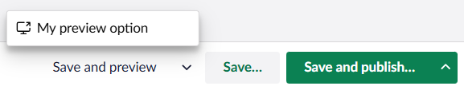

# Additional preview environments support

With Umbraco, you can save and preview draft content before going live. The preview feature allows you to visualize how a page will look like once it is published, directly from within the backoffice. This is also possible for the Content Delivery API data. You can extend the preview functionality in the backoffice by configuring external preview URLs for client libraries consuming the Content Delivery API.


To get introduced to the preview functionality in the Content Delivery API, please refer to the [Preview concept](https://docs.umbraco.com/umbraco-cms/reference/content-delivery-api#preview) section.


Generating external preview URLs for the backoffice requires implementation both client- and server-side.

## Server-side implementation

On the server-side you'll need a custom `IUrlProvider` implementation. This is responsible for generating the preview URL for a given piece of content.

An external preview environment likely requires some kind of authentication to allow preview. The URL provider should perform this as well.

Here's an example of what a URL provider could look like:


```csharp
using Umbraco.Cms.Core.Models;
using Umbraco.Cms.Core.Models.PublishedContent;
using Umbraco.Cms.Core.Routing;

namespace My.Site;

public class MyUrlProvider : IUrlProvider
{
    public string Alias => "MyUrlProvider";

    public UrlInfo? GetUrl(IPublishedContent content, UrlMode mode, string? culture, Uri current)
        => null;

    public IEnumerable<UrlInfo> GetOtherUrls(int id, Uri current)
        => [];

    public async Task<UrlInfo?> GetPreviewUrlAsync(IContent content, string? culture, string? segment)
    {
        var token = await GetPreviewTokenAsync();
        return new UrlInfo(
                url: new Uri($"https://my.preview.environment/?id={content.Key}&culture={culture}&token={token}"),
                provider: Alias,
                culture: culture,
                message: null,
                isExternal: true);
    }

    private async Task<string> GetPreviewTokenAsync()
    {
        // this is where you'll perform auth against the external preview environment and return an auth token
    }
}
```


The URL provider must be registered with Umbraco. This is done with a composer:


```csharp
using Umbraco.Cms.Core.Composing;

namespace My.Site;

public class MyUrlProviderComposer : IComposer
{
    public void Compose(IUmbracoBuilder builder)
        => builder.AddUrlProvider<MyUrlProvider>();
}
```


## Client-side implementation

On the client-side you'll need an extension of:

- Type: `workspaceActionMenuItem`.
- Kind: `previewOption`.


You can read more about extensions in the [Extending the Umbraco Backoffice](https://docs.umbraco.com/welcome/getting-started/developing-websites-with-umbraco/extending-the-umbraco-backoffice) article.


Here's a sample extension:

```json
{
  "name": "My UrlProvider",
  "alias": "My.UrlProvider",
  "extensions": [
    {
      "type": "workspaceActionMenuItem",
      "kind": "previewOption",
      "alias": "My.PreviewOption",
      "name": "My Preview Option",
      "forWorkspaceActions": "Umb.WorkspaceAction.Document.SaveAndPreview",
      "weight": 99,
      "meta": {
        "icon": "icon-umbraco",
        "label": "My preview option",
        "urlProviderAlias": "MyUrlProvider"
      }
    }
  ]
}
```

This extension works with the URL provider above, because the `urlProviderAlias` of the extension matches the `Alias` of the URL provider.

Save the extension as `umbraco-package.json` in a folder under `App_Plugins` and (re)start the site. The result is a new preview option in a pop-up over the "Save and preview" button:




The default "Save and preview" button is also an extension of this type.

In other words, multiple preview options can co-exist. If you have multiple external environments, you can create preview options for all of them.

The extension `weight` determines the order of appearance. A `weight` above 100 will swap the default preview option with the custom one.

