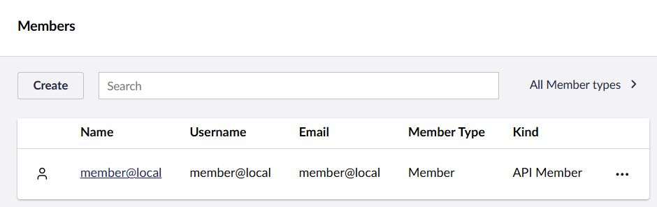

# Server-to-server access to protected content in the Delivery API

If protected content is consumed from the Delivery API in a server-to-server context, the [interactive authorization flow](README.md) won't work. Instead, we have to utilize the OpenId Connect Client Credentials flow, which is configured in the application settings.

## Configuration

In the Delivery API, Client Credentials map known Members to client IDs and secrets. These Members are known as API Members. When an API consumer uses the Client Credentials of an API Member, the consumer efficiently assumes the identity of this API Member.


An API Member works the same as a regular Member, with the added option of authorizing with Client Credentials.


In the following configuration example, the Member "member@local" is mapped to a set of Client Credentials:



```json
{
    "Umbraco": {
        "CMS": {
            "DeliveryApi": {
                "Enabled": true,
                "MemberAuthorization": {
                    "ClientCredentialsFlow": {
                        "Enabled": true,
                        "AssociatedMembers": [
                            {
                                "ClientId": "my-client",
                                "ClientSecret": "my-client-secret",
                                "UserName": "member@local"
                            }
                        ]
                    }
                }
            }
        }
    }
}
```



After restarting the site, the backoffice will list "member@local" as an API Member:



## Authorizing and consuming the Delivery API

The configured Client Credentials can be exchanged for an access token using the Delivery API token endpoint. Subsequently, the access token can be used as a Bearer token to retrieve protected content from the Delivery API.

The following code sample illustrates how this can be done.


This sample requires the NuGet packages [`Microsoft.Extensions.Hosting`](https://www.nuget.org/packages/Microsoft.Extensions.Hosting) and [`IdentityModel`](https://www.nuget.org/packages/IdentityModel) to run.


You should _always_ reuse access tokens for the duration of their lifetime. This will increase performance both for your Delivery API consumer and for the Delivery API itself.


The code sample handles token reuse in the `ApiAccessTokenService` service. It must be registered as a singleton service to work.


In the code sample, the token endpoint is hardcoded in the token exchange request. The Delivery API also supports OpenId Connect Discovery for API Members, if you prefer that.


```csharp
using Microsoft.Extensions.DependencyInjection;
using Microsoft.Extensions.Hosting;
using System.Net.Http.Json;
using IdentityModel.Client;

var builder = Host.CreateApplicationBuilder(args);
builder.Services.AddSingleton<ApiAccessTokenService>();
builder.Services.AddTransient<ApiConsumerService>();

using IHost host = builder.Build();
var consumer = host.Services.GetRequiredService<ApiConsumerService>();
await consumer.ExecuteAsync();

public static class Constants
{
    // the base URL of the Umbraco site - change this to fit your custom setup
    public static string Host => "https://localhost:44391";
}

// This is the API consumer, which will be listing the first few available content items - including protected ones.
public class ApiConsumerService
{
    private readonly ApiAccessTokenService _apiAccessTokenService;

    public ApiConsumerService(ApiAccessTokenService apiAccessTokenService)
        => _apiAccessTokenService = apiAccessTokenService;

    public async Task ExecuteAsync()
    {
        // get an access token from the access token service.
        var accessToken = _apiAccessTokenService.GetAccessToken();
        if (accessToken is null)
        {
            Console.WriteLine("Could not get an access token, aborting.");
            return;
        }

        var client = new HttpClient();
        client.SetBearerToken(accessToken);

        // fetch [pageSize] content items from the "all content" Delivery API endpoint.
        const int pageSize = 5;
        var apiResponse = await client.GetAsync($"{Constants.Host}/umbraco/delivery/api/v2/content?take={pageSize}");
        var apiContentResponse = await apiResponse
            .EnsureSuccessStatusCode()
            .Content
            .ReadFromJsonAsync<ApiContentResponse>();

        if (apiContentResponse is null)
        {
            Console.WriteLine("Could not parse content from the API response.");
            return;
        }

        Console.WriteLine($"There are {apiContentResponse.Total} items in total - listing the first {pageSize} items.");
        foreach (var item in apiContentResponse.Items)
        {
            Console.WriteLine($"- {item.Name} ({item.Id})");
        }
    }
}

// This service ensures the reuse of access tokens for the duration of their lifetime.
// It must be registered as a singleton service to work properly.
public class ApiAccessTokenService
{
    private readonly Lock _lock = new();

    private string? _accessToken;
    private DateTime _accessTokenExpiry = DateTime.MinValue;

    public string? GetAccessToken()
    {
        if (_accessTokenExpiry > DateTime.UtcNow)
        {
            // we already have a token, reuse it.
            return _accessToken;
        }

        using (_lock.EnterScope())
        {
            if (_accessTokenExpiry > DateTime.UtcNow)
            {
                // another thread fetched a new token before this thread entered the lock, reuse it.
                return _accessToken;
            }

            var client = new HttpClient();
            var tokenResponse = client.RequestClientCredentialsTokenAsync(
                    new ClientCredentialsTokenRequest
                    {
                        Address = $"{Constants.Host}/umbraco/delivery/api/v1/security/member/token",
                        ClientId = "umbraco-member-my-client",
                        ClientSecret = "my-client-secret"
                    }
                )
                // cannot await inside a using.
                .GetAwaiter().GetResult();

            if (tokenResponse.IsError || tokenResponse.AccessToken is null)
            {
                Console.WriteLine($"Error obtaining a token: {tokenResponse.ErrorDescription}");
                return null;
            }

            _accessToken = tokenResponse.AccessToken;
            _accessTokenExpiry = DateTime.UtcNow.AddSeconds(tokenResponse.ExpiresIn - 20);
            return tokenResponse.AccessToken;
        }
    }
}

public class ApiContentResponse
{
    public required int Total { get; set; }

    public required ApiContentItemResponse[] Items { get; set; }
}

public class ApiContentItemResponse
{
    public required Guid Id { get; set; }

    public required string Name { get; set; }
}
```

