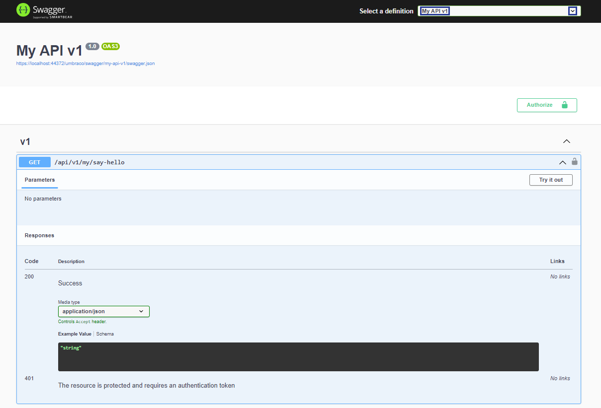

# Custom API with Authorization and Swagger

This article covers how to create a Custom API controller protected by the backoffice authorization policies. It also shows how to enable the authorization UI in Swagger docs.




Before  proceeding, make sure to read the [Management API](./management-api/README.md) article. It provides information about the Swagger documentation and Authorization used in this article.



This example can be a starting point for creating a secure custom API with automatic Swagger documentation. You can find other examples in the [API versioning and OpenAPI](./api-versioning-and-openapi.md) article.

1. Create a new `.cs` file called `MyBackOfficeSecurityRequirementsOperationFilter` in your Umbraco project.

2. Add the following code so that the new API shows in the Swagger documentation and Swagger UI:



```csharp

using Microsoft.Extensions.Options;
using Microsoft.OpenApi.Models;
using Swashbuckle.AspNetCore.SwaggerGen;
using Umbraco.Cms.Api.Management.OpenApi;
using Umbraco.Cms.Core.Composing;

namespace Umbraco.Cms.Web.UI.New.Custom;

//Necessary code for the new API to show in the Swagger documentation and Swagger UI
public class MyBackOfficeSecurityRequirementsOperationFilter : BackOfficeSecurityRequirementsOperationFilterBase
{
    protected override string ApiName => "my-api-v1";
}

public class MyConfigureSwaggerGenOptions : IConfigureOptions<SwaggerGenOptions>
{
    public void Configure(SwaggerGenOptions options)
    {
        options.SwaggerDoc("my-api-v1", new OpenApiInfo { Title = "My API v1", Version = "1.0" });
        options.OperationFilter<MyBackOfficeSecurityRequirementsOperationFilter>();
    }
}

public class MyComposer : IComposer
{
    public void Compose(IUmbracoBuilder builder)
        => builder.Services.ConfigureOptions<MyConfigureSwaggerGenOptions>();
}

```



- Our filter inherits from `BackOfficeSecurityRequirementsOperationFilterBase`. This marks our API as supporting authorization via Swagger.
- `MyConfigureSwaggerGenOptions` configures our API swagger docs with our filter applied.
- `MyComposer ` makes sure the swagger generator knows about our API docs configuration at runtime.

3. Add the ApiController to setup the logic behind the endpoint:



```csharp

using Umbraco.Cms.Api.Common.Attributes;
using Umbraco.Cms.Api.Common.Filters;
using Umbraco.Cms.Core;
using Umbraco.Cms.Core.Models.Membership;
using Umbraco.Cms.Core.Security;
using Umbraco.Cms.Web.Common.Authorization;
using Asp.Versioning;
using Microsoft.AspNetCore.Authorization;
using Microsoft.AspNetCore.Mvc;
...

//Creating the Controller
[ApiController]
[ApiVersion("1.0")] 
[MapToApi("my-api-v1")] 
[Authorize(Policy = AuthorizationPolicies.BackOfficeAccess)] 
[JsonOptionsName(Constants.JsonOptionsNames.BackOffice)]
[Route("api/v{version:apiVersion}/my")]
public class MyApiController : Controller
{
    private readonly IBackOfficeSecurityAccessor _backOfficeSecurityAccessor;

    public MyApiController(IBackOfficeSecurityAccessor backOfficeSecurityAccessor)
        => _backOfficeSecurityAccessor = backOfficeSecurityAccessor;

    [HttpGet("say-hello")]
    [MapToApiVersion("1.0")]
    [ProducesResponseType(typeof(string), StatusCodes.Status200OK)]
    public IActionResult SayHello()
    {
        IUser currentUser = _backOfficeSecurityAccessor.BackOfficeSecurity?.CurrentUser
                            ?? throw new InvalidOperationException("No backoffice user found");
        return Ok($"Hello, {currentUser.Name}");
    }
}

```



<details>

<summary>See the entire file: MyBackOfficeSecurityRequirementsOperationFilter.cs</summary>



```csharp
using Asp.Versioning;
using Microsoft.AspNetCore.Authorization;
using Microsoft.AspNetCore.Mvc;
using Microsoft.Extensions.Options;
using Microsoft.OpenApi.Models;
using Swashbuckle.AspNetCore.SwaggerGen;
using Umbraco.Cms.Api.Common.Attributes;
using Umbraco.Cms.Api.Common.Filters;
using Umbraco.Cms.Api.Management.OpenApi;
using Umbraco.Cms.Core;
using Umbraco.Cms.Core.Composing;
using Umbraco.Cms.Core.Models.Membership;
using Umbraco.Cms.Core.Security;
using Umbraco.Cms.Web.Common.Authorization;

namespace Umbraco.Cms.Web.UI.New.Custom;

//Necessary code for the new API to show in the Swagger documentation and Swagger UI
public class MyBackOfficeSecurityRequirementsOperationFilter : BackOfficeSecurityRequirementsOperationFilterBase
{
    protected override string ApiName => "my-api-v1";
}

public class MyConfigureSwaggerGenOptions : IConfigureOptions<SwaggerGenOptions>
{
    public void Configure(SwaggerGenOptions options)
    {
        options.SwaggerDoc("my-api-v1", new OpenApiInfo { Title = "My API v1", Version = "1.0" });
        options.OperationFilter<MyBackOfficeSecurityRequirementsOperationFilter>();
    }
}

public class MyComposer : IComposer
{
    public void Compose(IUmbracoBuilder builder)
        => builder.Services.ConfigureOptions<MyConfigureSwaggerGenOptions>();
}

//Creating the Controller
[ApiController]
[ApiVersion("1.0")] 
[MapToApi("my-api-v1")] 
[Authorize(Policy = AuthorizationPolicies.BackOfficeAccess)] 
[JsonOptionsName(Constants.JsonOptionsNames.BackOffice)]
[Route("api/v{version:apiVersion}/my")]
public class MyApiController : Controller
{
    private readonly IBackOfficeSecurityAccessor _backOfficeSecurityAccessor;

    public MyApiController(IBackOfficeSecurityAccessor backOfficeSecurityAccessor)
        => _backOfficeSecurityAccessor = backOfficeSecurityAccessor;

    [HttpGet("say-hello")]
    [MapToApiVersion("1.0")]
    [ProducesResponseType(typeof(string), StatusCodes.Status200OK)]
    public IActionResult SayHello()
    {
        IUser currentUser = _backOfficeSecurityAccessor.BackOfficeSecurity?.CurrentUser
                            ?? throw new InvalidOperationException("No backoffice user found");
        return Ok($"Hello, {currentUser.Name}");
    }
}
```



</details>

4. Run the project and navigate to `{yourdomain}/umbraco/swagger`.
5. Choose the swagger documentation we created with the code above named **My API v1** from **Select a definition**.



Here, we can find the endpoint that we created:

```http
GET /api/v1/my/say-hello
```

6. Click on the **Authorize** button to authenticate.

7. Try out the endpoint using the **Try it out** button.
8. Click on **Execute**.


We now get the response we have setup using the code: `"Hello, {{userName}}"`.
