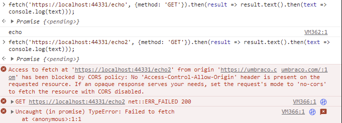

# Custom Middleware

Middleware is responsible for processing/customizing an incoming request before generating an outgoing response. Shortly defined the middleware is a step to check the requests before giving a response back.

Umbraco automatically configures all required middleware in the `WithMiddleware()` method in a specific order based on the [Microsoft documentation](https://learn.microsoft.com/en-us/aspnet/core/fundamentals/middleware/?view=aspnetcore-7.0#middleware-order).

You can use Umbraco pipeline filters in case you want to add your own middleware before, in-between or after the default Umbraco middleware. Filters are added by configuring the `UmbracoPipelineOptions` and require an instance of `IUmbracoPipelineFilter` that contains the following callbacks:

* `PrePipeline` - executed before any Umbraco-specific middleware is added, an example can be [URL rewrites](iisrewriterules.md).
* `PreRouting` - executed after the static files middleware and before the [routing middleware](https://learn.microsoft.com/en-us/aspnet/core/fundamentals/routing?view=aspnetcore-7.0) is added (using `UseRouting()`). It can also be used to change the incoming URL.
* `PostRouting` - executed after the routing middleware is added and can be used to [configure Cross-origin resource sharing (CORS)](https://learn.microsoft.com/en-us/aspnet/core/security/cors?view=aspnetcore-7.0).
* `PostPipeline` - executed after all Umbraco-specific middleware is added.
* `Endpoints` - executed right before the Umbraco-specific endpoints are added using `WithEndpoints()`.

The addition of the `PostRouting` callback is to allow correctly configuring the Cross-Origin Resource Sharing (CORS) middleware without having to use the `WithCustomMiddleware()` method.

* `IUmbracoPipelineFilter` is an interface in Umbraco that allows the creation of custom filters which then modifies the behavior of the request pipeline. It can be used to change different aspects of how Umbraco handles incoming requests, such as changing content or adding security checks.
* `WithCustomMiddleware()` is a method that can be used in Umbraco for adding custom middleware. This includes some specific customizable instructions that run in the request processing pipeline.


Using `WithCustomMiddleware()` instead of `WithMiddleware()` should only be used as a last resort. This is because Umbraco can break if you forget to add middleware or add them in the wrong order.


## Configuring the Cross-Origin Resource Sharing (CORS) middleware

Create a composer with the following:

```csharp

using Umbraco.Cms.Core.Composing;
using Umbraco.Cms.Web.Common.ApplicationBuilder;

public class CorsComposer : IComposer
{
    public const string AllowAnyOriginPolicyName = nameof(AllowAnyOriginPolicyName);

    public void Compose(IUmbracoBuilder builder)
        => builder.Services
        .AddCors(options => options.AddPolicy(AllowAnyOriginPolicyName, policy => policy.AllowAnyOrigin()))
        .Configure<UmbracoPipelineOptions>(options => options.AddFilter(new UmbracoPipelineFilter("Cors", postRouting: app => app.UseCors())))
        // For testing only
        .Configure<UmbracoPipelineOptions>(options => options.AddFilter(new UmbracoPipelineFilter("CorsTest", endpoints: app => app.UseEndpoints(endpoints =>
        {
            endpoints.MapGet("/echo", context => context.Response.WriteAsync("echo")).RequireCors(AllowAnyOriginPolicyName);
            endpoints.MapGet("/echo2", context => context.Response.WriteAsync("echo2"));
        }))));
}
```

You should be able to request `/echo` from any origin, but get an error when trying to fetch `/echo2` from a foreign origin. This can be tested by pasting the following JavaScript code in browser console when not on the local origin/Umbraco website (such as umbraco.com):

```javascript
fetch('https://localhost:44331/echo', {method: 'GET'}).then(result => result.text().then(text => console.log(text)));
fetch('https://localhost:44331/echo2', {method: 'GET'}).then(result => result.text().then(text => console.log(text)));
```

This should return the following:

<figure><figcaption><p>Browser result image</p></figcaption></figure>

An additional bonus is that this doesn't require any changes in your `Program.cs` file. It also allows packages to enable Cross-Origin Resource Sharing (CORS) and configure their own policies.

Users that currently use `WithCustomMiddleware()` will need to add calls to `RunPreRouting()` and `RunPostRouting()`. This is similar to Umbraco adding additional middleware in future versions.
