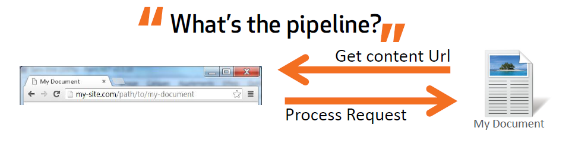

# Routing in Umbraco

_This section describes what the Umbraco Request Pipeline is. It explains how Umbraco matches a document to a given request and how it generates a URL for a document._

## Request pipeline

### What is the pipeline

The request pipeline is the process of building up the URL for a node and resolving a request to a specified node. It ensures that the right content is sent back.

### Outbound vs Inbound

The pipeline works bidirectional: [**inbound**](inbound-pipeline.md) and [**outbound**](outbound-pipeline.md).

[**Outbound**](outbound-pipeline.md) is the process of building up a URL for a requested node. [**Inbound**](inbound-pipeline.md) is every request received by the web server and handled by Umbraco.

### Customizing the pipeline

This section will describe the components that you can use to modify Umbraco's request pipeline: [**IContentFinder**](icontentfinder.md) & `IUrlProvider`
