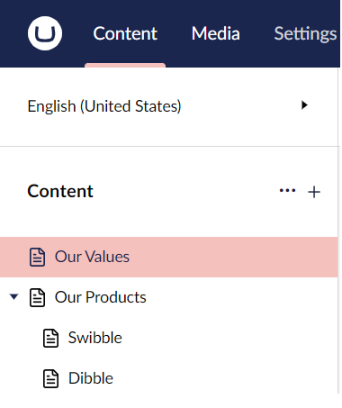
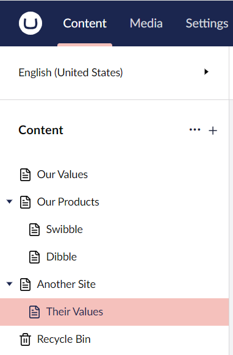
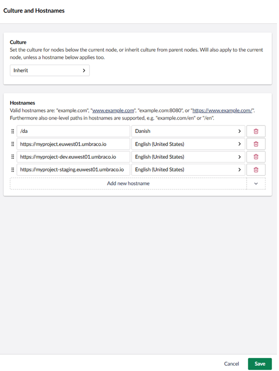
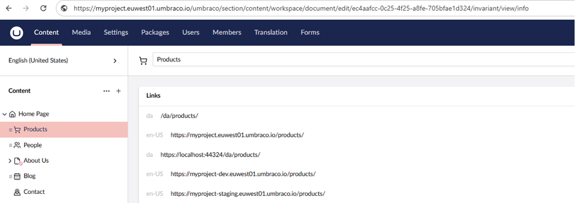
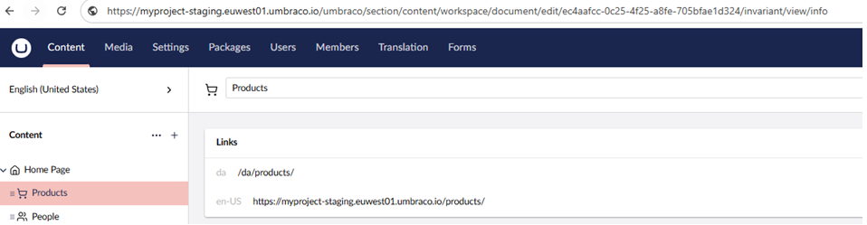
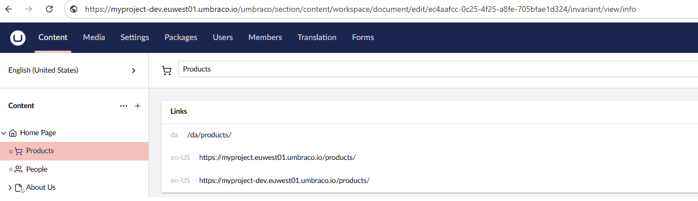

# Outbound request pipeline

The **outbound pipeline** consists out of the following steps:

1. [Create segments](#id-1.-create-segments)
2. [Create paths](#id-2.-create-paths)
3. [Create URLs](#id-3.-creating-urls)

To explain these steps, the following content tree is used as an example:



## 1. Create segments

When a URL is constructed, Umbraco converts every node in the tree into a segment. Each published content item has a corresponding URL segment.

In the example above, "Our Products" becomes "our-products" and "Swibble" becomes "swibble".

Segments are created by the URL Segment Provider.

### URL Segment Provider

The Dependency Injection (DI) container of an Umbraco implementation contains a collection of `UrlSegmentProviders`. This collection is populated during Umbraco startup. Umbraco ships with a 'DefaultUrlSegmentProvider', but custom implementations can be added to the collection.

When the `GetUrlSegment` extension method is called for a content item and culture combination, each registered `IUrlSegmentProvider` in the collection is executed in collection order. This continues until `UrlSegmentProvider` returns a segment value for the content. No further `UrlSegmentProviders` in the collection are executed after that point. If no segment is returned by any provider in the collection, the `DefaultUrlSegmentProvider` is used as a fallback. This ensures that a segment is always created.

To create a new URL Segment Provider, implement the `IUrlSegmentProvider` interface:

```csharp
public interface IUrlSegmentProvider
{
    string? GetUrlSegment(IContentBase content, string? culture = null);

    string? GetUrlSegment(IContentBase content, bool published, string? culture = null)
        => GetUrlSegment(content, culture);

    bool HasUrlSegmentChanged(IContentBase content, string? currentPublishedSegment, string? culture)
        => !string.Equals(
            GetUrlSegment(content, published: false, culture),
            currentPublishedSegment,
            StringComparison.OrdinalIgnoreCase);

    bool MayAffectDescendantSegments(IContentBase content) => false;
}
```


Each culture variation can have a different URL segment.


The returned string becomes the URL segment for the node. The value cannot contain the URL segment separator character `/`. A value such as `5678/swibble` would create additional segments, which is not allowed.

#### Redirect tracking optimization

When content is published, Umbraco checks whether the URL segment has changed before traversing descendant nodes to create redirects. The redirect tracker uses `HasUrlSegmentChanged` to compare the draft segment (what the segment will be after publishing) against the currently published segment. If the segment is unchanged, descendant traversal is skipped because no descendant URLs can have changed either.

The default implementations of `HasUrlSegmentChanged` and `MayAffectDescendantSegments` handle the common case automatically. Custom providers only need to override these methods in specific scenarios:

* **`HasUrlSegmentChanged`**: Override if your provider derives segments from external state (for example, a database or API) rather than from content properties. The default implementation compares the draft segment to the published segment using `GetUrlSegment`.
* **`MayAffectDescendantSegments`**: Override to return `true` if your provider computes descendant URL segments based on ancestor data that does not affect the ancestor's own segment. When ancestor data changes the ancestor's segment, Umbraco already traverses descendants. This method covers the rare case where ancestor data changes without changing the ancestor's segment, but still affects descendant segments.

#### Example

The following example adds the unique SKU or product reference of a product page to the existing URL segment.

```csharp
using Umbraco.Cms.Core.Models;
using Umbraco.Cms.Core.Strings;

namespace RoutingDocs.SegmentProviders;

public class ProductPageUrlSegmentProvider : IUrlSegmentProvider
{
    private readonly IUrlSegmentProvider _provider;

    public ProductPageUrlSegmentProvider(IShortStringHelper stringHelper)
    {
        _provider = new DefaultUrlSegmentProvider(stringHelper);
    }

    public string GetUrlSegment(IContentBase content, string? culture = null)
    {
        // Only apply this rule for product pages
        if (content.ContentType.Alias != "productPage")
        {
            return null;
        }

        var segment = _provider.GetUrlSegment(content, culture);
        var productSku = content.GetValue<string>("productSKU");
        return $"{segment}--{productSku}".ToLower();
    }
}
```

The returned string becomes the native URL segment. There is no need for URL rewriting.

For the "swibble" product in the example content tree, `ProductPageUrlSegmentProvider` returns the segment `swibble--123xyz`, where `123xyz` is the unique product SKU for the swibble product.

Register the custom `UrlSegmentProvider` with Umbraco using a composer:

```csharp
using Umbraco.Cms.Core.Composing;
using Umbraco.Cms.Core.DependencyInjection;

namespace RoutingDocs.SegmentProviders;

public class RegisterCustomSegmentProviderComposer : IComposer
{
    public void Compose(IUmbracoBuilder builder)
    {
        builder.UrlSegmentProviders().Insert<ProductPageUrlSegmentProvider>();
    }
}
```

### The Default URL Segment Provider

The Default URL Segment Provider builds segments by checking for one of the following values, in this order:

1. A property with alias `umbracoUrlName` on the node. This is a convention-based way to give editors control of the segment name. With variants, this can vary by culture.
2. The name of the content item, for example `content.Name`.

The Umbraco string extension `ToUrlSegment()` is used to produce a clean, URL-safe segment.

## 2. Create paths

To create a path, the pipeline uses the segments of each node.

In the example, the "swibble" node receives the path `/our-products/swibble`. Using the `ProductPageUrlSegmentProvider` from above, the path becomes `/our-products/swibble-123xyz`.

### Multiple sites in a single Umbraco implementation

In a multi-site scenario, an internal path such as `/our-products/swibble-123xyz` could belong to any of the sites, or match multiple nodes across multiple sites. In this case, additional sites have their internal path prefixed by the node ID of their root node. Any content node with a hostname defines a new root for paths.



| Node         | Segment        | Internal Path                |
| ------------ | -------------- | ---------------------------- |
| Our Values   | our-values     | /our-values                  |
| Our Products | our-products   | /our-products                |
| Swibble      | swibble-123xyz | /our-products/swibble-123xyz |
| Dibble       | dibble-456abc  | /our-products/dibble-456abc  |
| Another Site | another-site   | **9676**/                    |
| Their Values | their-values   | **9676**/their-values        |

Paths can be cached. Scheme, domain, and current request cannot be cached.

#### Considerations when working with Hostnames

* Domain without path: `www.site.com` produces `1234/path/to/page`.
* Domain with path: `www.site.com/dk` produces `1234/dk/path/to/page`.
* No domain specified: `/path/to/page`.
* `HideTopLevelNodeFromPath` set to `true`: the path becomes `/to/page`.

## 3. Creating URLs

The URL of a node consists of a complete [URI](https://en.wikipedia.org/wiki/Uniform_Resource_Identifier): the Schema, Domain name, port, and path.

In the example, the "swibble" node has the URL: `http://example.com/our-products/swibble`.

URL generation is handled by the URL Provider. The URL Provider is called whenever a URL is requested in code, for example:

```csharp
@Model.Url
@Umbraco.Url(1234)
@UmbracoContext.UrlProvider.GetUrl(1234);
```

The DI container of an Umbraco implementation contains a collection of `UrlProviders`. This collection is populated during Umbraco startup. Umbraco ships with a `DefaultUrlProvider`, but custom implementations can be added to the collection. When `.Url` is called, each `IUrlProvider` in the collection is executed in collection order until a particular `IUrlProvider` returns a value.

### DefaultUrlProvider

Umbraco ships with a `DefaultUrlProvider`, which maps the structure of the content tree to URLs out of the box. In Umbraco 15 and later, this is implemented as `NewDefaultUrlProvider`.

### How the Default URL provider works

* If the current domain matches the root domain of the target content, return a relative URL. Otherwise, return an absolute URL.
* If the target content has one root domain, use that domain to build the absolute URL.
* If the target content has more than one root domain, determine which one to use to build the absolute URL.
* Complete the absolute URL with the scheme (HTTP or HTTPS). Use the scheme from the domain if one is specified; otherwise use the current request scheme.
* If `addTrailingSlash` is `true`, add a trailing slash.
* Add the virtual directory.

If the URL provider encounters collisions when generating content URLs, it selects the first available node and assigns the URL to that node. The remaining nodes are marked as colliding and do not receive a generated URL. Fetching the URL of a node with a collision URL results in an error string that includes the node ID, for example `#err-1094`. This can happen when an `umbracoUrlName` property overrides the generated URL of a node, or when multiple root nodes exist without hostnames assigned.


Publishing an unpublished node with a conflicting URL may change the active node rendered at that URL. This occurs when the newly published node takes priority based on sort order in the tree.


### Custom URL Provider

Create a custom URL Provider by implementing the `IUrlProvider` interface:

```csharp
public interface IUrlProvider
{
    UrlInfo? GetUrl(IPublishedContent content, UrlMode mode, string? culture, Uri current);

    IEnumerable<UrlInfo> GetOtherUrls(int id, Uri current);

    Task<UrlInfo?> GetPreviewUrlAsync(IContent content, string? culture, string? segment);

    public string Alias { get; }
}
```

The `UrlInfo` object returned by `GetUrl` can contain a custom URL.

When implementing a custom URL Provider, consider the following:

* Cache results where possible.
* Handle schemes (HTTP vs HTTPS) and hostnames.
* Inbound routing may require a matching `IContentFinder`.


For small changes to URL generation logic, inherit from `NewDefaultUrlProvider` and override the `GetUrl()` virtual method rather than implementing `IUrlProvider` from scratch.


#### Example

This example replaces the default URL provider with a custom implementation, based on `NewDefaultUrlProvider`. The custom URL provider implements a new routing scheme for product pages.


The code below alters the outbound URL for product pages but does not provide matching inbound URL routing. This **will** break inbound routing, making the product pages unroutable.

To restore inbound routing, implement a custom content finder. See [IContentFinder](icontentfinder.md) for more information.


```csharp
using Microsoft.Extensions.Logging;
using Microsoft.Extensions.Options;
using Umbraco.Cms.Core.Configuration.Models;
using Umbraco.Cms.Core.Models.PublishedContent;
using Umbraco.Cms.Core.PublishedCache;
using Umbraco.Cms.Core.Routing;
using Umbraco.Cms.Core.Services;
using Umbraco.Cms.Core.Services.Navigation;
using Umbraco.Cms.Core.Web;

namespace RoutingDocs.UrlProviders;

// A custom URL provider that replaces the default URL provider
// to implement a custom URL scheme for product pages.
public class CustomUrlProvider : NewDefaultUrlProvider
{
    public CustomUrlProvider(
        IOptionsMonitor<RequestHandlerSettings> requestSettings,
        ILogger<NewDefaultUrlProvider> logger,
        ISiteDomainMapper siteDomainMapper,
        IUmbracoContextAccessor umbracoContextAccessor,
        UriUtility uriUtility,
        IPublishedContentCache publishedContentCache,
        IDomainCache domainCache,
        IIdKeyMap idKeyMap,
        IDocumentUrlService documentUrlService,
        IDocumentNavigationQueryService documentNavigationQueryService,
        IPublishedContentStatusFilteringService publishedContentStatusFilteringService,
        ILanguageService languageService)
        : base(requestSettings, logger, siteDomainMapper, umbracoContextAccessor, uriUtility,
            publishedContentCache, domainCache, idKeyMap, documentUrlService,
            documentNavigationQueryService, publishedContentStatusFilteringService, languageService)
    {
    }

    public override UrlInfo? GetUrl(IPublishedContent content, UrlMode mode, string? culture, Uri current)
    {
        // Get the default URL from the base implementation (NewDefaultUrlProvider).
        UrlInfo? defaultUrlInfo = base.GetUrl(content, mode, culture, current);

        if (defaultUrlInfo?.Url is null)
        {
            // The base URL provider could not resolve a URL.
            return null;
        }

        // Only apply the custom URL scheme to product pages.
        if (content.ContentType.Alias is not "productPage")
        {
            // Not a product page — return the default URL.
            return defaultUrlInfo;
        }

        // Build the custom URL for product pages.
        var productPageUrl = $"{defaultUrlInfo.Url.ToString().TrimEnd('/')}/some-custom-path";
        return UrlInfo.FromUri(
            new Uri(productPageUrl, UriKind.RelativeOrAbsolute),
            Alias,
            defaultUrlInfo.Culture,
            defaultUrlInfo.IsExternal
        );
    }
}
```

Use a composer to replace the default URL provider with the custom implementation:

```csharp
using Umbraco.Cms.Core.Composing;
using Umbraco.Cms.Core.Routing;

namespace RoutingDocs.UrlProviders;

public class RegisterCustomUrlProviderComposer : IComposer
{
    public void Compose(IUmbracoBuilder builder)
        // Register the custom URL provider instead of the default URL provider.
        => builder.UrlProviders()
            .Remove<NewDefaultUrlProvider>()
            .Insert<CustomUrlProvider>();
}
```


To use multiple URL providers, add them with multiple `Insert` calls. Umbraco cycles through all registered providers until one returns a non-`null` value. If all custom providers return `null`, Umbraco falls back to the default URL provider. The last provider added with `Insert` is the first to execute.


### GetOtherUrls

The `GetOtherUrls` method is used only in the Umbraco Backoffice. It provides editors with a list of other URLs that also map to the node.

For example, the convention-based `umbracoUrlAlias` property allows editors to specify a comma-delimited list of alternative URLs for a node. A corresponding `AliasUrlProvider` is registered in the `UrlProviderCollection` to display this list in the backoffice **Info** panel.

### GetPreviewUrlAsync

Implement this method when the URL provider supports a custom preview URL scheme.

A common use case is providing external preview environments for headless sites. See [Additional preview environments support](../../content-delivery-api/additional-preview-environments-support.md) for a complete example.

Most custom URL providers do not support this. A default implementation returning `null` is sufficient in those cases:

```csharp
public Task<UrlInfo?> GetPreviewUrlAsync(IContent content, string? culture, string? segment)
    => Task.FromResult<UrlInfo?>(null);
```

### Url Provider Mode

The URL Provider Mode specifies whether the URL provider produces absolute or relative URLs. `Auto` is the default.

The available modes are:

```csharp
public enum UrlMode
{
  /// <summary>
  /// Indicates that the url provider should do what it has been configured to do.
  /// </summary>
  Default = 0,

  /// <summary>
  /// Indicates that the url provider should produce relative urls exclusively.
  /// </summary>
  Relative,

  /// <summary>
  /// Indicates that the url provider should produce absolute urls exclusively.
  /// </summary>
  Absolute,

  /// <summary>
  /// Indicates that the url provider should determine automatically whether to return relative or absolute urls.
  /// </summary>
  Auto
}
```

Change the default setting in the  `Umbraco:CMS:WebRouting` section of `appsettings.json`:

```json
"Umbraco": {
  "CMS": {
    "WebRouting": {
      "UrlProviderMode": "Relative"
    }
  }
}
```

See [WebRouting config reference documentation](../../configuration/webroutingsettings.md) for more information on routing settings.

### Site Domain Mapper

The `ISiteDomainMapper` implementation is used in the `IUrlProvider`. It filters a list of `DomainAndUri` objects to return the one that best matches the current request.

Create a custom `SiteDomainMapper` by implementing `ISiteDomainMapper`:

```csharp
public interface ISiteDomainMapper
{
    DomainAndUri? MapDomain(IReadOnlyCollection<DomainAndUri> domainAndUris, Uri current, string? culture, string? defaultCulture);
    IEnumerable<DomainAndUri> MapDomains(IReadOnlyCollection<DomainAndUri> domainAndUris, Uri current, bool excludeDefault, string? culture, string? defaultCulture);
}
```

The `MapDomain` methods receive the current request URI. Custom logic determines which domain to use for a site in the context of that request. The `SiteDomainMapper` receives the current URI and all eligible domains, and returns the single domain used by the URL Provider to construct the URL.

Only a single `ISiteDomainMapper` can be registered with Umbraco.

Register the custom `ISiteDomainMapper` using the `SetSiteDomainHelper` extension method:

```csharp
using Umbraco.Cms.Core.Composing;
using Umbraco.Cms.Core.DependencyInjection;
using Umbraco.Extensions;

namespace RoutingDocs.SiteDomainMapper;

public class RegisterCustomSiteDomainMapperComposer : IComposer
{
    public void Compose(IUmbracoBuilder builder)
    {
        builder.SetSiteDomainHelper<CustomSiteDomainMapper>();
    }
}
```

### Default SiteDomainMapper

Umbraco ships with a default `SiteDomainMapper` that supports grouping sets of domains together. In a multi-environment setup such as Umbraco Cloud, multiple domains may be configured for a single site. For example, live, staging, testing, and a backoffice domain. Each domain is set up as a **Culture and Hostname** entry inside Umbraco.



Without a `SiteDomainMapper`, editors see the full list of possible URLs for each content item across all configured domains:



This can lead to confusion. Clicking a staging URL may display content from a different environment or database.

To avoid this, use the default `SiteDomainMapper`'s `AddSite` method to group related URLs together. Because the `SiteDomainMapper` is registered in the DI container, create a component to add the sites in the `Initialize` method:

```csharp
using Umbraco.Cms.Core.Composing;
using Umbraco.Cms.Core.Routing;

namespace UmbracoProject.App_Plugins.Outbound;

public class SiteDomainMapperComponent : IAsyncComponent
{
    private readonly SiteDomainMapper? _siteDomainMapper;

    public SiteDomainMapperComponent(ISiteDomainMapper siteDomainMapper)
    {
        if (siteDomainMapper is SiteDomainMapper concreteSiteDomainMapper)
        {
            _siteDomainMapper = concreteSiteDomainMapper;
        }
    }

    public Task InitializeAsync(bool isCompleted, CancellationToken cancellationToken)
    {
        _siteDomainMapper?.AddSite("dev", "myproject-dev.euwest01.umbraco.io", "myproject.euwest01.umbraco.io");
        _siteDomainMapper?.AddSite("staging", "myproject-staging.euwest01.umbraco.io");

        return Task.CompletedTask;
    }

    public Task TerminateAsync(bool isCompleted, CancellationToken cancellationToken)
        => Task.CompletedTask;
}
```

Register the component with a composer:

```csharp
using Umbraco.Cms.Core.Composing;

namespace RoutingDocs.SiteDomainMapping;

public class AddSiteComposer : ComponentComposer<SiteDomainMapperComponent>
{
}
```

When an editor visits the backoffice, the **Links** panel filters the displayed URLs to only those in the same site group as the current domain. An editor visiting via `myproject-staging.euwest01.umbraco.io` sees only the staging URL:



An editor visiting via `myproject-dev.euwest01.umbraco.io` sees only the `dev` and `live` URLs:




This is a grouping, not a one-to-one mapping. Multiple URLs can be added to a group. In the example above, an editor visiting via `myproject.euwest01.umbraco.io` (the live domain) would also see `myproject-dev.euwest01.umbraco.io` listed, as both belong to the `dev` group.


#### Grouping the groupings - BindSites

The `SiteDomainMapper` includes a `BindSites` method to bind different site groupings together:

```csharp
public Task InitializeAsync(bool isCompleted, CancellationToken cancellationToken)
{
    _siteDomainMapper?.AddSite("dev", "myproject-dev.euwest01.umbraco.io", "myproject.euwest01.umbraco.io");
    _siteDomainMapper?.AddSite("staging", "myproject-staging.euwest01.umbraco.io");
    _siteDomainMapper?.BindSites("dev", "staging");

    return Task.CompletedTask;
}
```

Visiting the backoffice via `myproject-dev.euwest01.umbraco.io` now lists all domains from both the `dev` and the `staging` group.
