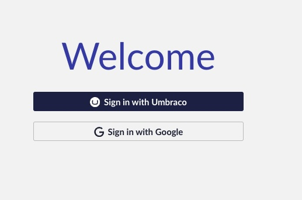
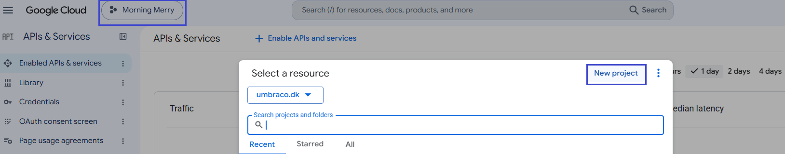
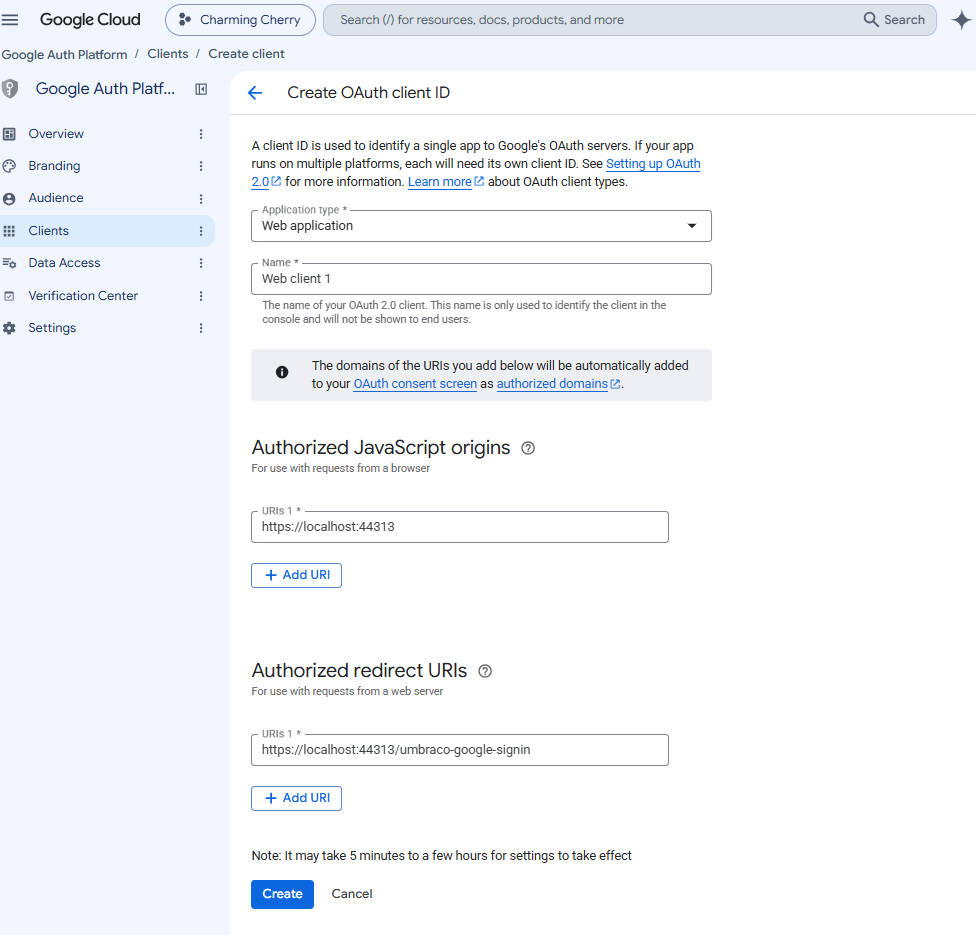
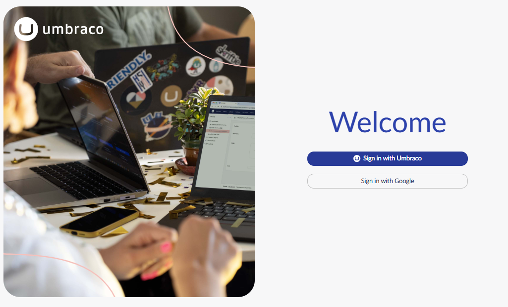

# Add Google Authentication (Users)

The Umbraco Backoffice supports external login providers (OAuth) for performing authentication of your users. This could be any OpenIDConnect provider such as Entra ID/Azure Active Directory, Identity Server, Google, or Facebook.


**Note for Umbraco Cloud users**

Umbraco Cloud supports External Identity Providers, including Google Authentication.
If you're working on a Cloud project, see the [External Login Providers](https://docs.umbraco.com/umbraco-cloud/begin-your-cloud-journey/project-features/external-login-providers) article in the Umbraco Cloud documentation.

The following tutorial is intended only for non-Cloud (on-premises or self-hosted) projects.


In this tutorial, we will take you through the steps of setting up a Google login for the Umbraco CMS backoffice.

## What is a Google Login?

When you log in to the Umbraco Backoffice, you need to enter your username and password. Integrating your website with Google authentication adds a button that you can click to log in with your Google account.



## Why?

We are sure a lot of content editors and implementors of your Umbraco sites would love to have one less password to remember. Click **Sign in with Google** and if you are already logged in with your Google account, it will log you in directly.

### What the tutorial covers

1. [Setting up a Google OAuth API](add-google-authentication.md#id-1.-setting-up-a-google-oauth-api)
2. [Integrating Google Auth in your project](add-google-authentication.md#id-2.-integrating-google-auth-in-your-project)
3. [Configuring the solution to allow Google logins](add-google-authentication.md#id-3.-configuring-the-solution-to-allow-google-logins)

### Prerequisites

For this tutorial, you need:

* [Visual Studio](https://visualstudio.microsoft.com/) installed.
* A [Google](https://myaccount.google.com/) account.
* A working [Umbraco solution](https://umbraco.com/products/umbraco-cloud/).

## 1. Setting up a Google OAuth API

The first thing to do is set up a Google API. To do this, you need to go to [https://console.developers.google.com/](https://console.developers.google.com/) and log in with your Google account.

### Setup a Google Console Project

1. Click the project dropdown and select **New Project**.

    
2. Enter a **Project name**, **Organization**, and **Parent resource**.
3. Click **Create**.

### Set up an OAuth Consent Screen

Before you can create the credentials, you need to configure your consent screen.

1. Click **OAuth consent screen** from the left-side navigation menu.
2. Click **Get Started**.
3. Fill in the required information:
   * App name
   * User support email
4. Choose the **Audience** that fits your setup.
5. Click **Next**.
6. Enter **Contact Information**.
7. Click **Next**.
8. Select **I agree to the Google API Services: User Data Policy.** if you agree.
9. Click **Continue**.
10. Click **Create**.

### Create credentials

1. Click **Create OAuth client** in the Overview page. Alternatively, go to **Clients** > **Create client**.
2. Select **Web Application** from the **Application type** dropdown.
3. Enter the following details:

    * Application **Name**
    * **Authorized JavaScript origins**
    * **Authorized redirect URIs**

    
4. Click **Create**.

A popup appears displaying the **Client ID** and **Client secret**. You will need these values later while configuring your solution.


The **Client secret** will no longer be available to view or download once you close the dialog. Make sure to copy or download the information. The **Client Id** can be accessed from the **Clients** tab in the **APIs & Services** menu.


## 2. Integrating Google Auth in your project

Once the Google API is set up it is time to install the Google Auth provider on the Umbraco project.

If you are working with a Cloud project, see the [Working locally](https://docs.umbraco.com/umbraco-cloud/set-up/working-locally) article to complete this step.

### Installing a Nuget Package

You can install and manage packages in a project.

1. Navigate to your project/solution folder.


If you have cloned down an Umbraco Project, you will need to navigate to the `src` folder where you can see a `.csproj` file.


2. Run the following command to install the `Microsoft.AspNetCore.Authentication.Google` package.

```bash
dotnet add package Microsoft.AspNetCore.Authentication.Google
```


You can check the [latest version of the package](https://www.nuget.org/packages/Microsoft.AspNetCore.Authentication.Google) before installing it.


For more information on installing and using a package with the .Net CLI, see [Microsoft Documentation](https://learn.microsoft.com/en-us/nuget/quickstart/install-and-use-a-package-using-the-dotnet-cli).

## 3. Configuring the Solution to allow Google Logins

To use an external login provider such as Google on your Umbraco CMS project, you have to implement a couple of new classes:

* A custom-named `BackOfficeExternalLoginProviderOptions` configuration class.
* A custom-named `GoogleOptions` configuration class.
* A Composer to tie it all together.
* An Umbraco backoffice manifest declaration.

You can create these files in a location of your choice. In this tutorial, the files are added to:

* `ExternalUserLogin\GoogleAuthentication` folder for the C# classes.
* `\App_Plugins\my-auth-providers` folder location for the frontend registration.

1. Create a new class:`GoogleBackOfficeExternalLoginProviderOptions.cs`.
2. Add the following code to the file:



```csharp
using Microsoft.Extensions.Options;
using Umbraco.Cms.Api.Management.Security;
using Umbraco.Cms.Core;

namespace MyCustomUmbracoProject.ExternalUserLogin.GoogleAuthentication;

public class GoogleBackOfficeExternalLoginProviderOptions : IConfigureNamedOptions<BackOfficeExternalLoginProviderOptions>
{
    public const string SchemeName = "Google";

    public void Configure(string? name, BackOfficeExternalLoginProviderOptions options)
    {
        if (name != Constants.Security.BackOfficeExternalAuthenticationTypePrefix + SchemeName)
        {
            return;
        }

        Configure(options);
    }

    public void Configure(BackOfficeExternalLoginProviderOptions options)
    {
        options.AutoLinkOptions = new ExternalSignInAutoLinkOptions(
            autoLinkExternalAccount: true, // must be true for auto-linking to be enabled
            defaultUserGroups: new[] {  "editor" }, // group for auto-created users; unset means no groups
            defaultCulture: null, // null uses the appsettings.json default
            allowManualLinking: true // also requires meta.linking.allowManualLinking in the manifest
        )
        {
            // Optional callback
            OnAutoLinking = (autoLinkUser, loginInfo) =>
            {
                // New users are unapproved by default - approve them here.
                // See https://github.com/umbraco/Umbraco-CMS/issues/12487
                autoLinkUser.IsApproved = true;
            },
            OnExternalLogin = (user, loginInfo) =>
            {
                return true; // false blocks sign-in
            },
        };
    }
}
```




The code used here, enables [auto-linking](../security/external-login-providers.md#auto-linking) with the external login provider. This enables the option for users to login to the Umbraco backoffice prior to having a backoffice User.

Set the `autoLinkExternalAccount` to `false` in order to disable auto-linking in your implementation.


3. Create a new class: `GoogleBackOfficeAuthenticationOptions.cs`.
4. Add the following code to the file:



```csharp
using Microsoft.AspNetCore.Authentication.Google;
using Microsoft.Extensions.Options;
using Umbraco.Cms.Api.Management.Security;
using Umbraco.Cms.Web.Common.Helpers;

namespace MyCustomUmbracoProject.ExternalUserLogin.GoogleAuthentication;

public class GoogleBackOfficeAuthenticationOptions : IConfigureNamedOptions<GoogleOptions>
{
    private readonly OAuthOptionsHelper _helper;

    public GoogleBackOfficeAuthenticationOptions(OAuthOptionsHelper helper)
    {
        _helper = helper;
    }

    public void Configure(GoogleOptions options)
    {
        options.CallbackPath = "/umbraco-google-signin"; // must match the redirect URI in Google Cloud Console exactly
        options.ClientId = "YOURCLIENTID";
        options.ClientSecret = "YOURCLIENTSECRET";
        options.Scope.Add("https://www.googleapis.com/auth/userinfo.email"); // needed for auto-linking

        // Routes sign-in errors to Umbraco's own login error page instead of an unhandled exception.
        _helper.SetDefaultErrorEventHandling(options, GoogleBackOfficeExternalLoginProviderOptions.SchemeName);
    }

    public void Configure(string? name, GoogleOptions options)
    {
        // only configure the options if it is for the backend
        if (name == BackOfficeAuthenticationBuilder.SchemeForBackOffice(GoogleBackOfficeExternalLoginProviderOptions
                .SchemeName))
        {
            Configure(options);
        }
    }
}

```



5. Replace **YOURCLIENTID** and **YOURCLIENTSECRET** with the values from the **OAuth Client Ids Credentials** window. Or use the [IOptions pattern](https://learn.microsoft.com/en-us/aspnet/core/fundamentals/configuration/options) to read the values from app settings (or other sources).
6. Register both `ConfigureNameOptions` into a composer and add the provider to Umbraco:



```csharp
using Umbraco.Cms.Api.Management.Security;
using Umbraco.Cms.Core.Composing;

namespace MyCustomUmbracoProject.ExternalUserLogin.GoogleAuthentication;

public class GoogleBackOfficeExternalLoginComposer : IComposer
{
    public void Compose(IUmbracoBuilder builder)
    {
        builder.Services.ConfigureOptions<GoogleBackOfficeExternalLoginProviderOptions>();
        builder.Services.ConfigureOptions<GoogleBackOfficeAuthenticationOptions>();

        builder.AddBackOfficeExternalLogins(logins =>
        {
            logins.AddBackOfficeLogin(
                backOfficeAuthenticationBuilder =>
                {
                    // this Add... method will be part of the OathProvider nuget package you install
                    backOfficeAuthenticationBuilder.AddGoogle(
                        BackOfficeAuthenticationBuilder.SchemeForBackOffice(
                            GoogleBackOfficeExternalLoginProviderOptions
                                .SchemeName)!,
                        options =>
                        {
                            // Empty: required for the options pattern to work.
                            // Skip GoogleBackOfficeAuthenticationOptions and configure inline here instead, if preferred.

                        });
                });
        });
    }
}
```



7. Register the provider with the backoffice client by adding the following file to the manifest file in `/App_Plugins/my-auth-providers/umbraco-package.json`:



```json
{
  "$schema": "../../umbraco-package-schema.json",
  "name": "My Auth Package",
  "allowPublicAccess": true,
  "extensions": [
    {
      "type": "authProvider",
      "alias": "My.AuthProvider.Google",
      "name": "My Google Auth Provider",
      "forProviderName": "Umbraco.Google",
      "meta": {
        "label": "Google",
        "linking": {
          "allowManualLinking": true
        }
      }
    }
  ]
}
```



8. Build and run the website.
9. Log in to the backoffice using the Google Authentication option.


Manual linking requires `allowManualLinking: true` in both `ExternalSignInAutoLinkOptions` and the manifest's `meta.linking.allowManualLinking`. With both set, users can link an account manually:

1. Login to the backoffice using Umbraco credentials.
2. Select your user profile in the top-right corner.
3. Click **External Logins** > **Link your Google account**.
4. Choose the account you wish to link.

For future backoffice logins, the user will be able to use Google Authentication.




## Troubleshooting

If Google shows an error instead of completing sign-in, check the error:

* **`Error 400: redirect_uri_mismatch`**: the redirect URI your app sent doesn't exactly match one registered in Google Cloud Console. Compare the **Authorized redirect URIs** entry against `CallbackPath` character-for-character, including scheme, port, and no extra or missing slashes.
* **`Error 403: org_internal`** ("can only be used within its organization"): the app's Audience is set to **Internal**, and the signing-in account is outside that organization. Either sign in with an account from the organization, or change Audience to **External** in **Google Auth Platform > Audience**.
* **`Error 400: access_denied`** ("This app's request is invalid" or similar) while credentials are otherwise correct. The app is in **Testing** status and the account isn't in the test-user list.

## Related Links

* [External login providers](../security/external-login-providers.md)
* [Add Microsoft Entra ID Authentication](add-microsoft-entra-id-authentication.md)
