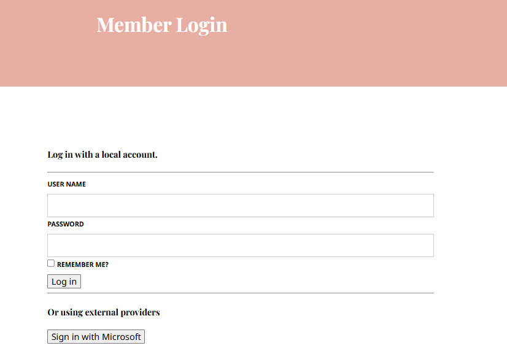

# Add Microsoft Entra ID Authentication

This tutorial takes you through configuring Microsoft Entra ID (formerly Azure Active Directory) for sign-in on your Umbraco CMS website. It covers two separate setups:

* [Members](#members): sign-in for website Members on the front end.
* [Users](#users): sign-in for Backoffice Users.

Complete Steps 1 and 2 then continue with the Members section, the Users section, or both.

The tutorial uses the ASP.NET Core Microsoft Account authentication handler. This handler signs in against the Microsoft identity platform. It isn't configured for Azure AD B2C tenants, which use their own sign-in endpoints and user flows.

## Prerequisites

* An Umbraco project.
* Visual Studio, or another Integrated Development Environment (IDE).
* Access to an Entra ID (Azure AD) tenant with permission to register an application.
* For Members only: a [setup for Member Login](../../develop-with-umbraco/tutorials/members-registration-and-login.md).

## Step 1: Register the app in Entra ID

Register your site as an application in your Entra ID tenant. Follow [Microsoft's quickstart for registering an application](https://learn.microsoft.com/en-us/entra/identity-platform/quickstart-register-app), then [add a client secret](https://learn.microsoft.com/en-us/entra/identity-platform/how-to-add-credentials).

When you register the app, use these settings:

* **Redirect URI**: select the **Web** platform and add the URI for each setup you follow:
  * Members: `https://{your-site}/umbraco-entraid-members-signin`
  * Users: `https://{your-site}/umbraco-entraid-signin`
* **Supported account types**: choose based on who should sign in. Single-tenant apps need an extra setting, described in [Single-tenant apps](#single-tenant-apps).

Use your local HTTPS address while developing. Each path must match the CallbackPath in the code exactly.

Members and Users can share one app registration, but they need separate callback paths. Each sign-in handler listens on its own path.

Before moving on, make sure you have:

* The **Application (client) ID**.
* The client secret **Value**. Microsoft only shows it once.
* The **Directory (tenant) ID**, if you registered a single-tenant app.

Every Microsoft/Azure account has a default Entra ID directory. Registering an app doesn't require creating a new tenant - only permission to register an application in an existing directory.

An error mentioning `Microsoft.AzureActiveDirectory/register/action` is a subscription-level resource-provider check, separate from app-registration permissions. It typically appears only when registering through the Azure Portal's subscription-linked navigation. Registering through [`entra.microsoft.com`](https://entra.microsoft.com) directly avoids it.

### Single-tenant apps

By default, the handler uses Microsoft's `/common` endpoints, which single-tenant apps reject. If you registered a single-tenant app, add these lines where the code sets `ClientId` and `ClientSecret`:

```csharp
options.AuthorizationEndpoint = "https://login.microsoftonline.com/YOURTENANTID/oauth2/v2.0/authorize";
options.TokenEndpoint = "https://login.microsoftonline.com/YOURTENANTID/oauth2/v2.0/token";
```

Replace `YOURTENANTID` with the Directory (tenant) ID. For more information, see [Microsoft's identity platform documentation](https://learn.microsoft.com/en-us/entra/identity-platform/howto-modify-supported-accounts).

## Step 2: Install the NuGet package

You need to install the `Microsoft.AspNetCore.Authentication.MicrosoftAccount` NuGet package. There are two approaches to installing the packages:

1. Use your favorite IDE and open up the **NuGet Package Manager** to search and install the package.
2. Use the command line to install the package:

```bash
dotnet add package Microsoft.AspNetCore.Authentication.MicrosoftAccount
```


The code samples below use placeholder values for the `ClientId` and `ClientSecret`. Don't commit the client secret to source control. Read it from configuration instead, for example use secrets during development.


## Members

This section sets up Entra ID sign-in for website Members.

### Step 3: Add Member sign-in

This step wires up the sign-in functionality only.

1. Create `MemberAuthenticationExtensions.cs`.



```csharp
namespace MyApp;

public static class MemberAuthenticationExtensions
{
    public static IUmbracoBuilder ConfigureAuthenticationMembers(this IUmbracoBuilder builder)
    {
        builder.AddMemberExternalLogins(logins =>
        {
            logins.AddMemberLogin(
                membersAuthenticationBuilder =>
                {
                    membersAuthenticationBuilder.AddMicrosoftAccount(
                        membersAuthenticationBuilder.SchemeForMembers("EntraId"),
                        options =>
                        {
                            options.CallbackPath = "/umbraco-entraid-members-signin";
                            options.ClientId = "YOURCLIENTID";
                            options.ClientSecret = "YOURCLIENTSECRET";
                            options.SaveTokens = true;
                        });
                });
        });
        return builder;
    }
}
```



2. Replace `YOURCLIENTID` and `YOURCLIENTSECRET` with the values from [Step 1](#step-1-register-the-app-in-entra-id). 

3. *[Optional]* For a single-tenant app, also add the endpoints from [Single-tenant apps](#single-tenant-apps) inside `options`.

4. Register the extension in `Program.cs`:



```csharp
builder.CreateUmbracoBuilder()
    .AddBackOffice()
    .AddWebsite()
    .AddDeliveryApi()
    .AddComposers()
    //Add Members ConfigureAuthentication
    .ConfigureAuthenticationMembers()
    .Build();
```



5. Build the project.
6. Run the site.



If your Member login view is based on the **Login** partial view snippet, a **Sign in with Microsoft** button appears under **Or using external providers**. Selecting it redirects to Microsoft and back to your site.

At this point, the login form shows a message explaining the provider isn't linked yet. This is expected. The sign-in succeeded, but no Member is linked to the Microsoft account yet. Step 4 fixes this. 

If Microsoft shows an error instead, see [Troubleshooting](#troubleshooting).

### Step 4: Add Member auto-linking

Whether you need this step depends on how the site should work:

* **Microsoft sign-in is how people become Members.** There's no separate registration step. Auto-linking is required. Without it, a Microsoft sign-in never results in a signed-in Member.
* **Members register locally and Microsoft sign-in is an extra option.** Auto-linking can stay off. Members link their account manually instead, from wherever your site lets a Member manage their profile. If you don't have one, Umbraco's **Edit Profile** partial view snippet is a starting point.

With auto-linking on, a first-time sign-in with Microsoft creates a new Member automatically, using the settings below.

1. Create `EntraIdMembersExternalLoginProviderOptions.cs`:



```csharp
using Microsoft.Extensions.Options;
using Umbraco.Cms.Core;
using Umbraco.Cms.Web.Common.Security;

namespace MyApp;

public class EntraIdMembersExternalLoginProviderOptions : IConfigureNamedOptions<MemberExternalLoginProviderOptions>
{
    public const string SchemeName = "EntraId";

    public void Configure(string? name, MemberExternalLoginProviderOptions options)
    {
        if (name != Constants.Security.MemberExternalAuthenticationTypePrefix + SchemeName)
        {
            return;
        }
        Configure(options);
    }

    public void Configure(MemberExternalLoginProviderOptions options)
    {
        options.AutoLinkOptions = new MemberExternalSignInAutoLinkOptions(
            autoLinkExternalAccount: true,
            defaultCulture: null,
            defaultIsApproved: true,
            defaultMemberTypeAlias: Constants.Security.DefaultMemberTypeAlias
        )
        {
            // Runs before the Member is created or linked.
            OnAutoLinking = (autoLinkUser, loginInfo) => { },
            // Return false to block the sign-in.
            OnExternalLogin = (user, loginInfo) => { return true; }
        };
    }
}
```



The settings mean:

* `defaultMemberTypeAlias`: the Member Type for new Members. `Constants.Security.DefaultMemberTypeAlias` is `Member`.
* `defaultIsApproved: true`: new Members are approved and can sign in immediately.

2. Register it and swap the hardcoded scheme string for the class's constant, in `MemberAuthenticationExtensions.cs` from [Step 3](#step-3-add-member-sign-in):



```csharp
namespace MyApp;

public static class MemberAuthenticationExtensions
{
    public static IUmbracoBuilder ConfigureAuthenticationMembers(this IUmbracoBuilder builder)
    {
        builder.Services.ConfigureOptions<EntraIdMembersExternalLoginProviderOptions>();
        builder.AddMemberExternalLogins(logins =>
        {
            logins.AddMemberLogin(
                membersAuthenticationBuilder =>
                {
                    membersAuthenticationBuilder.AddMicrosoftAccount(
                        membersAuthenticationBuilder.SchemeForMembers(EntraIdMembersExternalLoginProviderOptions.SchemeName),
                        options =>
                        {
                            options.CallbackPath = "/umbraco-entraid-members-signin";
                            options.ClientId = "YOURCLIENTID";
                            options.ClientSecret = "YOURCLIENTSECRET";
                            options.SaveTokens = true;
                        });
                });
        });
        return builder;
    }
}
```



3. *[Optional]* If you added the single-tenant endpoints in [Step 3](#step-3-add-member-sign-in), keep them in `options`.

4. Rebuild and sign in again.

On the first sign-in, Umbraco creates a new Member. Later sign-ins use that link.


Are you building a package for Umbraco?

Then you will not have access to the `Program.cs` file. Instead you need to create a composer in order to register your extension method.

Learn more about this in the [Dependency Injection](../../develop-with-umbraco/application-code/backend-and-custom-logic/using-ioc.md) article.


## Users

This section sets up Entra ID sign-in for the Umbraco Backoffice.

### Step 3: Wire up the Backoffice login

This step adds a sign-in button in the Backoffice.

1. Create `EntraIdBackOfficeExternalLoginProviderOptions.cs`:



```csharp
using Microsoft.Extensions.Options;
using Umbraco.Cms.Api.Management.Security;
using Umbraco.Cms.Core;

namespace MyApp;

public class EntraIdBackOfficeExternalLoginProviderOptions : IConfigureNamedOptions<BackOfficeExternalLoginProviderOptions>
{
    public const string SchemeName = "EntraId";

    public void Configure(string? name, BackOfficeExternalLoginProviderOptions options)
    {
        if (name != Constants.Security.BackOfficeExternalAuthenticationTypePrefix + SchemeName)
        {
            return;
        }

        Configure(options);
    }

    public void Configure(BackOfficeExternalLoginProviderOptions options)
    {
       // No auto-linking yet - Step 5 adds this.
    }
}

```



2. Create `EntraIdBackOfficeAuthenticationOptions.cs`:



```csharp
using Microsoft.AspNetCore.Authentication.MicrosoftAccount;
using Microsoft.Extensions.Options;
using Umbraco.Cms.Api.Management.Security;
using Umbraco.Cms.Web.Common.Helpers;

namespace MyApp;

public class EntraIdBackOfficeAuthenticationOptions : IConfigureNamedOptions<MicrosoftAccountOptions>
{
    private readonly OAuthOptionsHelper _helper;

    public EntraIdBackOfficeAuthenticationOptions(OAuthOptionsHelper helper)
    {
        _helper = helper;
    }

    public void Configure(MicrosoftAccountOptions options)
    {
        options.CallbackPath = "/umbraco-entraid-signin";
        options.ClientId = "YOURCLIENTID";
        options.ClientSecret = "YOURCLIENTSECRET";

        _helper.SetDefaultErrorEventHandling(options, EntraIdBackOfficeExternalLoginProviderOptions.SchemeName);
    }

    public void Configure(string? name, MicrosoftAccountOptions options)
    {
        if (name == BackOfficeAuthenticationBuilder.SchemeForBackOffice(EntraIdBackOfficeExternalLoginProviderOptions.SchemeName))
        {
            Configure(options);
        }
    }
}
```



3. Replace `YOURCLIENTID` and `YOURCLIENTSECRET` with the values from [Step 1](#step-1-register-the-app-in-entra-id). 

4. *[Optional]* For a single-tenant app, also add the endpoints from [Single-tenant apps](#single-tenant-apps) inside `Configure(MicrosoftAccountOptions options)`.

`SetDefaultErrorEventHandling` sends sign-in errors back to the Backoffice login screen instead of an unhandled error page.

5. Create `EntraIdBackOfficeExternalLoginComposer.cs`:



```csharp
using Umbraco.Cms.Api.Management.Security;
using Umbraco.Cms.Core.Composing;

namespace MyApp;

public class EntraIdBackOfficeExternalLoginComposer : IComposer
{
    public void Compose(IUmbracoBuilder builder)
    {
        builder.Services.ConfigureOptions<EntraIdBackOfficeExternalLoginProviderOptions>();
        builder.Services.ConfigureOptions<EntraIdBackOfficeAuthenticationOptions>();

        builder.AddBackOfficeExternalLogins(logins =>
        {
            logins.AddBackOfficeLogin(
                backOfficeAuthenticationBuilder =>
                {
                    backOfficeAuthenticationBuilder.AddMicrosoftAccount(
                        BackOfficeAuthenticationBuilder.SchemeForBackOffice(
                            EntraIdBackOfficeExternalLoginProviderOptions.SchemeName)!,
                        options =>
                        {
                            // empty action needed for the options pattern to work
                        });
                });
        });
    }
}
```



Both `builder.Services.ConfigureOptions<EntraIdBackOfficeExternalLoginProviderOptions>();` and the `AddMicrosoftAccount(...)` call above are required together. Dropping the provider-options class, for example while simplifying or merging it into another class, leaves the scheme unregistered with ASP.NET Core entirely. It surfaces as `No authentication handler is registered for the scheme 'Umbraco.EntraId'` when the button is clicked, not at build time.

Alternatively, configure `BackOfficeExternalLoginProviderOptions` inline instead of via a separate class, using a second parameter on `AddBackOfficeLogin`:

```csharp
logins.AddBackOfficeLogin(
    backOfficeAuthenticationBuilder =>
    {
        backOfficeAuthenticationBuilder.AddMicrosoftAccount(
            BackOfficeAuthenticationBuilder.SchemeForBackOffice(EntraIdBackOfficeAuthenticationOptions.SchemeName)!,
            options => { /* set in EntraIdBackOfficeAuthenticationOptions */ });
    },
    options =>
    {
        options.AutoLinkOptions = new ExternalSignInAutoLinkOptions(
            autoLinkExternalAccount: true,
            defaultUserGroups: new[] { "editor" }
        );
    });
```

Either form works, as long as one of them is present.

Umbraco discovers composers automatically, so no change to `Program.cs` is needed. This also works in packages.

### Step 4: Register the login button

1. Add a manifest file at `/App_Plugins/my-auth-providers-entraid/umbraco-package.json`:



```json
{
  "$schema": "../../umbraco-package-schema.json",
  "name": "My Auth Package - Entra ID",
  "allowPublicAccess": true,
  "extensions": [
    {
      "type": "authProvider",
      "alias": "My.AuthProvider.EntraId",
      "name": "My Entra ID Auth Provider",
      "forProviderName": "Umbraco.EntraId",
      "meta": {
        "label": "Microsoft Entra ID"
      }
    }
  ]
}
```



In the above code:

  * `forProviderName` must be `Umbraco.` followed by the scheme name from the options class.
  * `allowPublicAccess` must be `true`. The login screen loads before anyone is signed in, so it can only use public manifests.

2. Build and run the site.


A **Sign in with Microsoft Entra ID** button appears on the Backoffice login screen. Selecting it redirects to Microsoft and back.

At this point, sign-in succeeds at Microsoft, but Umbraco shows an error because no User is linked to the Microsoft account. This is expected. Step 5 fixes this.

If Microsoft shows an error instead, see [Troubleshooting](#troubleshooting).

### Step 5: Add User auto-linking

1. Update `EntraIdBackOfficeExternalLoginProviderOptions.cs`:



```csharp
using Microsoft.Extensions.Options;
using Umbraco.Cms.Api.Management.Security;
using Umbraco.Cms.Core;

namespace MyApp;

public class EntraIdBackOfficeExternalLoginProviderOptions : IConfigureNamedOptions<BackOfficeExternalLoginProviderOptions>
{
    public const string SchemeName = "EntraId";

    public void Configure(string? name, BackOfficeExternalLoginProviderOptions options)
    {
        if (name != Constants.Security.BackOfficeExternalAuthenticationTypePrefix + SchemeName)
        {
            return;
        }

        Configure(options);
    }

    public void Configure(BackOfficeExternalLoginProviderOptions options)
    {
        options.AutoLinkOptions = new ExternalSignInAutoLinkOptions(
            autoLinkExternalAccount: true,
            defaultUserGroups: new[] { "editor" },
            defaultCulture: null,
            allowManualLinking: true
        )
        {
            OnAutoLinking = (autoLinkUser, loginInfo) =>
            {
                autoLinkUser.IsApproved = true;
            },
            OnExternalLogin = (user, loginInfo) =>
            {
                return true;
            },
        };
    }
}
```



The settings mean:

  * `defaultUserGroups`: the aliases of the User Groups new Users are added to. `editor` is the alias of the default Editors group. These groups only apply when a User is created.
  * `defaultCulture: null`: new Users get the default Backoffice language.
  * `allowManualLinking: true`: Users can still link or unlink their Microsoft account from their user profile.

2. Rebuild and sign in again.

On the first sign-in, Umbraco creates a new User. Later sign-ins use that link.

## Troubleshooting

If Microsoft shows an error instead of redirecting back, check the error code:

* `AADSTS50011`: the redirect URI doesn't match. Compare the URI from [Step 1](#step-1-register-the-app-in-entra-id) with `CallbackPath`, including the scheme and port.
* `AADSTS50194`: the app is single-tenant, but the `/common` endpoints are used. Add the endpoints from [step 2](#step-2-install-the-nuget-package).
* `AADSTS700016`: the client ID isn't registered. You're likely still using the placeholder values. Replace `YOURCLIENTID` and `YOURCLIENTSECRET` with the values from [Step 1](#step-1-register-the-app-in-entra-id).

For more on auto-linking and other providers, see the [External login providers](../../run-in-production/security/external-login-providers.md) article.

## Related Links

* [External login providers](../../run-in-production/security/external-login-providers.md)
* [Add Google Authentication](add-google-authentication.md)
