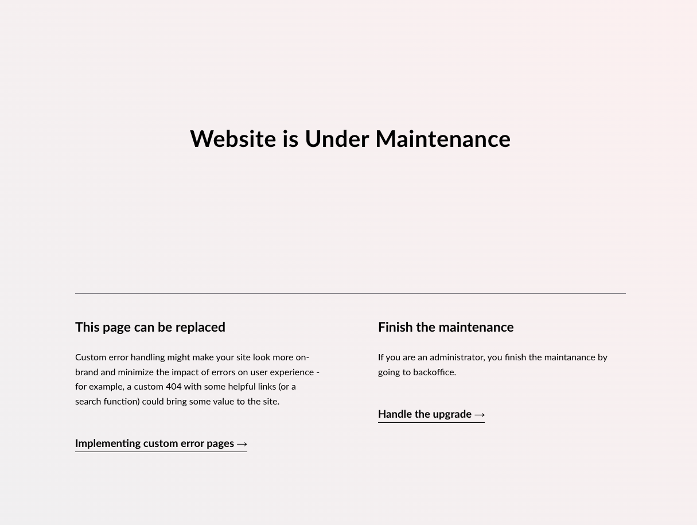

# Create a custom maintenance page

A maintenance page will be shown when an Umbraco project is running an upgrade. This prevents visitors from landing on an upgrade page or seeing content meant for project maintainers.




Two different pages are shown during an upgrade, depending on how the upgrade runs:

* The **maintenance page** is shown while an upgrade is pending and waiting for an administrator to run it.
* The **upgrading page** is shown while an [unattended upgrade](../../get-started/upgrading-and-migrating/upgrade-unattended.md) runs in the background.

Customizing one does not change the other. This article covers the maintenance page. To customize the upgrading page, use the `UpgradingViewPath` setting instead.


## Customize the maintenance page

The following guide will take you through the steps to customize and brand the default maintenance page.

There are two ways to do this. Configuring a view path is recommended. The view then lives alongside the rest of your views, and a mistake in the path is reported instead of being ignored.


Both approaches require Umbraco 17.8 or later. In earlier versions, the default maintenance page could not be replaced.


### Configure your own view

1. Add a new file to your project, for example `Views/Maintenance.cshtml`.
2. Add your custom markup to the file.
3. Open the project `appSettings.json` file.
4. Add the following configuration, pointing at your file:


```json
{
    "Umbraco": {
        "CMS": {
            "Global": {
                "MaintenanceViewPath": "~/Views/Maintenance.cshtml"
            }
        }
    }
}
```


### Replace the default view

Alternatively, add a file at the location the default view uses. Umbraco then renders your file instead of the one built into the CMS.

1. Go to the root of your Umbraco project files.
2. Open the `umbraco` folder, and create a new folder called `UmbracoWebsite` if it does not already exist.
3. Add a new file called `Maintenance.cshtml`.
4. Add your custom markup to the file.


The folder and file names must match exactly, including the casing. If the path does not match, Umbraco renders its default page and no error is shown.



Keeping the Umbraco project in Upgrade mode for a longer time is not recommended. Most migrations can be executed while the website continues to work.


## Disable the maintenance page

As most upgrades can be done without the website having to restart or go down, the maintenance page can be disabled.

1. Open the project `appSettings.json` file.
2. Add the following configuration:


```json
{
    "Umbraco": {
        "CMS": {
            "Global": {
                "ShowMaintenancePageWhenInUpgradeState": false
            }
        }
    }
}
```

