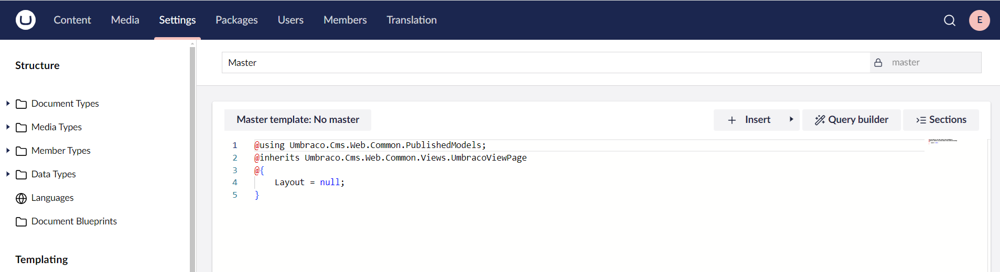
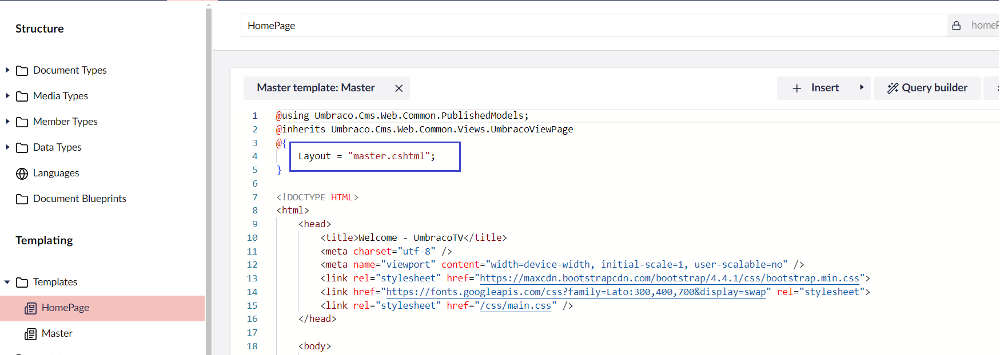
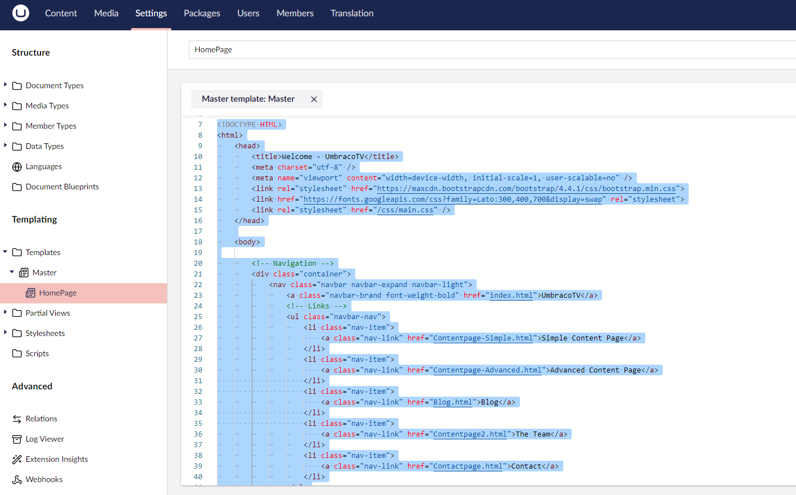
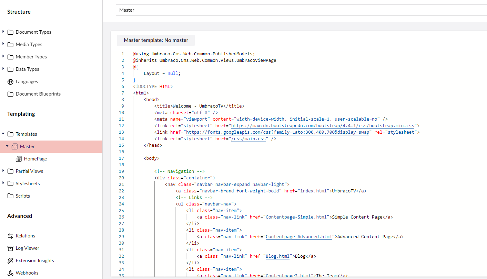
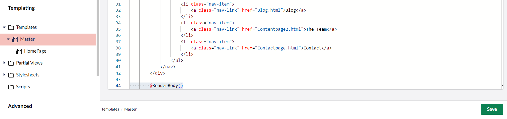
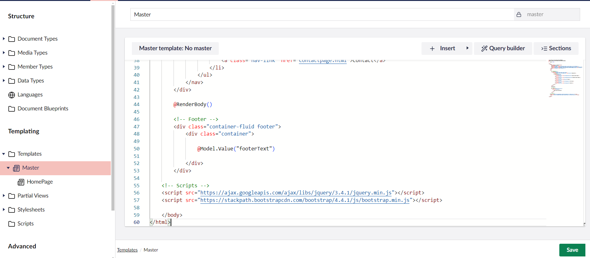

# Creating a Master Template

We've seen how to create a **Document Type** and its corresponding **Template**. If you want to create a website containing Home, News, and Contact Us pages, you will need to create a _**Document Type**_ with a corresponding **Template**.

You may end up copying the same HTML code into each of these templates, which can be time-consuming and repetitive. In such scenario, you might want to consider creating a new master template.

To create a new master template:

1. Go to **Settings**.
2. Select the **...** next to the **Templates** folder. Alternatively, click **+** to open a blank template.
3. Click **Create**.\
   A template opens up in the content editor.
4.  Enter a **Name** for the master template. Let's call it _Master_.

    
5. Click **Save**.

## Using the Master Template

To use the master template:

1. Go to **Settings**.
2. Expand the **Templates** folder from the **Templating** section.
3. Open the **Homepage** template.
4. Select `Master Template: No Master`.\
   The Master template dialog opens on the right-side of the browser.
5. Select the template called **Master**.
6.  Click **Choose**.\
    The Razor code section is updated from `Layout = null;` to `Layout = "Master.cshtml";`

    
7. Click **Save**.

## Updating Templates With the New Master Template

We now need to move the parts of our HTML template that are common across all templates into the _**Master**_. It might be slightly different for different websites. You'll need to consider if all pages contain a `<div id="main">` section so that you can update it in the master.

To update templates with the new master template, follow these steps:

1. Go to **Settings**.
2. Expand the **Templates** folder from the **Templating** section.
3. Navigate to the **Homepage** template.
4.  Cut everything from the `<!DOCTYPE HTML>` (around line 7) to the end of the `</div>` tag (around line 43) which is the `header` and `navigation` of the site to the master template.

    
5. Click **Save**.
6.  Go to the **Master** template and paste this HTML markup after the closing curly brace (around line 7).

    
7.  Add `@RenderBody()` at the end of the markup. This will tell Umbraco to insert the child template's content.

    
8. Click **Save**.
9. Repeat the same process for the footer content:
   * Go to the **Homepage** template and cut everything from the `<!-- Footer -->` tag (around line 108) to the end of the `</html>` tag (around line 122) and click **Save**.
   *   Go to the **Master** template and paste this HTML markup after the `@RenderBody()` field we've added.

       
10. Click **Save**.

Now we've done a lot of work. When we refresh our localhost page, nothing has changed. If you have a compilation error you have perhaps mistyped **@RenderBody()**.

If you are missing any content such as header or footer, ensure that the templates matches the following:

<details>

<summary>See the entire file: Master Template</summary>


```csharp
@using Umbraco.Cms.Web.Common.PublishedModels;
@inherits Umbraco.Cms.Web.Common.Views.UmbracoViewPage
@{
	Layout = null;
}
<!DOCTYPE HTML>
<html>
	<head>
		<title>Welcome - UmbracoTV</title>
		<meta charset="utf-8" />
		<meta name="viewport" content="width=device-width, initial-scale=1, user-scalable=no" />
		<link rel="stylesheet" href="https://maxcdn.bootstrapcdn.com/bootstrap/4.4.1/css/bootstrap.min.css">
		<link href="https://fonts.googleapis.com/css?family=Lato:300,400,700&display=swap" rel="stylesheet">
		<link rel="stylesheet" href="/css/main.css" />
	</head>
	
	<body>

		<!-- Navigation -->
		<div class="container">
			<nav class="navbar navbar-expand navbar-light">
				<a class="navbar-brand font-weight-bold" href="index.html">UmbracoTV</a>
				<!-- Links -->
				<ul class="navbar-nav">
					<li class="nav-item">
					    <a class="nav-link" href="Contentpage-Simple.html">Simple Content Page</a>
					</li>
					<li class="nav-item">
					    <a class="nav-link" href="Contentpage-Advanced.html">Advanced Content Page</a>
                    </li>
                    <li class="nav-item">
					    <a class="nav-link" href="Blog.html">Blog</a>
                    </li>
                    <li class="nav-item">
					    <a class="nav-link" href="Contentpage2.html">The Team</a>
					</li>
					<li class="nav-item">
					    <a class="nav-link" href="Contactpage.html">Contact</a>
					</li>
				</ul>
			</nav>
		</div>

        @RenderBody()

        <!-- Footer -->
		<div class="container-fluid footer">
			<div class="container">

				@Model.Value("footerText")

			</div>
		</div>
	
	<!-- Scripts -->
	<script src="https://ajax.googleapis.com/ajax/libs/jquery/3.4.1/jquery.min.js"></script>
	<script src="https://stackpath.bootstrapcdn.com/bootstrap/4.4.1/js/bootstrap.min.js"></script>
	
	</body>
</html>	
```


</details>

<details>

<summary>See the entire file: HomePage Template</summary>


```csharp
@using Umbraco.Cms.Web.Common.PublishedModels;
@inherits Umbraco.Cms.Web.Common.Views.UmbracoViewPage
@{
	Layout = "master.cshtml";
}


		
		<!-- Jumbotron, w title -->
		<div class="jumbotron text-center jumbotron-fluid">
			<div class="container">
				<h1 class="display-1">@Model.Value("pageTitle")</h1>
				<p>And this is <span class="font-weight-bold">only</span> the beginning.</p>
			</div>
		</div>

		<!-- This is where we're going to render our content -->
		
		<div class="container">

			<div class="row section">
				<div class="col-md-12">

					@Model.Value("bodyText")

				</div>				
			</div>

		</div>

		<!-- Grey Banner -->
		<div class="container-fluid grey-bg">
			<div class="container">
				<div class="row section">
					<div class="col-md-8">
						<h2>A flexible CMS - do things your way</h2>
						<p>The Umbraco source code is free and available for download either as a ZIP file or via NuGet under the MIT license, so you can <a href="#">start crafting websites in Umbraco today</a>. 
						Need to build a site with multiple 3rd party extensions and customized add-ons? No problem. Need to build a simple site with a straightforward contact form? No problem.</p>
						<p>Whatever type or scale of your project, Umbraco will be able to handle it - and the cherry on top; with Umbraco’s well-known editor friendly UI, 
							no matter how complex a site you’re building, you know that your editors will still find it a breeze to edit. Oh, and the cherry on top of the cherry - 
							there's <span class="font-weight-bold">no need for you to spend time learning a new coding or templating language as Umbraco is based on C#, javaScript and Razor</span>. </p>
					</div>
					<div class="col-md-4">
						
					</div>
				</div>
			</div>
		</div>

		<!-- Blog section -->
		<div class="container">

			<div class="row section">
				<div class="col-md-12">
					<h1>Latest from the blog</h1>
				</div>

				<!-- Blog Post query goes here. -->
				<div class="col-md-4">
					<div class="box-blog">
						<a href="Blogpost.html"><div class="blog-promoImage" style="background-image:url('/images/u_product_roadmap_white-1.png')"></div></a>
						<h5>Product Update - Deploying Deploy 3.3</h5>
						<p class="blog-meta">January 20th 2020 - by Sofie Toft</p>
						<p>The end of 2019 is approaching and with this, also the last Product Update of the year. 
							Let’s have a look at what we’ve been working on and what you can expect in the near future.</p>
					</div>
					<a href="Blogpost.html" class="btn btn-inverted">Read more >></a>
				</div>
				<div class="col-md-4">
					<div class="box-blog">
						<a href="#"><div class="blog-promoImage" style="background-image:url('/images/Press.jpg')"></div></a>
						<h5>Umbraco <3 YouTube</h5>
						<p class="blog-meta">January 20th 2020 - by Sofie Toft</p>
						<p>The end of 2019 is approaching and with this, also the last Product Update of the year. 
							Let’s have a look at what we’ve been working on and what you can expect in the near future.</p>
					</div>
					<a href="#" class="btn btn-inverted">Read more >></a>
				</div>
				<div class="col-md-4">
					<div class="box-blog">
						<a href="#"><div class="blog-promoImage" style="background-image:url('/images/sofie-hammock.jpg')"></div></a>
						<h5>A day in a Documentation Curators life</h5>
						<p class="blog-meta">January 20th 2020 - by Sofie Toft</p>
						<p>The end of 2019 is approaching and with this, also the last Product Update of the year. 
							Let’s have a look at what we’ve been working on and what you can expect in the near future.</p>
					</div>
					<a href="#" class="btn btn-inverted blog-box-btn">Read more >></a>
				</div>
			</div>

		</div>

		<!-- Call to Action -->
		<div class="container-fluid orange-bg">
			<div class="container">

				<div class="row section">
					<div class="col-md-12 text-center">
						<h1>How to continue your Umbraco journey</h1>
						<p>What’s next? We have gathered the 3 best ways for you to go on from here ensuring you get the best start to your Umbraco journey: <br/><br/></p>
						<a href="#" class="btn btn-inverted-orange" role="button">3 ways to start your Umbraco Journey >></a>
					</div>
				</div>
	
			</div>
		</div>
```


</details>
