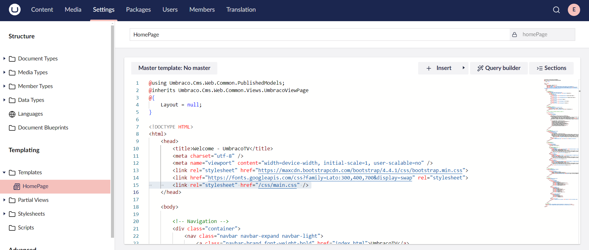

# CSS and Images

Our homepage is currently missing the CSS and image files. To include these files:

1. Open File Explorer and navigate to both your Umbraco project folder and the **Custom Umbraco Template** folder.


The Umbraco project folder refers to the folder created during the [Umbraco installation](../../fundamentals/setup/install/).


2. Copy the **css** and **images** folders from the _Custom Umbraco template_ folder.
3. Paste them inside the **wwwroot** folder of your Umbraco project.
4. Go to the **HomePage** template in the **Settings** section.
5.  Make sure the stylesheet reference in the HTML is `/css/main.css`.

    

## Stylesheet Reference

Use the Developer Tools in Chrome/Firefox/Edge and refresh `http://localhost:xxxx.`

* Check the **Network** tab to confirm no CSS or image files are missing.
* If you see any errors, double-check for typos and confirm the folders are placed correctly inside the **wwwroot** folder of your Umbraco project.

## How Static Files Are Served

Umbraco serves static files such as stylesheets and images from the **wwwroot** folder. This folder acts as the web root in ASP.NET Core applications. Any files placed here are publicly accessible and can be served directly by the application when requested by the browser.
