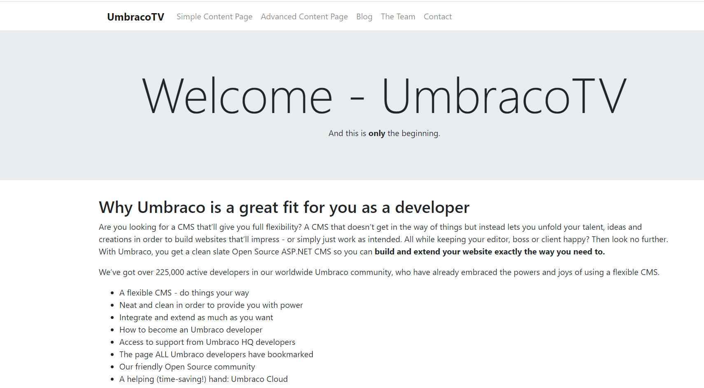

# Getting Started

The **Creating a Basic Site** tutorial provides step-by-step instructions to build an Umbraco website using a set of HTML, CSS, and JavaScript files. This tutorial enables you to use a website template, modify it, and connect the sections that require content management in the Umbraco CMS.

## **What You Need**

To begin this tutorial, you will need to download the [Custom Umbraco Template](https://umbra.co/Umbracotemplate). Clicking the link will automatically download the files to your device.

### Installing Umbraco

To download the latest version of Umbraco, refer to the [Installation article](../../fundamentals/setup/install/). On the installation wizard, follow the steps:

1.  Enter your **Name**, **Email**, and **Password**.

    
2. Click **Next**.
3. Choose the level of **Consent for telemetry data** for your Umbraco installation.
4. Click **Next**.
5. Select the **Database Type** from the drop-down list.
6. Enter the **Database Name**.
7. Click **Install**.

The installation will take a couple of minutes to complete.

### Preparing the Custom Umbraco Template Site

1. Unzip the [Custom Umbraco Template](https://umbra.co/Umbracotemplate) to a folder on your system. Clicking the link will automatically download the files to your device.
2.  Open the **index.html** from the folder in your preferred browser to see the template.

    

The template contains some text with dummy links. We’re going to turn this into a fully-fledged, Umbraco-powered site!

## Logging in to Umbraco

You can log in to Umbraco in two steps:

1. Once the installation is complete, you will see the **Login** screen.
2.  Enter the **Name** and **Password** used during the installation process. You should see a similar Umbraco Backoffice as the image below:

    
