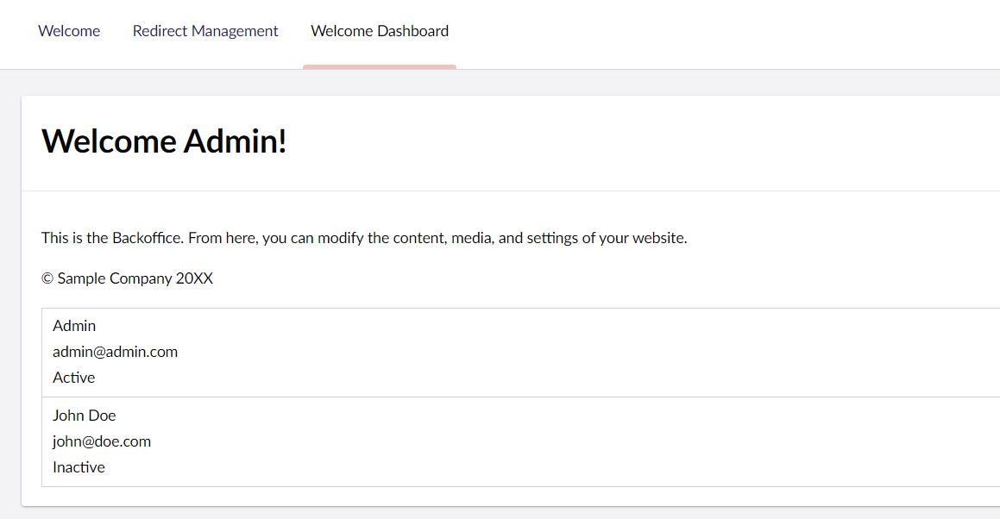
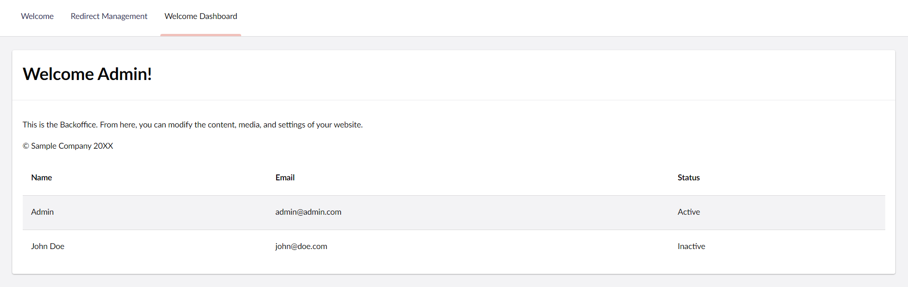

# Using Umbraco UI library in the Dashboard

## Overview

This is the fourth and final part of the guide to building a Custom Dashboard. This part continues work on the dashboard we built in part three: [Adding functionality to the Dashboard](adding-functionality-to-the-dashboard.md). But it goes further to showcase how we can use the UI Library in our extension.

The steps we will go through in this part are:

1. [Using UI Box](extending-the-dashboard-using-umbraco-ui-library.md#ui-box)
2. [Using UI Table](extending-the-dashboard-using-umbraco-ui-library.md#ui-table)
3. [Challenge (Optional)](extending-the-dashboard-using-umbraco-ui-library.md#challenge-optional)

### Umbraco UI Library

The [Umbraco UI Library](../../customizing/foundation/localization.md) is a set of web components and variables that we can use to build Umbraco User Interfaces. It is already part of the Backoffice, which means you can already start to use it.

By using the variables available from the UI Library, you ensure that your extensions are a consistent size with the rest of the backoffice.

## UI Box

1. Let's start by wrapping `uui-box` around our render output. This makes our dashboard the same style as the built-in dashboards of Umbraco:


```typescript
render() {
    return html`
        <uui-box>

            // rest of the render code

        </uui-box>
    `;
}
```


2. The `uui-box` has a headline property as well. Here are two options:

* Move the headline into the headline property:


```typescript
 render() {
    return html`
        <uui-box headline="${this.localize.term('welcomeDashboard_heading')} ${this._currentUser?.name ?? 'Unknown'}!">

            // rest of the render code

        </uui-box>
    `;
}
```


* Add an element instead. This element can also be styled and contain other elements.\
  \
  Let's keep using `umb-localize` instead of `localize.term()`:


```typescript
render() {
    return html`
        <uui-box>
            <span slot="headline">
                <umb-localize key="welcomeDashboard_heading">Welcome</umb-localize>
                ${this._currentUser?.name ?? 'Unknown'}!
            </span>

            // rest of the render code

        </uui-box>
    `;
}
```


3. The UI Library also has a lot of variables we can use such as sizes and colors. Let's update our `padding` to ensure that our element is always consistent with the rest of the backoffice:


```typescript
static styles = [
	css`
		:host {
			display: block;
			padding: var(--uui-size-layout-1);
		}

		...

	`,
];
```


This already looks a lot better!

<figure><figcaption><p>The dashboard in uui-box</p></figcaption></figure>

<details>

<summary>See the entire file: welcome-dashboard.element.ts</summary>


```typescript
import { type UmbCurrentUserModel, UMB_CURRENT_USER_CONTEXT } from "@umbraco-cms/backoffice/current-user";
import { LitElement, css, html, customElement, state, repeat } from "@umbraco-cms/backoffice/external/lit";
import { type UmbUserDetailModel, UmbUserCollectionRepository } from '@umbraco-cms/backoffice/user';
import { UmbElementMixin } from "@umbraco-cms/backoffice/element-api";

@customElement('my-welcome-dashboard')
export class MyWelcomeDashboardElement extends UmbElementMixin(LitElement) {
	@state()
    private _currentUser?: UmbCurrentUserModel;

    @state()
    private _userData: Array<UmbUserDetailModel> = [];

    #userRepository = new UmbUserCollectionRepository(this);

    constructor() {
        super();
        this.consumeContext(UMB_CURRENT_USER_CONTEXT, (instance) => {
            this._observeCurrentUser(instance);
        });
        this._getPagedUserData();
    }

    //Get the current user
    private async _observeCurrentUser(instance: typeof UMB_CURRENT_USER_CONTEXT.TYPE) {
        this.observe(instance.currentUser, (currentUser) => {
            this._currentUser = currentUser;
        });
    }

    //Get all users
    private async _getPagedUserData() {
        const { data } = await this.#userRepository.requestCollection();
        this._userData = data?.items ?? [];
    }

	render() {
		return html`
			<uui-box>
				<h1 slot="headline">
					<umb-localize key="welcomeDashboard_heading">Welcome</umb-localize>
					${this._currentUser?.name ?? 'Unknown'}!
				</h1>
				<div>
					<p>
						<umb-localize key="welcomeDashboard_bodytext">
							This is the Backoffice. From here, you can modify the content, media, and settings of your website.
						</umb-localize>
					</p>
					<p>
						<umb-localize key="welcomeDashboard_copyright"> © Sample Company 20XX </umb-localize>
					</p>
				</div>
				<div id="users-wrapper">
                    ${repeat(this._userData, (user) => user.unique, (user) => this._renderUser(user))}
                </div>
			</uui-box>
		`;
	}

	private _renderUser(user: UmbUserDetailModel) {
		return html`<div class="user">
			<div>${user.name}</div>
			<div>${user.email}</div>
			<div>${user.state}</div>
		</div>`;
	}

	static styles = [
		css`
			:host {
				display: block;
				padding: var(--uui-size-layout-1);
			}

			#users-wrapper {
				border: 1px solid lightgray;
			}

			.user {
				padding: 5px 10px;
			}

			.user:not(:first-child) {
				border-top: 1px solid lightgray;
			}
		`,
	];
}

export default MyWelcomeDashboardElement;

declare global {
	interface HTMLElementTagNameMap {
		'my-welcome-dashboard': MyWelcomeDashboardElement;
	}
}
```


</details>

## UI Table

Let's try another uui element. Since we have a lot of information from the users, it could be a good idea to insert it into a proper table.

1. The Umbraco UI (UUI) Library also includes a [uui-table](https://uui.umbraco.com/?path=/docs/layout-table-table--docs), so let's use it:


```typescript
render() {
	return html`
		<uui-box>

			...

			<uui-table id="users-wrapper">
				<uui-table-row>
					<uui-table-head-cell>Name</uui-table-head-cell>
					<uui-table-head-cell>Email</uui-table-head-cell>
					<uui-table-head-cell>Status</uui-table-head-cell>
				</uui-table-row>
				${repeat(this._userData, (user) => user.unique, (user) => this._renderUser(user))}
			</uui-table>
		</uui-box>
	`;
}

private _renderUser(user: UmbUserDetailModel) {
    if (!user) return;
    return html`<uui-table-row class="user">
        <uui-table-cell>${user.name}</uui-table-cell>
        <uui-table-cell>${user.email}</uui-table-cell>
        <uui-table-cell>${user.state}</uui-table-cell>
    </uui-table-row>`;
}
```


2. Since the `uui-table` and others are handling the table, we can redo our CSS a bit:


```typescript
static styles = [
	css`
		:host {
			display: block;
			padding: var(--uui-size-layout-1);
		}

		uui-table-head-cell {
			font-weight: bold;
		}

		.user:hover,
		.user:focus {
			cursor: pointer;
			background-color: var(--uui-color-surface-alt);
		}
	`,
];
```


Your dashboard component should now look like this:

<figure><figcaption><p>Dashboard with uui-table in use</p></figcaption></figure>

<details>

<summary>See the entire file: welcome-dashboard.element.ts</summary>


```typescript
import { type UmbCurrentUserModel, UMB_CURRENT_USER_CONTEXT } from "@umbraco-cms/backoffice/current-user";
import { LitElement, css, html, customElement, state, repeat } from "@umbraco-cms/backoffice/external/lit";
import { type UmbUserDetailModel, UmbUserCollectionRepository } from '@umbraco-cms/backoffice/user';
import { UmbElementMixin } from "@umbraco-cms/backoffice/element-api";

@customElement('my-welcome-dashboard')
export class MyWelcomeDashboardElement extends UmbElementMixin(LitElement) {
    @state()
    private _currentUser?: UmbCurrentUserModel;

    @state()
    private _userData: Array<UmbUserDetailModel> = [];

    #userRepository = new UmbUserCollectionRepository(this);

    constructor() {
        super();
        this.consumeContext(UMB_CURRENT_USER_CONTEXT, (instance) => {
            this._observeCurrentUser(instance);
        });
        this._getPagedUserData();
    }

    //Get the current user
    private async _observeCurrentUser(instance: typeof UMB_CURRENT_USER_CONTEXT.TYPE) {
        this.observe(instance.currentUser, (currentUser) => {
            this._currentUser = currentUser;
        });
    }

    //Get all users
    private async _getPagedUserData() {
        const { data } = await this.#userRepository.requestCollection();
        this._userData = data?.items ?? [];
    }

    render() {
        return html`
			<uui-box>
				<h1 slot="headline">
					<umb-localize key="welcomeDashboard_heading">Welcome</umb-localize>
					${this._currentUser?.name ?? 'Unknown'}!
				</h1>
				<div>
					<p>
						<umb-localize key="welcomeDashboard_bodytext">
							This is the Backoffice. From here, you can modify the content, media, and settings of your website.
						</umb-localize>
					</p>
					<p>
						<umb-localize key="welcomeDashboard_copyright"> © Sample Company 20XX </umb-localize>
					</p>
				</div>

				<uui-table id="users-wrapper">
					<uui-table-row>
						<uui-table-head-cell>Name</uui-table-head-cell>
						<uui-table-head-cell>Email</uui-table-head-cell>
						<uui-table-head-cell>Status</uui-table-head-cell>
					</uui-table-row>
                    ${repeat(this._userData, (user) => user.unique, (user) => this._renderUser(user))}
				</uui-table>
			</uui-box>
		`;
    }

    private _renderUser(user: UmbUserDetailModel) {
        if (!user) return;
        return html`<uui-table-row class="user">
			<uui-table-cell>${user.name}</uui-table-cell>
			<uui-table-cell>${user.email}</uui-table-cell>
			<uui-table-cell>${user.state}</uui-table-cell>
		</uui-table-row>`;
    }

    static styles = [
        css`
			:host {
				display: block;
				padding: var(--uui-size-layout-1);
			}

			uui-table-head-cell {
				font-weight: bold;
			}

			.user:hover,
			.user:focus {
				cursor: pointer;
				background-color: var(--uui-color-surface-alt);
			}
		`,
    ];
}

export default MyWelcomeDashboardElement;

declare global {
    interface HTMLElementTagNameMap {
        'my-welcome-dashboard': MyWelcomeDashboardElement;
    }
}
```


</details>

## **Challenge (optional)**

Insert the <mark style="color:orange;">`user.state`</mark> into a <mark style="color:orange;">`uui-tag`</mark> that uses different values of the properties<mark style="color:orange;">`look`</mark> and <mark style="color:orange;">`color`</mark>.

The values depend on the state of the user. For example, use `look="primary"` and `color="positive"` when the user is <mark style="color:orange;">`Active`</mark>

[Check out the uui-tag in the library here](https://uui.umbraco.com/?path=/story/uui-tag--looks-and-colors)

<details>

<summary>See possible solution to the challenge</summary>

Remember that you can come to a solution in many different ways! Here is a possible solution to how it could've been solved:

```typescript
import { UserStateModel } from '@umbraco-cms/backoffice/external/backend-api';
import { UUIInterfaceColor, UUIInterfaceLook } from '@umbraco-cms/backoffice/external/uui';

	...

  private _renderUser(user: UmbUserDetailModel) {
    if (!user) return;
	const state = this.getLookAndColorFromUserState(user.state!);
    return html`<uui-table-row class="user">
			<uui-table-cell>${user.name}</uui-table-cell>
			<uui-table-cell>${user.email}</uui-table-cell>
			<uui-table-cell><uui-tag look=${state.look} color=${state.color}>${user.state}</uui-tag></uui-table-cell>
		</uui-table-row>`;
  }
  getLookAndColorFromUserState = (state?: UserStateModel): { look: UUIInterfaceLook; color: UUIInterfaceColor } => {
    switch (state) {
      case UserStateModel.INACTIVE:
      case UserStateModel.INVITED:
        return { look: 'primary', color: 'warning' };
      case UserStateModel.ACTIVE:
        return { look: 'primary', color: 'positive' };
      case UserStateModel.DISABLED:
        return { look: 'primary', color: 'danger' };
      default:
        return { look: 'secondary', color: 'default' };
    }
  };

	...
```

</details>

The `uui-table-row` also have a selectable property.

Continue to experiment with different UUI elements from the UI library to build awesome interfaces!

## Wrap up

Over the four previous steps, we have:

* Set up the dashboard plugin
* Wrote a basic Welcome Message view
* Configured the Custom Welcome Dashboard to be displayed
* Added translations
* Added styles
* Added interactive functionality with Lit and TypeScript
* Displayed the current user's name in our welcome message
* Displayed the most recent log viewer items
* You can do anything with Umbraco UI Library
