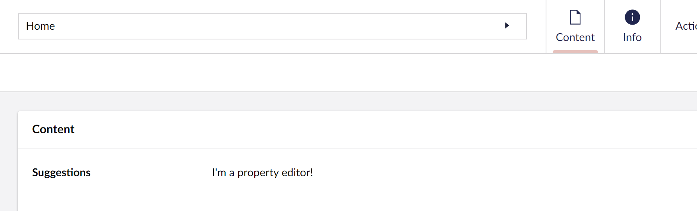
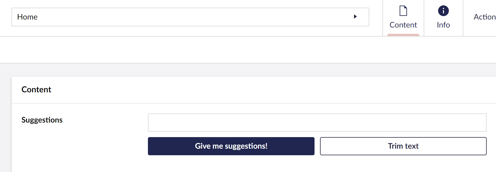
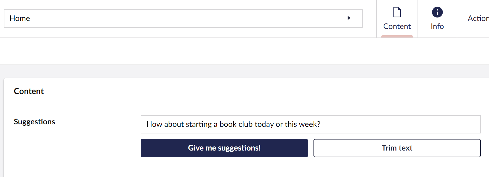

# Creating a Property Editor

## Overview

This guide explains how to set up a property editor and hook it into Umbraco's Data Types. It also covers the creation of a basic property editor and how to test the property editor.

The steps covered in part one are:

* [Setting up a Plugin](./#setting-up-a-plugin)
* [Creating a Web Component](./#creating-a-web-component)
* [Registering the Data Type in Umbraco](./#registering-the-data-type-in-umbraco)
* [Adding styling and setting up events in Web Components](./#adding-styling-and-setting-up-events-in-the-web-components)
* [Setup Event Logic](./#setup-event-logic)

This tutorial uses TypeScript and Lit with Umbraco. It is expected that your package is already [set up to use TypeScript and Lit](../../customizing/development-flow/vite-package-setup.md).

To see how to set up an extension in Umbraco using TypeScript and Lit, read the article [Creating your first extension](../creating-your-first-extension.md).

### **Resources**

This tutorial will not go in-depth on how TypeScript and Lit work. To learn about TypeScript and Lit, you can find their documentation below:

* [TypeScript documentation](https://www.typescriptlang.org/docs/)
* [Lit documentation](https://lit.dev/docs/)

### The End Result

At the tutorial's end, the result is a Umbraco Suggestions Data Type, registered in the backoffice, and assigned to a Document Type. This Data Type can create and suggest values.


At each step, you will find a dropdown for `suggestions-property-editor-ui.element.ts and umbraco-package.json` to confirm your placement for code snippets.


## Setting up a plugin

1. Follow the [Vite Package Setup](../../customizing/development-flow/vite-package-setup.md) by creating a new project folder called "`suggestions`" in `App_Plugins`.
2. Create a manifest file to define and configure the property editor. The manifest can be defined in either JSON or TypeScript.

### Manifest

Property editor UI extensions can be defined either with JSON in `umbraco-package.json` or with JavaScript/TypeScript.



Create a manifest file named `umbraco-package.json` at the root of the `suggestions` folder, and add the following code:


```json
{
    "$schema": "../../umbraco-package-schema.json",
    "name": "My.AwesomePackage",
    "version": "0.1.0",
    "extensions": [
        {
            "type": "propertyEditorUi",
            "alias": "My.PropertyEditorUi.Suggestions",
            "name": "My Suggestions Property Editor UI",
            "element": "/App_Plugins/Suggestions/dist/suggestions.js",
            "elementName": "my-suggestions-property-editor-ui",
            "meta": {
                "label": "Suggestions",
                "icon": "icon-list",
                "group": "common",
                "propertyEditorSchemaAlias": "Umbraco.Plain.String"
            }
        }
    ]
}
```




Extension authors define the property editor UI manifest, then register it dynamically during runtime using a [Backoffice Entry Point](../../customizing/extending-overview/extension-types/backoffice-entry-point.md) extension.

Create a manifest file named `manifests.ts` and add the following code:


```typescript
import type { ManifestPropertyEditorUi } from '@umbraco-cms/backoffice/property-editor';

export const propertyEditorUiManifest: ManifestPropertyEditorUi[] = [
    {
        type: 'propertyEditorUi',
        alias: 'My.PropertyEditorUi.Suggestions',
        name: 'My Suggestions Property Editor UI',
        element: () => import('./suggestions-property-editor-ui.element.js'),
        elementName: 'my-suggestions-property-editor-ui',
        meta: {
            label: 'Suggestions',
            icon: 'icon-list',
            group: 'common',
            propertyEditorSchemaAlias: 'Umbraco.Plain.String'
        }
    }
];
```





The `umbraco-package.json` files are cached by the server. When creating new `umbraco-package.json` files, it might take a few seconds before those are loaded into the server cache.



It is important to select the right `propertyEditorSchemaAlias` as it affects how the Property Editor data is made available when rendering the website.

In this example, we selected the `Umbraco.Plain.String` because we want a string value. For more options, see the [default Property Editor Schema aliases](default-property-editor-schema-aliases.md) article.


## Creating a Web Component

Create the web component for the property editor.

1. Create a file in the `src` folder with the name `suggestions-property-editor-ui.element.ts`
2. In this new file, add the following code:


```typescript
import { LitElement, html, customElement, property } from '@umbraco-cms/backoffice/external/lit';
import type { UmbPropertyEditorUiElement } from '@umbraco-cms/backoffice/property-editor';

@customElement('my-suggestions-property-editor-ui')
export default class MySuggestionsPropertyEditorUIElement extends LitElement implements UmbPropertyEditorUiElement {
    @property({ type: String })
    public value = '';

    override render() {
        return html`I'm a property editor!`;
    }
}

declare global {
    interface HTMLElementTagNameMap {
        'my-suggestions-property-editor-ui': MySuggestionsPropertyEditorUIElement;
    }
}
```


3.  In the `vite.config.ts` file replace the `entry` to the newly created `.ts` file:

    ```typescript
    entry: "src/suggestions-property-editor-ui.element.ts"
    ```

The basic parts of the editor are now complete, namely:

* The package manifest, telling Umbraco what to load
* The web component for the editor

4. Reload the backoffice.

## Registering the Data Type in Umbraco

1. Add the newly added property editor "Suggestions" in the Document Type and save it.


The assigned property's value can now be edited with the new property editor.

2. Check out the content where you will see the property editor that looks like this:

<figure><figcaption></figcaption></figure>

## Adding styling and setting up events in the Web Components

Start by creating an input field and some buttons to style and hook up to events.

1. Update the render method to include some input fields and buttons in the `suggestions-property-editor-ui.element.ts` file:


```typescript
override render() {
    return html`
      <uui-input
        id="suggestion-input"
        class="element"
        label="text input"
        .value=${this.value || ""}
      >
      </uui-input>
      <div id="wrapper">
        <uui-button
          id="suggestion-button"
          class="element"
          look="primary"
          label="give me suggestions"
        >
          Give me suggestions!
        </uui-button>
        <uui-button
          id="suggestion-trimmer"
          class="element"
          look="outline"
          label="Trim text"
        >
          Trim text
        </uui-button>
      </div>
    `;
  }
```



The Umbraco UI library is already a part of the backoffice, which means it can be used immediately.


2. Add some styling. Update the import from lit to include `css` and `UmbTextStyles`:


```typescript
import { LitElement, html, css, customElement, property } from '@umbraco-cms/backoffice/external/lit';
import { UmbTextStyles } from '@umbraco-cms/backoffice/style';
```


3. Add the CSS:


```typescript
render() {
  ...
}

static override readonly styles = [
  UmbTextStyles,
  css`
    #wrapper {
      margin-top: 10px;
      display: flex;
      gap: 10px;
    }
    .element {
      width: 100%;
    }
  `,
];
```


It should now look something like this:

<figure><figcaption></figcaption></figure>

<details>

<summary>See the file: suggestions-property-editor-ui.element.ts</summary>


```typescript
import { LitElement, html, css, customElement, property } from '@umbraco-cms/backoffice/external/lit';
import type { UmbPropertyEditorUiElement } from '@umbraco-cms/backoffice/property-editor';
import { UmbTextStyles } from '@umbraco-cms/backoffice/style';

@customElement('my-suggestions-property-editor-ui')
export default class MySuggestionsPropertyEditorUIElement extends LitElement implements UmbPropertyEditorUiElement {
    @property({ type: String })
    public value = '';

    override render() {
        return html`
          <uui-input
            id="suggestion-input"
            class="element"
            label="text input"
            .value=${this.value || ""}
          >
          </uui-input>
          <div id="wrapper">
            <uui-button
              id="suggestion-button"
              class="element"
              look="primary"
              label="give me suggestions"
            >
              Give me suggestions!
            </uui-button>
            <uui-button
              id="suggestion-trimmer"
              class="element"
              look="outline"
              label="Trim text"
            >
              Trim text
            </uui-button>
          </div>
        `;
    }

    static override readonly styles = [
        UmbTextStyles,
        css`
          #wrapper {
            margin-top: 10px;
            display: flex;
            gap: 10px;
          }
          .element {
            width: 100%;
          }
        `,
      ];

}


declare global {
    interface HTMLElementTagNameMap {
        'my-suggestions-property-editor-ui': MySuggestionsPropertyEditorUIElement;
    }
}
```


</details>

It's starting to look good! Next, set up the event logic.

## Setup Event Logic

### Setup Input Field

Start with the input field. When typing something in the input field, the property editor's value should change to the input field's current value.

A `change` event must be dispatched, which can be done in two ways:

* Using `new CustomEvent('change')` or
* Using `new UmbChangeEvent()` which is recommended as you can leverage the core class

1. Add the import so the event can be used:


```typescript
import { UmbChangeEvent } from '@umbraco-cms/backoffice/event';
```


2. Add the event to the property editor:


```typescript
  #onInput(e: InputEvent) {
    this.value = (e.target as HTMLInputElement).value;
    this.#dispatchChangeEvent();
  }

  #dispatchChangeEvent() {
    this.dispatchEvent(new UmbChangeEvent());
  }

  override render() {
    return html`
      <uui-input
        id="suggestion-input"
        class="element"
        label="text input"
        .value=${this.value || ""}
        @input=${this.#onInput}
      >
      </uui-input>

      ....
}
```


Look at the suggestions button next.

### Setup Suggestions Button

* When pressing the suggestion button, the text should update to the suggestion received. Similar to how the value of the property editor changes when writing in the input field.
* The value should also change when pressing the suggestion button.

1. Update the import for Lit:


```typescript
import { LitElement, html, css, customElement, property, state } from '@umbraco-cms/backoffice/external/lit';
```


2. Add suggestions to the property editor:


```typescript
  @state()
  private _suggestions = [
    'You should take a break',
    'I suggest that you visit the Eiffel Tower',
    'How about starting a book club today or this week?',
    'Are you hungry?',
  ];

  override render() {...}
```


3. Update the suggestion button in the render method to call a `onSuggestion` method when pressing the button:


```typescript
#onSuggestion() {
    const randomIndex = (this._suggestions.length * Math.random()) | 0;
    this.value = this._suggestions[randomIndex];
    this.#dispatchChangeEvent();
}

override render() {
    return html`

    ...

    <uui-button
        id="suggestion-button"
        class="element"
        look="primary"
        label="give me suggestions"
        @click=${this.#onSuggestion}
        >
        Give me suggestions!
        </uui-button>
    ...
    `;
}
```


<details>

<summary>See the entire file: suggestions-property-editor-ui.element.ts</summary>


```typescript
import { UmbChangeEvent } from '@umbraco-cms/backoffice/event';
import { css, customElement, html, LitElement, property, state } from '@umbraco-cms/backoffice/external/lit';
import type { UmbPropertyEditorUiElement } from '@umbraco-cms/backoffice/property-editor';
import { UmbTextStyles } from '@umbraco-cms/backoffice/style';

@customElement('my-suggestions-property-editor-ui')
export default class MySuggestionsPropertyEditorUIElement extends LitElement implements UmbPropertyEditorUiElement {
	@property({ type: String })
	public value = '';

	@state()
	private _suggestions = [
		'You should take a break',
		'I suggest that you visit the Eiffel Tower',
		'How about starting a book club today or this week?',
		'Are you hungry?',
	];

	#onInput(e: InputEvent) {
		this.value = (e.target as HTMLInputElement).value;
		this.#dispatchChangeEvent();
	}

	#onSuggestion() {
		const randomIndex = (this._suggestions.length * Math.random()) | 0;
		this.value = this._suggestions[randomIndex];
		this.#dispatchChangeEvent();
	}

	#dispatchChangeEvent() {
		this.dispatchEvent(new UmbChangeEvent());
	}

	override render() {
		return html`
			<uui-input
				id="suggestion-input"
				class="element"
				label="text input"
				.value=${this.value || ''}
				@input=${this.#onInput}>
			</uui-input>
			<div id="wrapper">
				<uui-button
					id="suggestion-button"
					class="element"
					look="primary"
					label="give me suggestions"
					@click=${this.#onSuggestion}>
					Give me suggestions!
				</uui-button>
				<uui-button id="suggestion-trimmer" class="element" look="outline" label="Trim text"> Trim text </uui-button>
			</div>
		`;
	}

	static override readonly styles = [
		UmbTextStyles,
		css`
			#wrapper {
				margin-top: 10px;
				display: flex;
				gap: 10px;
			}
			.element {
				width: 100%;
			}
		`,
	];
}

declare global {
	interface HTMLElementTagNameMap {
		'my-suggestions-property-editor-ui': MySuggestionsPropertyEditorUIElement;
	}
}
```


</details>

4. Clear your cache, reload the document, and see the Suggestions Data Type running.

<figure><figcaption></figcaption></figure>

When saving or publishing, the value of the Data Type is automatically synced to the current content object and sent to the server.

Learn more about extending this service by visiting the [Property Editors](../../customizing/property-editors/composition/) page.

## Going further

With all the steps completed, a Suggestion Data Type is now running in the property editor.

The next part covers adding configurations to the property editor.
