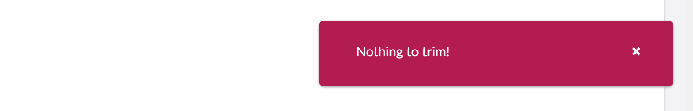
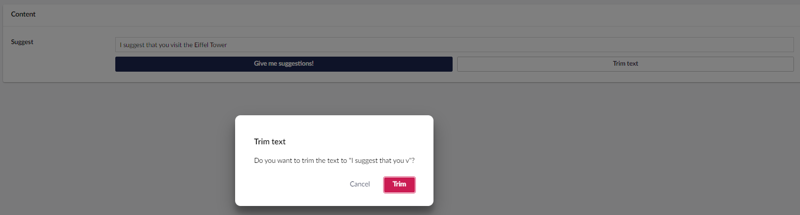

# Integrating context with a Property Editor

## Overview

This is the third step in the Property Editor tutorial. In this part, we will integrate built-in Umbraco Contexts. For this sample, we will use the `UmbNotificationContext` for some pop-ups and the `UmbModalManagerContext`. `UmbNotificationContext` is used to show a dialog when you click the Trim button and the textbox's input length is longer than the maxLength configuration.

The steps we will go through in this part are:

* [Setting up the contexts](integrating-context-with-a-property-editor.md#setting-up-the-contexts)
* [Using the modal and notification context](integrating-context-with-a-property-editor.md#using-the-modal-and-notification-context)
* [Adding more logic to the context](integrating-context-with-a-property-editor.md#adding-more-logic-to-the-context)

## Setting up the contexts

1. Add the following imports in the `suggestions-property-editor-ui.element.ts` file. This includes the notification context.


```typescript
import { UMB_NOTIFICATION_CONTEXT, UmbNotificationContext, UmbNotificationDefaultData} from '@umbraco-cms/backoffice/notification';
import { UmbElementMixin } from '@umbraco-cms/backoffice/element-api';
```


2. Update the class to extend from UmbElementMixin. This allows us to consume the contexts that we need:


```typescript
export default class MySuggestionsPropertyEditorUIElement extends UmbElementMixin((LitElement)) implements UmbPropertyEditorUiElement {

```


3. Create the constructor where we can consume the notification context above the `render()` method:


```typescript
#notificationContext?: UmbNotificationContext;

constructor() {
    super();

    this.consumeContext(UMB_NOTIFICATION_CONTEXT, (instance) => {
        this.#notificationContext = instance;
    });
}
```


## Using the notification context

Now we can use the notification context, let's change our `#onTrimText` method.

First, check if the length of our input is smaller or equal to our maxLength configuration. If it is, we have nothing to trim and will send a notification saying there is nothing to trim.

Here we can use the NotificationContext's peek method. It has two parameters `UmbNotificationColor` and an `UmbNotificationDefaultData` object.

1. Add the `#onTextTrim()`method above the `render()` method:


```typescript
#onTextTrim() {
    if (!this._maxChars) return;
    if (!this.value || (this.value as string).length <= this._maxChars) {
        const data: UmbNotificationDefaultData = {
            message: `Nothing to trim!`,
        };
        this.#notificationContext?.peek("danger", { data });
        return;
    }
}
```


2. Add a `click` event to the trim text button in the `render()` method:


```typescript
<uui-button
    id="suggestion-trimmer"
    class="element"
    look="outline"
    label="Trim text"
    @click=${this.#onTextTrim}></uui-button>
```


If our input length is less or equal to our maxLength configuration, we will now get a notification when pressing the Trim button.

<figure><figcaption><p>Trim Button Notification</p></figcaption></figure>

## Adding more logic to the context

Let's continue to add more logic. If the length is more than the `maxChars` configuration, we want to show a dialog for the user to confirm the trim.

Here, we use the `ModalManagerContext` which has an open method to show a dialog.

Like the notification context, we need to import it and consume it in the constructor.

1. Add the following import in the `suggestions-property-editor-ui.element.ts` file:


```typescript
import { UMB_MODAL_MANAGER_CONTEXT, UMB_CONFIRM_MODAL,} from '@umbraco-cms/backoffice/modal';
```


2. Remove the `UmbNotificationContext` from the `'@umbraco-cms/backoffice/notification'` import:

```typescript
import { UMB_NOTIFICATION_CONTEXT, UmbNotificationDefaultData } from '@umbraco-cms/backoffice/notification';
```

3. Update the constructor to consume the `UMB_MODAL_MANAGER_CONTEXT`and the `UMB_CONFIRM_MODAL.`


```typescript
#modalManagerContext?: typeof UMB_MODAL_MANAGER_CONTEXT.TYPE;
#notificationContext?: typeof UMB_NOTIFICATION_CONTEXT.TYPE;

constructor() {
    super();
    this.consumeContext(UMB_MODAL_MANAGER_CONTEXT, (instance) => {
        this.#modalManagerContext = instance;
    });

    this.consumeContext(UMB_NOTIFICATION_CONTEXT, (instance) => {
        this.#notificationContext = instance;
    });
}
```


4. Add more logic to the `onTextTrim` method:


```typescript
#onTextTrim() {
  ...

    const trimmed = (this.value as string).substring(0, this._maxChars);
    const modalHandler = this.#modalManagerContext?.open(this, UMB_CONFIRM_MODAL,
        {
            data: {
                headline: `Trim text`,
                content: `Do you want to trim the text to "${trimmed}"?`,
                color: "danger",
                confirmLabel: "Trim",
            }
        }
    );
    modalHandler?.onSubmit().then(() => {
        this.value = trimmed;
        this.#dispatchChangeEvent();
        const data: UmbNotificationDefaultData = {
            headline: `Text trimmed`,
            message: `You trimmed the text!`,
        };
        this.#notificationContext?.peek("positive", { data });
    }, null);
}
```


5. Run the command `npm run build` in the `suggestions` folder.
6. Run the project.
7. Go to the **Content** section of the Backoffice.
8. Ask for suggestions and click on the **Trim text** button. If the suggested text is long enough to be trimmed, you will be asked for confirmation:

<figure><figcaption><p>Models warning</p></figcaption></figure>

<details>

<summary>See the entire file: suggestions-property-editor-ui.element.ts</summary>


```typescript
import { UmbElementMixin } from '@umbraco-cms/backoffice/element-api';
import { UmbChangeEvent } from '@umbraco-cms/backoffice/event';
import { css, customElement, html, ifDefined, LitElement, property, state } from '@umbraco-cms/backoffice/external/lit';
import { UMB_CONFIRM_MODAL, UMB_MODAL_MANAGER_CONTEXT } from '@umbraco-cms/backoffice/modal';
import { UMB_NOTIFICATION_CONTEXT, type UmbNotificationDefaultData } from '@umbraco-cms/backoffice/notification';
import type {
	UmbPropertyEditorConfigCollection,
	UmbPropertyEditorUiElement,
} from '@umbraco-cms/backoffice/property-editor';
import { UmbTextStyles } from '@umbraco-cms/backoffice/style';

@customElement('my-suggestions-property-editor-ui')
export default class MySuggestionsPropertyEditorUIElement
	extends UmbElementMixin(LitElement)
	implements UmbPropertyEditorUiElement
{
	@property({ type: String })
	public value = '';

	@state()
	private _disabled?: boolean;

	@state()
	private _placeholder?: string;

	@state()
	private _maxChars?: number;

	@state()
	private _suggestions = [
		'You should take a break',
		'I suggest that you visit the Eiffel Tower',
		'How about starting a book club today or this week?',
		'Are you hungry?',
	];

	@property({ attribute: false })
	public set config(config: UmbPropertyEditorConfigCollection) {
		this._disabled = config.getValueByAlias('disabled');
		this._placeholder = config.getValueByAlias('placeholder');
		this._maxChars = config.getValueByAlias('maxChars');
	}

	#onInput(e: InputEvent) {
		this.value = (e.target as HTMLInputElement).value;
		this.#dispatchChangeEvent();
	}

	#onSuggestion() {
		const randomIndex = (this._suggestions.length * Math.random()) | 0;
		this.value = this._suggestions[randomIndex];
		this.#dispatchChangeEvent();
	}

	#dispatchChangeEvent() {
		this.dispatchEvent(new UmbChangeEvent());
	}

	#modalManagerContext?: typeof UMB_MODAL_MANAGER_CONTEXT.TYPE;
	#notificationContext?: typeof UMB_NOTIFICATION_CONTEXT.TYPE;

	constructor() {
		super();
		this.consumeContext(UMB_MODAL_MANAGER_CONTEXT, (instance) => {
			this.#modalManagerContext = instance;
		});

		this.consumeContext(UMB_NOTIFICATION_CONTEXT, (instance) => {
			this.#notificationContext = instance;
		});
	}

	#onTextTrim() {
		if (!this._maxChars) return;
		if (!this.value || (this.value as string).length <= this._maxChars) {
			const data: UmbNotificationDefaultData = {
				message: `Nothing to trim!`,
			};
			this.#notificationContext?.peek('danger', { data });
			return;
		}
		const trimmed = (this.value as string).substring(0, this._maxChars);
		const modalHandler = this.#modalManagerContext?.open(this, UMB_CONFIRM_MODAL, {
			data: {
				headline: `Trim text`,
				content: `Do you want to trim the text to "${trimmed}"?`,
				color: 'danger',
				confirmLabel: 'Trim',
			},
		});
		modalHandler?.onSubmit().then(() => {
			this.value = trimmed;
			this.#dispatchChangeEvent();
			const data: UmbNotificationDefaultData = {
				headline: `Text trimmed`,
				message: `You trimmed the text!`,
			};
			this.#notificationContext?.peek('positive', { data });
		}, null);
	}

	override render() {
		return html`
			<uui-input
				id="suggestion-input"
				class="element"
				label="text input"
				placeholder=${ifDefined(this._placeholder)}
				maxlength=${ifDefined(this._maxChars)}
				.value=${this.value || ''}
				@input=${this.#onInput}>
			</uui-input>
			<div id="wrapper">
				<uui-button
					id="suggestion-button"
					class="element"
					look="primary"
					label="give me suggestions"
					?disabled=${this._disabled}
					@click=${this.#onSuggestion}>
					Give me suggestions!
				</uui-button>
				<uui-button id="suggestion-trimmer" class="element" look="outline" label="Trim text" @click=${this.#onTextTrim}>
					Trim text
				</uui-button>
			</div>
		`;
	}

	static override readonly styles = [
		UmbTextStyles,
		css`
			#wrapper {
				margin-top: 10px;
				display: flex;
				gap: 10px;
			}
			.element {
				width: 100%;
			}
		`,
	];
}

declare global {
	interface HTMLElementTagNameMap {
		'my-suggestions-property-editor-ui': MySuggestionsPropertyEditorUIElement;
	}
}
```


</details>

## Wrap up

Over the previous steps, we have:

* Created a plugin.
* Defined an editor.
* Registered the Data Type in Umbraco.
* Added configuration to the Property Editor.
* Connected the editor with `UmbNotificationContext` and `UmbModalManagerContext`.
* Looked at some of the methods from notification & modal manager contexts in action.
* Integrated one of the built-in Umbraco Contexts with the Property Editor.
