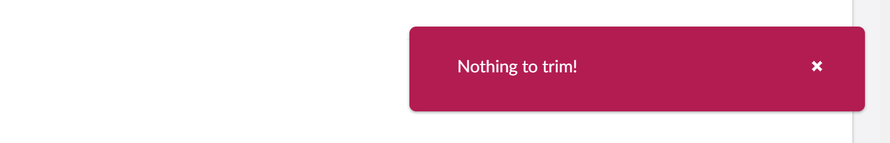
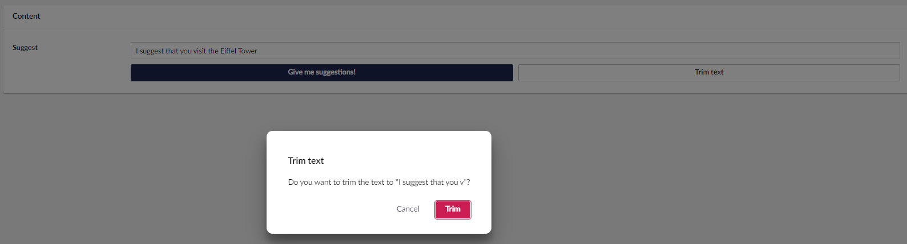
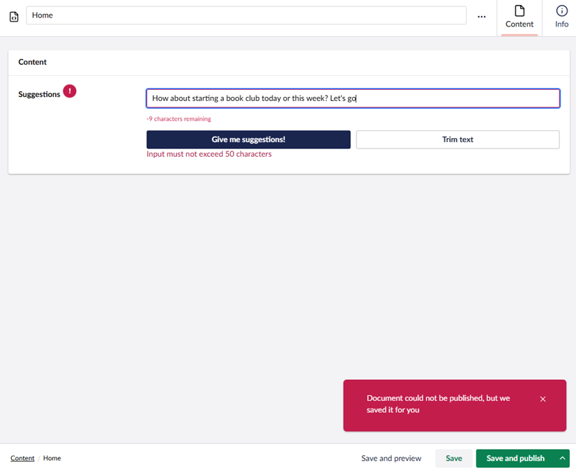

# Integrating context with a Property Editor

## Overview

This is the third step in the Property Editor tutorial. This part shows how to integrate built-in Umbraco Contexts. For this sample, let us use the `UmbNotificationContext` for some pop-ups and the `UmbModalManagerContext`. `UmbNotificationContext` shows a notification when the Trim button is clicked and the input exceeds the `maxChars` limit.

This part covers:

* [Setting up the contexts](integrating-context-with-a-property-editor.md#setting-up-the-contexts)
* [Using the notification context](integrating-context-with-a-property-editor.md#using-the-notification-context)
* [Adding more logic to the context](integrating-context-with-a-property-editor.md#adding-more-logic-to-the-context)

## Setting up the contexts

1. Add the following imports in the `suggestions-property-editor-ui.element.ts` file. This includes the notification context.


```typescript
import { UMB_NOTIFICATION_CONTEXT, UmbNotificationContext, UmbNotificationDefaultData} from '@umbraco-cms/backoffice/notification';
import { UmbElementMixin } from '@umbraco-cms/backoffice/element-api';
```


2. Update the class to extend from UmbElementMixin. This allows to consume the contexts needed:


```typescript
export default class MySuggestionsPropertyEditorUIElement extends UmbElementMixin((LitElement)) implements UmbPropertyEditorUiElement {

```


3. Create the constructor to consume the notification context above the `render()` method:


```typescript
#notificationContext?: UmbNotificationContext;

constructor() {
    super();

    this.consumeContext(UMB_NOTIFICATION_CONTEXT, (instance) => {
        this.#notificationContext = instance;
    });
}
```


## Using the notification context

With the notification context in place, update the `#onTrimText` method.

Check whether the input length is less than or equal to the `maxChars` value. If so, a notification is shown to indicate there is nothing to trim.

Use the `NotificationContext`'s `peek` method here. It has two parameters `UmbNotificationColor` and an `UmbNotificationDefaultData` object.

1. Add the `#onTextTrim()`method above the `render()` method:


```typescript
#onTextTrim() {
    if (!this._maxChars) return;
    if (!this.value || (this.value as string).length <= this._maxChars) {
        const data: UmbNotificationDefaultData = {
            message: `Nothing to trim!`,
        };
        this.#notificationContext?.peek("danger", { data });
        return;
    }
}
```


2. Add a `click` event to the trim text button in the `render()` method:


```typescript
<uui-button
    id="suggestion-trimmer"
    class="element"
    look="outline"
    label="Trim text"
    @click=${this.#onTextTrim}></uui-button>
```


If the input length is less or equal to the maxLength configuration, a notification is displayed when clicking on the Trim button.

<figure><figcaption><p>Trim Button Notification</p></figcaption></figure>

## Adding more logic to the context

Continue by adding more logic. If the length exceeds `maxChars`, show a confirmation dialog before trimming.

Here, use the `ModalManagerContext` which has an open method to show a dialog.

As with the notification context, import it and consume it in the constructor.

1. Add the following import in the `suggestions-property-editor-ui.element.ts` file:


```typescript
import { UMB_MODAL_MANAGER_CONTEXT, UMB_CONFIRM_MODAL,} from '@umbraco-cms/backoffice/modal';
```


2. Update the notification import to remove the `UmbNotificationContext` type, which is no longer needed:

```typescript
import { UMB_NOTIFICATION_CONTEXT, UmbNotificationDefaultData } from '@umbraco-cms/backoffice/notification';
```

3. Update the constructor to consume the `UMB_MODAL_MANAGER_CONTEXT`and the `UMB_CONFIRM_MODAL.`


```typescript
#modalManagerContext?: typeof UMB_MODAL_MANAGER_CONTEXT.TYPE;
#notificationContext?: typeof UMB_NOTIFICATION_CONTEXT.TYPE;

constructor() {
    super();
    this.consumeContext(UMB_MODAL_MANAGER_CONTEXT, (instance) => {
        this.#modalManagerContext = instance;
    });

    this.consumeContext(UMB_NOTIFICATION_CONTEXT, (instance) => {
        this.#notificationContext = instance;
    });
}
```


4. Add more logic to the `onTextTrim` method:


```typescript
#onTextTrim() {
  ...

    const trimmed = (this.value as string).substring(0, this._maxChars);
    const modalHandler = this.#modalManagerContext?.open(this, UMB_CONFIRM_MODAL,
        {
            data: {
                headline: `Trim text`,
                content: `Do you want to trim the text to "${trimmed}"?`,
                color: "danger",
                confirmLabel: "Trim",
            }
        }
    );
    modalHandler?.onSubmit().then(() => {
        this.value = trimmed;
        this.#dispatchChangeEvent();
        const data: UmbNotificationDefaultData = {
            headline: `Text trimmed`,
            message: `You trimmed the text!`,
        };
        this.#notificationContext?.peek("positive", { data });
    }, null);
}
```


<details>

<summary>See the entire file: suggestions-property-editor-ui.element.ts</summary>


```typescript
import { UmbElementMixin } from '@umbraco-cms/backoffice/element-api';
import { UmbChangeEvent } from '@umbraco-cms/backoffice/event';
import { css, customElement, html, ifDefined, LitElement, property, state } from '@umbraco-cms/backoffice/external/lit';
import { UMB_CONFIRM_MODAL, UMB_MODAL_MANAGER_CONTEXT } from '@umbraco-cms/backoffice/modal';
import { UMB_NOTIFICATION_CONTEXT, type UmbNotificationDefaultData } from '@umbraco-cms/backoffice/notification';
import type {
	UmbPropertyEditorConfigCollection,
	UmbPropertyEditorUiElement,
} from '@umbraco-cms/backoffice/property-editor';
import { UmbTextStyles } from '@umbraco-cms/backoffice/style';

@customElement('my-suggestions-property-editor-ui')
export default class MySuggestionsPropertyEditorUIElement
	extends UmbElementMixin(LitElement)
	implements UmbPropertyEditorUiElement
{
	@property({ type: String })
	public value = '';

	@state()
	private _disabled?: boolean;

	@state()
	private _placeholder?: string;

	@state()
	private _maxChars?: number;

	@state()
	private _suggestions = [
		'You should take a break',
		'I suggest that you visit the Eiffel Tower',
		'How about starting a book club today or this week?',
		'Are you hungry?',
	];

	@property({ attribute: false })
	public set config(config: UmbPropertyEditorConfigCollection) {
		this._disabled = config.getValueByAlias('disabled');
		this._placeholder = config.getValueByAlias('placeholder');
		this._maxChars = config.getValueByAlias('maxChars');
	}

	#onInput(e: InputEvent) {
		this.value = (e.target as HTMLInputElement).value;
		this.#dispatchChangeEvent();
	}

	#onSuggestion() {
		const randomIndex = (this._suggestions.length * Math.random()) | 0;
		this.value = this._suggestions[randomIndex];
		this.#dispatchChangeEvent();
	}

	#dispatchChangeEvent() {
		this.dispatchEvent(new UmbChangeEvent());
	}

	#modalManagerContext?: typeof UMB_MODAL_MANAGER_CONTEXT.TYPE;
	#notificationContext?: typeof UMB_NOTIFICATION_CONTEXT.TYPE;

	constructor() {
		super();
		this.consumeContext(UMB_MODAL_MANAGER_CONTEXT, (instance) => {
			this.#modalManagerContext = instance;
		});

		this.consumeContext(UMB_NOTIFICATION_CONTEXT, (instance) => {
			this.#notificationContext = instance;
		});
	}

	#onTextTrim() {
		if (!this._maxChars) return;
		if (!this.value || (this.value as string).length <= this._maxChars) {
			const data: UmbNotificationDefaultData = {
				message: `Nothing to trim!`,
			};
			this.#notificationContext?.peek('danger', { data });
			return;
		}
		const trimmed = (this.value as string).substring(0, this._maxChars);
		const modalHandler = this.#modalManagerContext?.open(this, UMB_CONFIRM_MODAL, {
			data: {
				headline: `Trim text`,
				content: `Do you want to trim the text to "${trimmed}"?`,
				color: 'danger',
				confirmLabel: 'Trim',
			},
		});
		modalHandler?.onSubmit().then(() => {
			this.value = trimmed;
			this.#dispatchChangeEvent();
			const data: UmbNotificationDefaultData = {
				headline: `Text trimmed`,
				message: `You trimmed the text!`,
			};
			this.#notificationContext?.peek('positive', { data });
		}, null);
	}

	override render() {
		return html`
			<uui-input
				id="suggestion-input"
				class="element"
				label="text input"
				placeholder=${ifDefined(this._placeholder)}
				maxlength=${ifDefined(this._maxChars)}
				.value=${this.value || ''}
				@input=${this.#onInput}>
			</uui-input>
			<div id="wrapper">
				<uui-button
					id="suggestion-button"
					class="element"
					look="primary"
					label="give me suggestions"
					?disabled=${this._disabled}
					@click=${this.#onSuggestion}>
					Give me suggestions!
				</uui-button>
				<uui-button id="suggestion-trimmer" class="element" look="outline" label="Trim text" @click=${this.#onTextTrim}>
					Trim text
				</uui-button>
			</div>
		`;
	}

	static override styles = [
		UmbTextStyles,
		css`
			#wrapper {
				margin-top: 10px;
				display: flex;
				gap: 10px;
			}
			.element {
				width: 100%;
			}
		`,
	];
}

declare global {
	interface HTMLElementTagNameMap {
		'my-suggestions-property-editor-ui': MySuggestionsPropertyEditorUIElement;
	}
}
```


</details>

5. Run the command `npm run build` in the `suggestions` folder.
6. Run the project.
7. Go to the **Content** section of the Backoffice.
8. Ask for suggestions and click on the **Trim text** button. If the suggested text is long enough to be trimmed, you will be asked for confirmation:

<figure><figcaption><p>Confirmation message</p></figcaption></figure>

## Enforcing the Character Limit


The `maxlength` attribute on `uui-input` only provides visual feedback. It highlights the input red when the limit is exceeded, but does not prevent saving or publishing.


To enforce the limit properly, your property editor needs to be a form control.

### Making the editor a Form Control



#### Import `UmbLitElement` and `UmbFormControlMixin`


```typescript
import { UmbLitElement } from '@umbraco-cms/backoffice/lit-element';
import { UmbFormControlMixin } from '@umbraco-cms/backoffice/validation';
```




#### Update the Lit import

Remove `UmbElementMixin` and `LitElement` from the `@umbraco-cms/backoffice/external/lit` import as they are no longer needed.


```typescript
import { css, customElement, html, ifDefined, property, state } from '@umbraco-cms/backoffice/external/lit';
```




#### Update the class declaration

Extend `UmbFormControlMixin` wrapping `UmbLitElement`:


```typescript
export default class MySuggestionsPropertyEditorUIElement
    extends UmbFormControlMixin<string | undefined, typeof UmbLitElement, undefined>(UmbLitElement, undefined)
    implements UmbPropertyEditorUiElement {
```




#### Replace `value` with a getter/setter

`UmbFormControlMixin` already defines `value` as an accessor:


```typescript
@property({ type: String })
public override set value(value: string | undefined) {
    super.value = value;
}
public override get value(): string | undefined {
    return super.value;
}
```




#### Add a validation rule

Add this in the constructor to block saving when the character limit is exceeded:


```typescript
this.addValidator(
    'tooLong',
    () => `Input must not exceed ${this._maxChars} characters`,
    () => !!this._maxChars && (this.value?.length ?? 0) > this._maxChars,
);
```




#### Register the input as a form control

Add `firstUpdated()` to register the input:


```typescript
protected override firstUpdated() {
    this.addFormControlElement(this.shadowRoot!.querySelector('#suggestion-input')!);
}
```




### Adding a character counter



#### Add the character counter

Add a character counter below the `uui-input` in your `render()` method:


```typescript
${this._maxChars !== undefined
    ? html`<p class="${(this.value?.length ?? 0) > this._maxChars ? 'over-limit' : ''}">
            ${this._maxChars - (this.value?.length ?? 0)} characters remaining
        </p>`
    : ''}
```




#### Add the styles


```typescript
p {
    font-size: 0.8em;
    margin: 4px 0 0;
    color: var(--uui-color-text-alt);
}
p.over-limit {
    color: var(--uui-color-danger);
}
```




<details>

<summary>See the entire file: suggestions-property-editor-ui.element.ts</summary>


```typescript

import { UmbChangeEvent } from '@umbraco-cms/backoffice/event';
import { css, customElement, html, ifDefined, property, state } from '@umbraco-cms/backoffice/external/lit';
import { UmbLitElement } from '@umbraco-cms/backoffice/lit-element';
import { UMB_CONFIRM_MODAL, UMB_MODAL_MANAGER_CONTEXT } from '@umbraco-cms/backoffice/modal';
import { UMB_NOTIFICATION_CONTEXT, type UmbNotificationDefaultData } from '@umbraco-cms/backoffice/notification';
import type {
	UmbPropertyEditorConfigCollection,
	UmbPropertyEditorUiElement,
} from '@umbraco-cms/backoffice/property-editor';
import { UmbTextStyles } from '@umbraco-cms/backoffice/style';
import { UmbFormControlMixin } from '@umbraco-cms/backoffice/validation';

@customElement('my-suggestions-property-editor-ui')
export default class MySuggestionsPropertyEditorUIElement
	extends UmbFormControlMixin<string | undefined, typeof UmbLitElement, undefined>(UmbLitElement, undefined)
	implements UmbPropertyEditorUiElement {
	@property({ type: String })
	public override set value(value: string | undefined) {
		super.value = value;
	}
	public override get value(): string | undefined {
		return super.value;
	}

	@state()
	private _disabled?: boolean;

	@state()
	private _placeholder?: string;

	@state()
	private _maxChars?: number;

	@state()
	private _suggestions = [
		'You should take a break',
		'I suggest that you visit the Eiffel Tower',
		'How about starting a book club today or this week?',
		'Are you hungry?',
	];

	@property({ attribute: false })
	public set config(config: UmbPropertyEditorConfigCollection) {
		this._disabled = config.getValueByAlias('disabled');
		this._placeholder = config.getValueByAlias('placeholder');
		this._maxChars = config.getValueByAlias('maxChars');
	}

	#onInput(e: InputEvent) {
		this.value = (e.target as HTMLInputElement).value;
		this.#dispatchChangeEvent();
	}

	#onSuggestion() {
		const randomIndex = (this._suggestions.length * Math.random()) | 0;
		this.value = this._suggestions[randomIndex];
		this.#dispatchChangeEvent();
	}

	#dispatchChangeEvent() {
		this.dispatchEvent(new UmbChangeEvent());
	}

	#modalManagerContext?: typeof UMB_MODAL_MANAGER_CONTEXT.TYPE;
	#notificationContext?: typeof UMB_NOTIFICATION_CONTEXT.TYPE;

	constructor() {
		super();
		this.consumeContext(UMB_MODAL_MANAGER_CONTEXT, (instance) => {
			this.#modalManagerContext = instance;
		});
		this.consumeContext(UMB_NOTIFICATION_CONTEXT, (instance) => {
			this.#notificationContext = instance;
		});

		this.addValidator(
			'tooLong',
			() => `Input must not exceed ${this._maxChars} characters`,
			() => !!this._maxChars && (this.value?.length ?? 0) > this._maxChars,
		);
	}

	protected override firstUpdated() {
		this.addFormControlElement(this.shadowRoot!.querySelector('#suggestion-input')!);
	}

	#onTextTrim() {
		if (!this._maxChars) return;
		if (!this.value || this.value.length <= this._maxChars) {
			const data: UmbNotificationDefaultData = {
				message: `Nothing to trim!`,
			};
			this.#notificationContext?.peek('danger', { data });
			return;
		}
		const trimmed = this.value.substring(0, this._maxChars);
		const modalHandler = this.#modalManagerContext?.open(this, UMB_CONFIRM_MODAL, {
			data: {
				headline: `Trim text`,
				content: `Do you want to trim the text to "${trimmed}"?`,
				color: 'danger',
				confirmLabel: 'Trim',
			},
		});
		modalHandler?.onSubmit().then(() => {
			this.value = trimmed;
			this.#dispatchChangeEvent();
			const data: UmbNotificationDefaultData = {
				headline: `Text trimmed`,
				message: `You trimmed the text!`,
			};
			this.#notificationContext?.peek('positive', { data });
		}, null);
	}

	override render() {
		return html`
			<uui-input
				id="suggestion-input"
				class="element"
				label="text input"
				placeholder=${ifDefined(this._placeholder)}
				maxlength=${ifDefined(this._maxChars)}
				.value=${this.value ?? ''}
				@input=${this.#onInput}>
			</uui-input>
			${this._maxChars !== undefined
				? html`<p class="${(this.value?.length ?? 0) > this._maxChars ? 'over-limit' : ''}">
						${this._maxChars - (this.value?.length ?? 0)} characters remaining
					</p>`
				: ''}
			<div id="wrapper">
				<uui-button
					id="suggestion-button"
					class="element"
					look="primary"
					label="give me suggestions"
					?disabled=${this._disabled}
					@click=${this.#onSuggestion}>
					Give me suggestions!
				</uui-button>
				<uui-button id="suggestion-trimmer" class="element" look="outline" label="Trim text" @click=${this.#onTextTrim}>
					Trim text
				</uui-button>
			</div>
		`;
	}

	static override styles = [
		UmbTextStyles,
		css`
			#wrapper {
				margin-top: 10px;
				display: flex;
				gap: 10px;
			}
			.element {
				width: 100%;
			}
			p {
				font-size: 0.8em;
				margin: 4px 0 0;
				color: var(--uui-color-text-alt);
			}
			p.over-limit {
				color: var(--uui-color-danger);
			}
		`,
	];
}

declare global {
	interface HTMLElementTagNameMap {
		'my-suggestions-property-editor-ui': MySuggestionsPropertyEditorUIElement;
	}
}
```


</details>

With all of these in place, the editor will:

* Show a live character counter.
* Display a validation message when the limit is exceeded.
* Block saving or publishing until the value is within the limit.

<figure><figcaption><p>Block Saving or Publishing when max length value is exceeded.</p></figcaption></figure>

## Wrap up

Over the previous steps, the following was covered:

* Created a plugin.
* Defined an editor.
* Registered the Data Type in Umbraco.
* Added configuration to the Property Editor.
* Connected the editor with `UmbNotificationContext` and `UmbModalManagerContext`.
* Looked at some of the methods from notification & modal manager contexts in action.
* Integrated one of the built-in Umbraco Contexts with the Property Editor.
* Enforced the `maxChars` configuration using `UmbFormControlMixin`, including a live character counter and validation that blocks saving and publishing.
