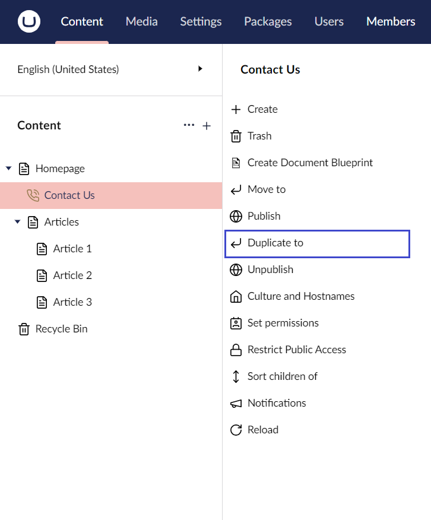
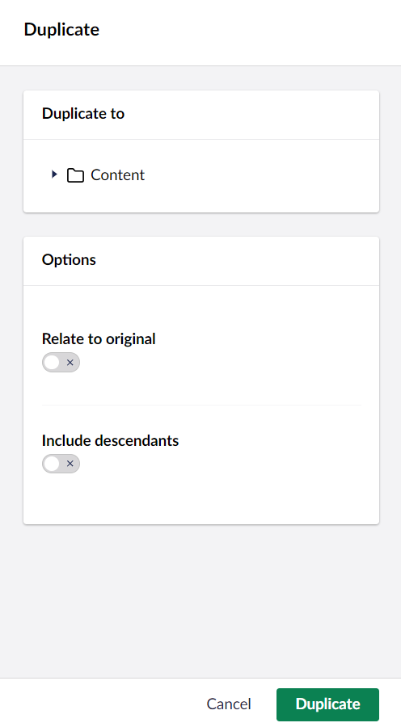
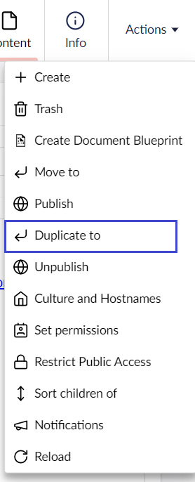

# Copying a Page

Re-use a page or a tree structure you have previously created by copying the parent page and its child pages to a different section within the site structure.

When you copy a parent page all of its child pages are also copied, by default. You can choose if you want to copy the child pages or not. You can also choose whether the links should be automatically updated or continue to link to the original pages.

You can copy a page in two ways:

## Option 1

1. Go to **Content**.
2. Click **...** next to the page you wish to copy.
3. Select **Duplicate to**.

    
4. A window appears on the right side of the screen. Here, you can choose where you want to copy the page in the tree structure.

    
5. Toggle **Relate to original** button if you want to keep the links linked to the original page.
6. Toggle **Include descendants** if you want to copy the child pages alongside the parent page.
7. Click **Duplicate**.
8. A confirmation message appears. Click **OK** to dismiss the confirmation message.

## Option 2

1. Go to **Content**.
2. Select the page you wish to copy.
3. Click **Actions** in the top-right corner of the screen.
4. Select **Duplicate to** from the **Actions** drop-down menu.

    
5. A window appears on the right side of the screen. Here, you can choose where you want to copy the page in the tree structure.
6. Toggle **Relate to original** button if you want to keep the links linked to the original page.
7. Toggle **Include descendants** if you want to copy the child pages alongside the parent page.
8. Click **Copy**.
9. A confirmation message appears. Click **OK** to dismiss the confirmation message.


When you select **Relate to original**, Umbraco will create a relationship between the original and copied page. This relationship can be used to programmatically link the pages - For example, linking two pages in a multilingual setup. This relationship **does not** sync the content between the original and copied page.

