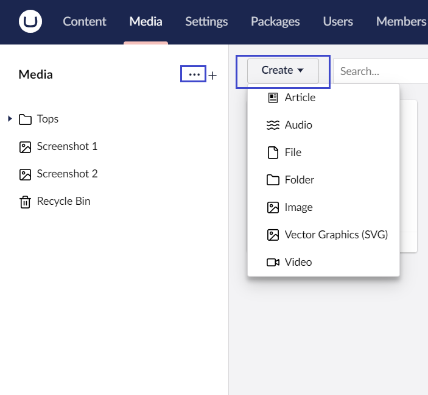

# Working with Media Types

The following default Media Types are available:

* Article - Used for uploading and storing documents.
* Audio - used for uploading and storing digital audio files.
* File - used for uploading and storing different types of files in the Media section.
* Folder - a container for organizing media items in the media tree.
* Image - used for uploading and storing images.
* Vector Graphics (SVG) - used for uploading and storing Scalable Vector Graphics files which are text files containing source code to draw the desired image.
* Video - used for uploading and storing video files.

## Uploading a Media Item

In the Media Library, there are multiple ways to upload media items. The two most commonly used ones are:

1. Use the **Create** button to create a new media item and then upload directly from your machine.
2.  The **...** next to the Media tree in the Media section.

    


We recommend using folders to organize your media items if you are going to add a lot of media to your website.


## Deleting a Media Item

If you wish to tidy up the Media section of your site, you can delete existing media items. Once you have deleted a media item, it is sent to the Recycle Bin. If you change your mind, you can restore the deleted media item from the Recycle Bin.

To delete a Media Item:

1. Select the media item you want to delete.
2.  Click **...** and select **Trash**.

    
3. Click **Trash**.


When media is moved to the recycle bin, the files are still accessible at their previous public URL. They will only be unavailable once the recycle bin is emptied or the media item is fully deleted.

If you wish to change this behavior, [see details for the `EnableMediaRecycleBinProtection` configuration option](../../../reference/configuration/contentsettings.md#enable-media-recycle-bin-protection).


## Restoring a Media Item from the Recycle Bin

The **Recycle Bin** is a separate tree structure within the Media section. Clicking on the arrow next to the Recycle Bin will display its contents.

To restore a Media Item:

1. Click **•••** next to the Media Item.
2.  Select **Restore**.

    
3. Click **Restore**.

## Moving an Image or File

To move Media Items within the Media section:

1. Select the Media Item you want to move.
2.  Click **...** next to the Media Item and click **Move**.

    .png>)
3.  Choose the location where you want to move the Media Item to in the tree structure.

    .png>)
4. Click **Move**.
5. Click **OK** to dismiss the confirmation message.
