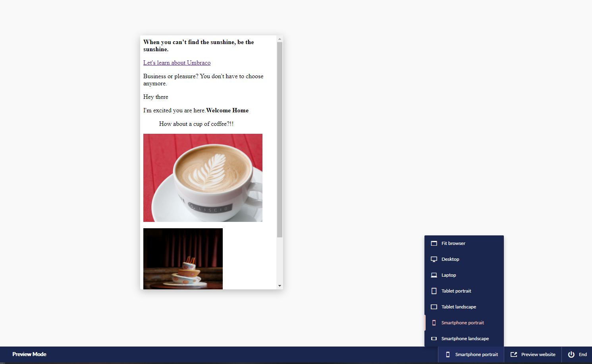

# Preview Pane Responsive View

When viewing page content in preview mode you have the option to scale the preview window to various device sizes:

1. Once you have finished editing the page content, click **Save and preview**.
2.  Select **Fit browser** to view the different preview modes.

    
3. Select the device you would like to scale the preview pane to.
