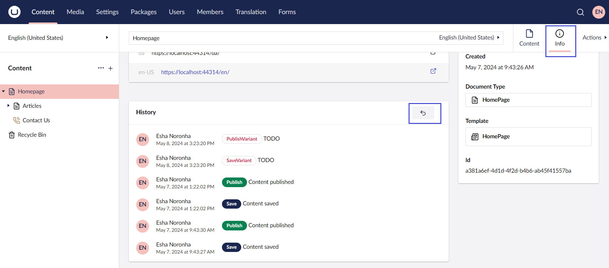

# Rollback to a Previous Version

You have the opportunity to access and re-publish older versions, if necessary.

To rollback to a previous version of the page:

1. Navigate to the page whose versions you wish to view.
2. Go to the **Info** tab.
3.  Click on the **Rollback** button in the **History** section.

    
4.  The Rollback window opens. Select a version of the page you wish to Rollback to.

    .png>)
5. Click **Rollback** to proceed with the changes. Your content has now been rolled back to the selected version of the page and is saved as a **Draft** version.
6. To publish the draft version, click **Save and publish**.
